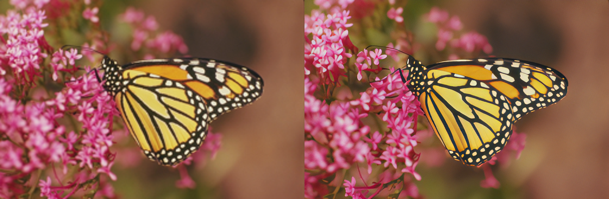
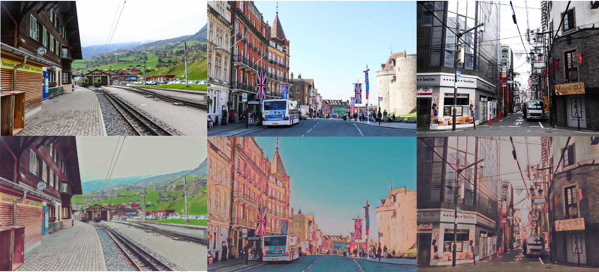

English | [简体中文](./README_cn.md)

# PaddleGAN

PaddleGAN provides developers with high-performance implementation of classic and SOTA Generative Adversarial Networks, and supports developers to quickly build, train and deploy GANs for academic, entertainment and industrial usage.

GAN-Generative Adversarial Network, was praised by "the Father of Convolutional Networks"  **Yann LeCun (Yang Likun)**  as **[One of the most interesting ideas in the field of computer science in the past decade]**. It's the one research area in deep learning that AI researchers are most concerned about.

<div align='center'>
  
</div>

[](LICENSE)


## Recent Contributors
[](https://sourcerer.io/fame/LaraStuStu/paddlepaddle/paddlegan/links/0)[](https://sourcerer.io/fame/LaraStuStu/paddlepaddle/paddlegan/links/1)[](https://sourcerer.io/fame/LaraStuStu/paddlepaddle/paddlegan/links/2)[](https://sourcerer.io/fame/LaraStuStu/paddlepaddle/paddlegan/links/3)[](https://sourcerer.io/fame/LaraStuStu/paddlepaddle/paddlegan/links/4)[](https://sourcerer.io/fame/LaraStuStu/paddlepaddle/paddlegan/links/5)[](https://sourcerer.io/fame/LaraStuStu/paddlepaddle/paddlegan/links/6)[](https://sourcerer.io/fame/LaraStuStu/paddlepaddle/paddlegan/links/7)

## Quick Start

* Please refer to the [installation document](./docs/en_US/install.md) to make sure you have installed PaddlePaddle and PaddleGAN correctly.

* Get started through ppgan.app interface:

   ```python
   from ppgan.apps import RealSRPredictor
   sr = RealSRPredictor()
   sr.run("docs/imgs/monarch.png")
   ```
* More applications, please refer to [ppgan.apps apis](./docs/en_US/apis/apps.md)
* More tutorials:
  - [Data preparation](./docs/en_US/data_prepare.md)
  - [Training/Evaluating/Testing basic usage](./docs/zh_CN/get_started.md)

## Model Tutorial

* [Pixel2Pixel](./docs/en_US/tutorials/pix2pix_cyclegan.md)
* [CycleGAN](./docs/en_US/tutorials/pix2pix_cyclegan.md)
* [PSGAN](./docs/en_US/tutorials/psgan.md)
* [First Order Motion Model](./docs/en_US/tutorials/motion_driving.md)
* [FaceParsing](./docs/en_US/tutorials/face_parse.md)
* [AnimeGANv2](./docs/en_US/tutorials/animegan.md)
* [U-GAT-IT](./docs/en_US/tutorials/ugatit.md)
* [Photo2Cartoon](./docs/en_US/tutorials/photo2cartoon.md)
* [Wav2Lip](./docs/en_US/tutorials/wav2lip.md)
* [Super_Resolution](./docs/en_US/tutorials/super_resolution.md)

## Composite Application

* [Video restore](./docs/zh_CN/tutorials/video_restore.md)

## Examples

### Image Translation

<div align='center'>
  
</div>

### Old video restore
<div align='center'>
  
</div>


### Motion driving
<div align='center'>
  
</div>

### Super resolution

<div align='center'>
  
</div>


### Makeup shifter

<div align='center'>
  
</div>


### Face cartoonization

<div align='center'>
  
</div>


### Realistic face cartoonization

<div align='center'>
  
</div>


### Photo animation

<div align='center'>
  
</div>


### Lip-syncing

<div align='center'>
  
</div>


## Changelog

- v0.1.0 (2020.11.02)
  - Release first version, supported models include Pixel2Pixel, CycleGAN, PSGAN. Supported applications include video frame interpolation, super resolution, colorize images and videos, image animation.
  - Modular design and friendly interface.

## Community

Scan OR Code below to join [PaddleGAN QQ Group：1058398620], you can get offical technical support  here and communicate with other developers/friends. Look forward to your participation!

<div align='center'>
  
</div>

### PaddleGAN Special Interest Group（SIG）

It was first proposed and used by [ACM（Association for Computing Machinery)](https://en.wikipedia.org/wiki/Association_for_Computing_Machinery) in 1961. Top International open source organizations including [Kubernates](https://kubernetes.io/) all adopt the form of SIGs, so that members with the same specific interests can share, learn knowledge and develop projects. These members do not need to be in the same country/region or the same organization, as long as they are like-minded, they can all study, work, and play together with the same goals~

PaddleGAN SIG is such a developer organization that brings together people who interested in GAN. There are frontline developers of PaddlePaddle, senior engineers from the world's top 500, and students from top universities at home and abroad.

We are continuing to recruit developers interested and capable to join us building this project and explore more useful and interesting applications together.

SIG contributions:

- [zhen8838](https://github.com/zhen8838): contributed to AnimeGANv2.
- [Jay9z](https://github.com/Jay9z): contributed to DCGAN and updated install docs, etc.
- [HighCWu](https://github.com/HighCWu): contributed to c-DCGAN and WGAN. Support to use `paddle.vision.datasets`.
- [hao-qiang](https://github.com/hao-qiang) & [ minivision-ai ](https://github.com/minivision-ai): contributed to the photo2cartoon project.


## Contributing

Contributions and suggestions are highly welcomed. Most contributions require you to agree to a [Contributor License Agreement (CLA)](https://cla-assistant.io/PaddlePaddle/PaddleGAN) declaring.
When you submit a pull request, a CLA-bot will automatically determine whether you need to provide a CLA. Simply follow the instructions provided by the bot. You will only need to do this once across all repos using our CLA.
For more, please reference [contribution guidelines](docs/en_US/contribute.md).

## License
PaddleGAN is released under the [Apache 2.0 license](LICENSE).
