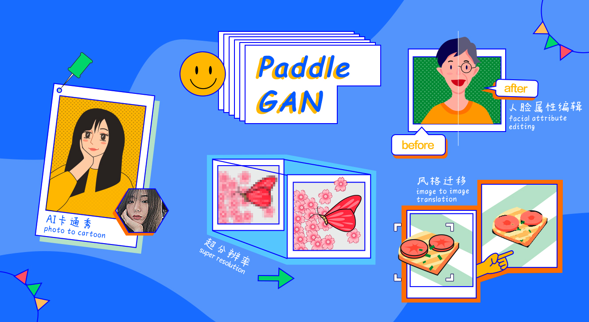

简体中文 | [English](./README.md)

# PaddleGAN

飞桨生成对抗网络开发套件--PaddleGAN，为开发者提供经典及前沿的生成对抗网络高性能实现，并支撑开发者快速构建、训练及部署生成对抗网络，以供学术、娱乐及产业应用。

GAN--生成对抗网络，被“卷积网络之父”**Yann LeCun（杨立昆）**誉为**「过去十年计算机科学领域最有趣的想法之一」**，是近年来火遍全网，AI研究者最为关注的深度学习技术方向之一。

  

## 近期活动🔥🔥🔥

- 🔥**2021.12.08**🔥

  **💙 AI快车道👩‍🏫：视频超分算法及行业应用 💙**
  - **视频超分SOTA算法详解**
  - **视频传输大幅降本提速方案**
  - **影像修复视频超分案例实践**
  - **课程回放链接🔗：https://aistudio.baidu.com/aistudio/education/group/info/25179**

  ⭐ **扫码加入技术交流群** ⭐

  

    
  

- 2021.4.15~4.22

  生成对抗网络七日打卡营火爆来袭，赶紧让百度资深研发带你上车GAN起来吧！

  **直播回放与课件资料：https://aistudio.baidu.com/aistudio/course/introduce/16651**

- 2020.12.10

  《大谷 Spitzer 手把手教你修复百年前老北京影像》b站直播中奖用户名单请点击[PaddleGAN直播中奖名单](./docs/luckydraw.md)查看~

  **想要看直播回放视频请点击链接：https://www.bilibili.com/video/BV1GZ4y1g7xc**

## 产品动态
- 👶 **人脸编辑神器：[StyleGAN V2人脸属性编辑](./docs/zh_CN/tutorials/styleganv2editing.md)之年龄变换--时光穿梭机，一键实现变老变年轻** 👨‍🦳
  - **[完整在线教程](https://aistudio.baidu.com/aistudio/projectdetail/3251280?channelType=0&channel=0)**
  

    
  

-  👀 **视频超分SOTA算法[PP-MSVSR](./docs/zh_CN/tutorials/video_super_resolution.md)：一行命令从"马赛克"到"高清影像"** 👀
    - **[完整在线教程](https://aistudio.baidu.com/aistudio/projectdetail/3205183)**
  

    
  

- 😍 **人脸编辑神器：[StyleGAN V2人脸属性编辑](./docs/zh_CN/tutorials/styleganv2editing.md)之性别转换--怕什么孤单？和自己谈一场恋爱吧！** 😍
  - **[完整在线教程](https://aistudio.baidu.com/aistudio/projectdetail/2565277?contributionType=1)**
  

    
  

- 👩‍🚀 **宇宙漫游指南：[LapStyle](./docs/zh_CN/tutorials/lap_style.md)风格迁移带你「沉浸式」体验太空漫游** 👨‍🚀

  - **[完整在线教程](https://aistudio.baidu.com/aistudio/projectdetail/2343740?contributionType=1)**

    

      
      
      
    

- 🧙‍♂️ **新增创意项目**：制作专属于你的**会动的霍格沃兹魔法头像** 🧙‍♀️

  - **[完整在线教程](https://aistudio.baidu.com/aistudio/projectdetail/2288888?channelType=0&channel=0)**

    

      
    

- ⭐ **新增人脸融合能力，结合新版Frirst Order Motion，实现人脸完美融合并带有丰富表情(๑^ں^๑)** ⭐

  - **[完整在线教程](https://aistudio.baidu.com/aistudio/projectdetail/2254031 )**

  

    
  

- 新增First Order Motion分辨率512清晰版本，并加上人脸增强特效，使得面部细节更清晰，详情见[教程](./docs/zh_CN/tutorials/motion_driving.md)。

- 新增真实照片转油画风格能力

  - 完整推理代码及教程见： https://github.com/wzmsltw/PaintTransformer

    

      
    

## 文档教程

### 安装

- 环境依赖：
  - PaddlePaddle >= 2.1.0
  - Python >= 3.6
  - CUDA >= 10.1
- [完整安装教程](./docs/zh_CN/install.md)

### 入门教程

- [快速开始](./docs/zh_CN/get_started.md)
- [数据准备](./docs/zh_CN/data_prepare.md)
- [API接口使用文档](./docs/en_US/apis/apps.md)
- [配置文件/Config使用说明](./docs/en_US/config_doc.md)

## 模型库

* 图像翻译
  * 风格迁移：[Pixel2Pixel](./docs/zh_CN/tutorials/pix2pix_cyclegan.md)
  * 风格迁移：[CycleGAN](./docs/zh_CN/tutorials/pix2pix_cyclegan.md)
  * 图像艺术风格转换：[LapStyle](./docs/zh_CN/tutorials/lap_style.md)
  * 人脸换妆：[PSGAN](./docs/zh_CN/tutorials/psgan.md)
  * 照片动漫化：[AnimeGANv2](./docs/zh_CN/tutorials/animegan.md)
  * 人像动漫化：[U-GAT-IT](./docs/zh_CN/tutorials/ugatit.md)
  * 人脸卡通化：[Photo2Cartoon](docs/zh_CN/tutorials/photo2cartoon.md)
  * 多种风格迁移：[StarGANv2](docs/zh_CN/tutorials/starganv2.md)
* 动作迁移
  * 人脸表情迁移：[First Order Motion Model](./docs/zh_CN/tutorials/motion_driving.md)
  * 唇形合成：[Wav2Lip](docs/zh_CN/tutorials/wav2lip.md)
* 基础GAN
  * [DCGAN](https://github.com/PaddlePaddle/PaddleGAN/blob/develop/ppgan/models/dc_gan_model.py)
  * WGAN
* 人脸生成
  * 人脸生成：[StyleGAN2](./docs/zh_CN/tutorials/styleganv2.md)
  * 人脸编码：[Pixel2Style2Pixel](./docs/zh_CN/tutorials/pixel2style2pixel.md)
  * 人脸增强：[FaceEnhancement](./docs/zh_CN/tutorials/face_enhancement.md)
  * 人脸解析：[FaceParsing](./docs/zh_CN/tutorials/face_parse.md)
* 分辨率提升
  * 单张图片超分：[Single Image Super Resolution(SISR)](./docs/zh_CN/tutorials/single_image_super_resolution.md)
    * 包含模型：RealSR、ESRGAN、LESRCNN、PAN、DRN
  * 视频超分：[Video Super Resolution(VSR)](./docs/zh_CN/tutorials/video_super_resolution.md)
    * 包含模型：⭐ PP-MSVSR ⭐、EDVR、BasicVSR、BasicVSR++
* 图像视频修复
  * 图像去模糊去噪去雨：[MPR Net](./docs/zh_CN/tutorials/mpr_net.md)
  * 视频去模糊：[EDVR](./docs/zh_CN/tutorials/video_super_resolution.md)

## 产业级应用

- [智能影像修复](./docs/zh_CN/industrial_solution/video_restore_cn.md)

## 在线教程

您可以通过[人工智能学习与实训社区AI Studio](https://aistudio.baidu.com/aistudio/index) 的示例工程在线体验PaddleGAN的部分能力:

|在线教程      |    链接   |
|--------------|-----------|
|人脸融合-PaddleGAN七夕特辑 | [点击体验](https://aistudio.baidu.com/aistudio/projectdetail/2254031 ) |
|表情动作迁移-一键实现多人版「蚂蚁呀嘿」 | [点击体验](https://aistudio.baidu.com/aistudio/projectdetail/1603391) |
|老北京视频修复|[点击体验](https://aistudio.baidu.com/aistudio/projectdetail/1161285)|
|表情动作迁移-当苏大强唱起unravel |[点击体验](https://aistudio.baidu.com/aistudio/projectdetail/1048840)|

## 效果展示

### 人脸融合

  

### 风格迁移

  

### 老视频修复

  

### 动作迁移

  

### 超分辨率

  

### 妆容迁移

  

### 人脸动漫化

  

### 写实人像卡通化

  

### 照片动漫化

  

### 唇形同步

  

## 版本更新
- v2.1.0 (2021.12.8)
  - 发布视频超分辨率模型PP-MSVSR以及多个预训练权重
  - 发布BasicVSR，IconVSR与Basicvsr++等多个效果领先的视频超分辨率模型及其预训练模型
  - 发布轻量级动作驱动模型（体积压缩：229M->10.1M），并优化融合效果
  - 发布高分辨率的FOMM和Wav2Lip预训练模型
  - 发布人脸反演，人脸融合和人脸编辑等多个基于StyleGANv2的有趣应用
  - 发布百度自研且效果领先的风格迁移模型LapStyle及其有趣应用，并上线官网[体验页面](https://www.paddlepaddle.org.cn/paddlegan)
  - 发布轻量的图像超分辨模型PAN

- v2.0.0 (2021.6.2)
  - 发布[Fisrt Order Motion](https://github.com/PaddlePaddle/PaddleGAN/blob/develop/docs/en_US/tutorials/motion_driving.md)模型以及多个预训练权重
  - 发布支持[多人脸驱动](https://github.com/PaddlePaddle/PaddleGAN/blob/develop/docs/en_US/tutorials/motion_driving.md#1-test-for-face)的应用
  - 发布视频超分辨模型[EDVR](https://github.com/PaddlePaddle/PaddleGAN/blob/develop/docs/en_US/tutorials/video_super_resolution.md)以及多个预训练权重
  - 发布PaddleGAN对应的[七日打卡训练营](https://github.com/PaddlePaddle/PaddleGAN/tree/develop/education)内容
  - 增强PaddleGAN在windows平台运行的鲁棒性

- v2.0.0-beta (2021.3.1)
  - 完全切换Paddle 2.0.0版本的API。
  - 发布超分辨模型：ESRGAN，RealSR，LESRCNN，DRN等
  - 发布唇形迁移模型：Wav2Lip
  - 发布街景动漫化模型：AnimeGANv2
  - 发布人脸动漫化模型：U-GAT-IT ，Photo2Cartoon
  - 发布高清人脸生成模型：StyleGAN2

- v0.1.0 (2020.11.02)
  - 初版发布，支持Pixel2Pixel、CycleGAN、PSGAN模型，支持视频插针、超分、老照片/视频上色、视频动作生成等应用。
  - 模块化设计，接口简单易用。

## 欢迎加入PaddleGAN技术交流群

扫描二维码加入PaddleGAN QQ群[群号：1058398620]，获得更高效的问题答疑，与各行业开发者交流讨论，我们期待您的加入！

  

### PaddleGAN 特别兴趣小组（Special Interest Group）

最早于1961年被[ACM（Association for Computing Machinery)](https://en.wikipedia.org/wiki/Association_for_Computing_Machinery)首次提出并使用，国际顶尖开源组织包括[Kubernates](https://kubernetes.io/)都采用SIGs的形式，使拥有同样特定兴趣的成员可以共同分享、学习知识并进行项目开发。这些成员不需要在同一国家/地区、同一个组织，只要大家志同道合，都可以奔着相同的目标一同学习、工作、玩耍~

PaddleGAN SIG就是这样一个汇集对GAN感兴趣小伙伴们的开发者组织，在这里，有百度飞桨的一线开发人员、有来自世界500强的资深工程师、有国内外顶尖高校的学生。

我们正在持续招募有兴趣、有能力的开发者加入我们一起共同建设本项目，并一起探索更多有用、有趣的应用。欢迎大家在加入群后联系我们讨论加入SIG并参与共建事宜。

SIG贡献:

- [zhen8838](https://github.com/zhen8838): 贡献AnimeGANv2.
- [Jay9z](https://github.com/Jay9z): 贡献DCGAN的示例、修改安装文档等。
- [HighCWu](https://github.com/HighCWu): 贡献c-DCGAN和WGAN，以及对`paddle.vision.datasets`数据集的支持；贡献inversion部分代码复现。
- [hao-qiang](https://github.com/hao-qiang) & [ minivision-ai ](https://github.com/minivision-ai): 贡献人像卡通化photo2cartoon项目。
- [lyl120117](https://github.com/lyl120117)：贡献去模糊MPRNet推理代码。

## 贡献代码

我们非常欢迎您可以为PaddleGAN提供任何贡献和建议。大多数贡献都需要同意参与者许可协议（CLA）。当提交拉取请求时，CLA机器人会自动检查您是否需要提供CLA。 只需要按照机器人提供的说明进行操作即可。CLA只需要同意一次，就能应用到所有的代码仓库上。关于更多的流程请参考[贡献指南](docs/zh_CN/contribute.md)。

## 许可证书

本项目的发布受[Apache 2.0 license](LICENSE)许可认证。
