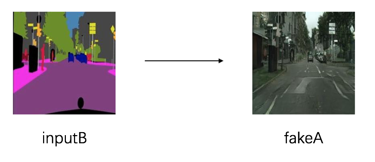

[English](./README.md) | 简体中文

# PaddleGAN

PaddleGAN 是一个基于飞桨的生成对抗网络开发工具包.

### 图片变换



### 妆容迁移


### 老视频修复


### 超分辨率


特性:

- 高度的灵活性:

  模块化设计，解耦各个网络组件，开发者轻松搭建、试用各种检测模型及优化策略，快速得到高性能、定制化的算法。

- 丰富的应用:

  PaddleGAN 提供了非常多的应用，比如说图像生成，图像修复，图像上色，视频补帧，人脸妆容迁移等.

## 安装

### 1. 安装 paddlepaddle

PaddleGAN 所需的版本:
* PaddlePaddle >= 2.0.0-rc
* Python >= 3.5+

```
pip install -U paddlepaddle-gpu
```

### 2. 安装ppgan
```
python -m pip install 'git+https://github.com/PaddlePaddle/PaddleGAN.git'
```

或者通过将项目克隆到本地
```
git clone https://github.com/PaddlePaddle/PaddleGAN
cd PaddleGAN

pip install -v -e .  # or "python setup.py develop"
```

## 数据准备
请参考 [数据准备](./docs/data_prepare.md) 来准备对应的数据.


## 快速开始
训练，预测，推理等请参考 [快速开始](./docs/get_started.md).

## 模型教程
* [Pixel2Pixel and CycleGAN](./docs/tutorals/pix2pix_cyclegan.md)
* [PSGAN](./docs/tutorals/psgan.md)
* [视频修复](./docs/tutorails/video_restore.md)
* [动作驱动](./docs/tutorials/motion_driving.md)

## 许可证书
本项目的发布受[Apache 2.0 license](LICENSE)许可认证。


## 贡献代码

我们非常欢迎你可以为PaddleGAN提供任何贡献和建议。大多数贡献都需要你同意参与者许可协议（CLA）。当你提交拉取请求时，CLA机器人会自动检查你是否需要提供CLA。 只需要按照机器人提供的说明进行操作即可。CLA只需要同意一次，就能应用到所有的代码仓库上。关于更多的流程请参考[贡献指南](docs/CONTRIBUTE.md)。


## 外部项目

外部基于飞桨的生成对抗网络模型

+ [PaddleGAN](https://github.com/PaddlePaddle/PaddleGAN)
