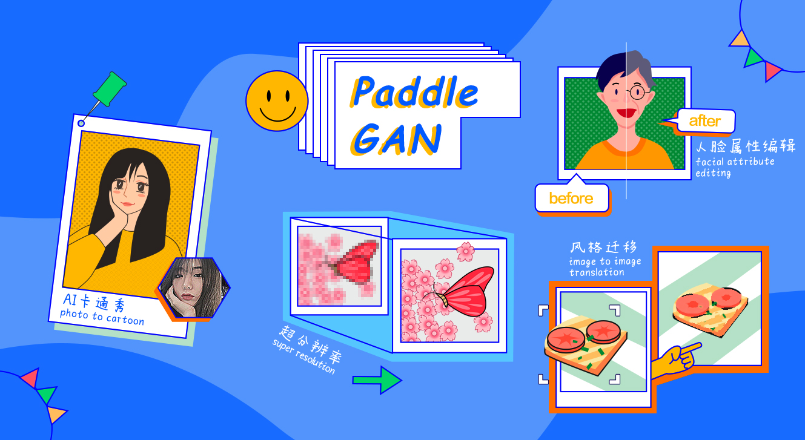
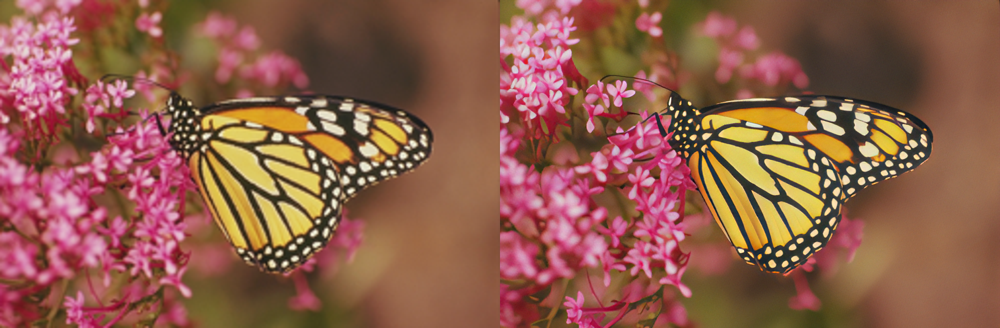
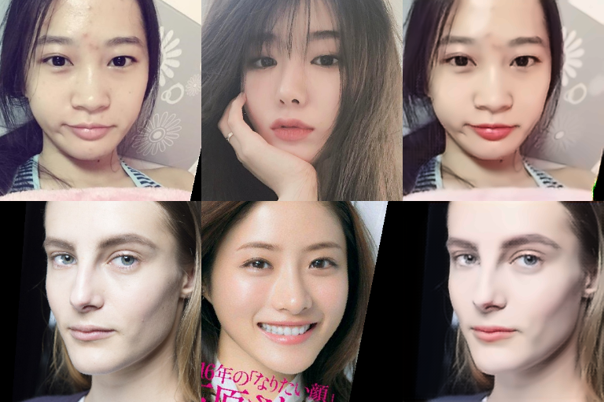
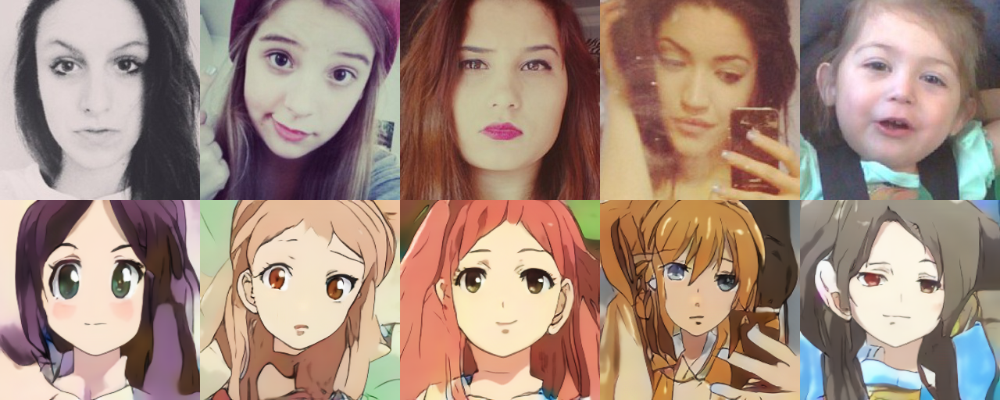
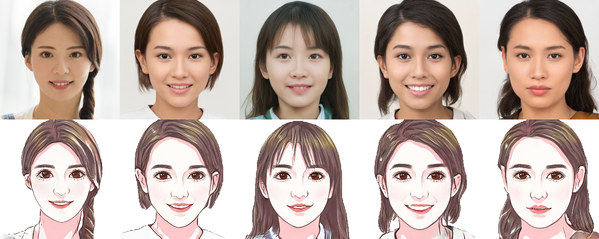
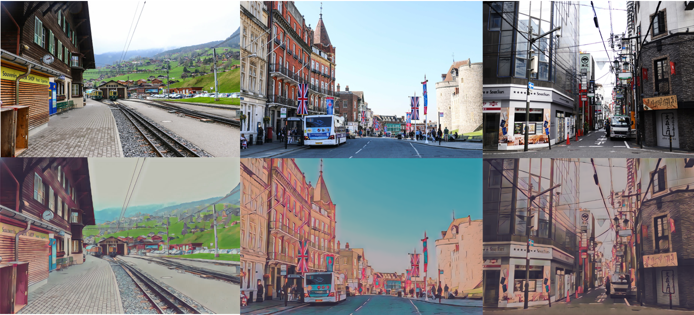
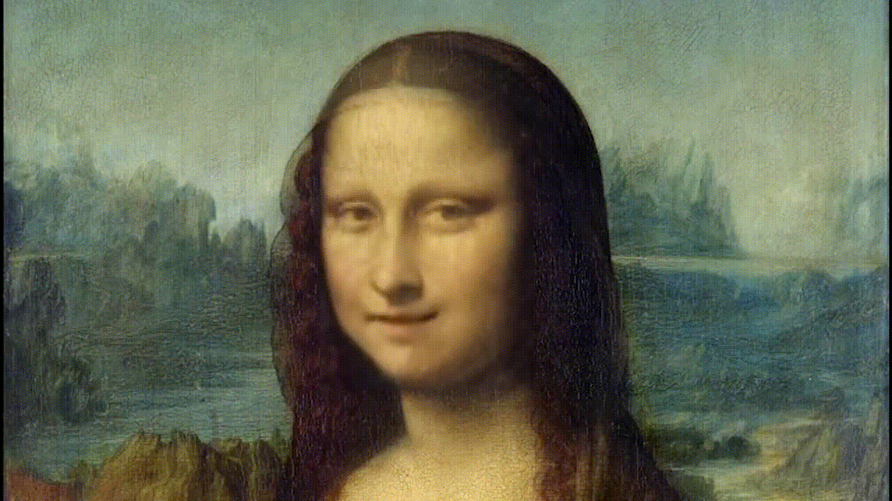

简体中文 | [English](./README.md)

# PaddleGAN

飞桨生成对抗网络开发套件--PaddleGAN，为开发者提供经典及前沿的生成对抗网络高性能实现，并支撑开发者快速构建、训练及部署生成对抗网络，以供学术、娱乐及产业应用。

GAN--生成对抗网络，被“卷积网络之父”**Yann LeCun（杨立昆）**誉为**「过去十年计算机科学领域最有趣的想法之一」**，是近年来火遍全网，AI研究者最为关注的深度学习技术方向之一。

<div align='center'>
  
</div>

[](LICENSE)


## 生成对抗网络七日打卡营🔥🔥🔥

**4月15日~4月22日【原理+实战=7天学会GAN】** 🤓 

**百度飞桨一线高级研发工程师团队亲自直播授课，连续7天最强干货，带大家逐步掌握GAN常用模型脉络及代码！**

讲师团队：百度高级研发工程师***4**

助教团队：深度学习领域平均码龄超过**5**年的高阶开发者***7**

**更有万元豪奖、百度实习内推机会等你来拿**🎁🎈🎊

⌨️**一等奖 1 名**：HHKB Professional静电容蓝牙键盘

🖥**二等奖 2 名**：Kindle paperwhite 电子阅读器

📞**三等奖 6 名**：小度无线智能耳机

📘**优秀奖 10 名**：纸质书《Generative Deep Learning》+《Deep Learning》

**还在等什么，快来点击报名吧：https://aistudio.baidu.com/aistudio/course/introduce/16651**

**直播链接：http://live.bilibili.com/21689802**

**直播日期：4月15日～4月20日直播授课，4月22日结营直播**

**具体详情请参见：[PaddleGAN生成对抗七日打卡营](./education/README.md)**


## 近期贡献者

[](https://sourcerer.io/fame/LaraStuStu/paddlepaddle/paddlegan/links/0)[](https://sourcerer.io/fame/LaraStuStu/paddlepaddle/paddlegan/links/1)[](https://sourcerer.io/fame/LaraStuStu/paddlepaddle/paddlegan/links/2)[](https://sourcerer.io/fame/LaraStuStu/paddlepaddle/paddlegan/links/3)[](https://sourcerer.io/fame/LaraStuStu/paddlepaddle/paddlegan/links/4)[](https://sourcerer.io/fame/LaraStuStu/paddlepaddle/paddlegan/links/5)[](https://sourcerer.io/fame/LaraStuStu/paddlepaddle/paddlegan/links/6)[](https://sourcerer.io/fame/LaraStuStu/paddlepaddle/paddlegan/links/7)

## 快速开始

* 请确保您按照[安装文档](./docs/zh_CN/install.md)的说明正确安装了PaddlePaddle和PaddleGAN

* 通过ppgan.apps接口直接使用应用:

  ```python
  from ppgan.apps import RealSRPredictor
  sr = RealSRPredictor()
  sr.run("docs/imgs/monarch.png")
  ```

* 更多应用的使用请参考[ppgan.apps API](./docs/zh_CN/apis/apps.md)
* 更多训练、评估教程:
  * [数据准备](./docs/zh_CN/data_prepare.md)
  * [训练/评估/推理教程](./docs/zh_CN/get_started.md)

## 经典模型实现

* [Pixel2Pixel](./docs/zh_CN/tutorials/pix2pix_cyclegan.md)
* [CycleGAN](./docs/zh_CN/tutorials/pix2pix_cyclegan.md)
* [PSGAN](./docs/zh_CN/tutorials/psgan.md)
* [First Order Motion Model](./docs/zh_CN/tutorials/motion_driving.md)
* [FaceParsing](./docs/zh_CN/tutorials/face_parse.md)
* [AnimeGANv2](./docs/zh_CN/tutorials/animegan.md)
* [U-GAT-IT](./docs/zh_CN/tutorials/ugatit.md)
* [Photo2Cartoon](docs/zh_CN/tutorials/photo2cartoon.md)
* [Wav2Lip](docs/zh_CN/tutorials/wav2lip.md)
* [single_image_super_solution(SISR)](./docs/zh_CN/tutorials/single_image_super_solution(SISR).md)
* [StyleGAN2](./docs/zh_CN/tutorials/styleganv2.md)
* [Pixel2Style2Pixel](./docs/zh_CN/tutorials/pixel2style2pixel.md)


## 复合应用

* [视频修复](./docs/zh_CN/tutorials/video_restore.md)

## 在线教程

您可以通过[人工智能学习与实训社区AI Studio](https://aistudio.baidu.com/aistudio/index) 的示例工程在线体验PaddleGAN的部分能力:

|在线教程      |    链接   |
|--------------|-----------|
|表情动作迁移-一键实现多人版「蚂蚁呀嘿」 | [点击体验](https://aistudio.baidu.com/aistudio/projectdetail/1603391) |
|老北京视频修复|[点击体验](https://aistudio.baidu.com/aistudio/projectdetail/1161285)|
|表情动作迁移-当苏大强唱起unravel |[点击体验](https://aistudio.baidu.com/aistudio/projectdetail/1048840)|


## 效果展示


### 图片变换

<div align='center'>
  
</div>

### 老视频修复

<div align='center'>
  
</div>


### 动作迁移

<div align='center'>
  
</div>

### 超分辨率

<div align='center'>
  
</div>


### 妆容迁移

<div align='center'>
  
</div>


### 人脸动漫化

<div align='center'>
  
</div>


### 写实人像卡通化

<div align='center'>
  
</div>


### 照片动漫化

<div align='center'>
  
</div>


### 唇形同步

<div align='center'>
  
</div>


## 版本更新

- v0.1.0 (2020.11.02)
  - 初版发布，支持Pixel2Pixel、CycleGAN、PSGAN模型，支持视频插针、超分、老照片/视频上色、视频动作生成等应用。
  - 模块化设计，接口简单易用。

## 近期活动更新

- 2020.12.10

  《大谷 Spitzer 手把手教你修复百年前老北京影像》b站直播中奖用户名单请点击[PaddleGAN直播中奖名单](./docs/luckydraw.md)查看~

  想要看直播回放视频请点击链接：https://www.bilibili.com/video/BV1GZ4y1g7xc
  
- 2021.4.15~4.22

  生成对抗网络七日打卡营火爆🔥来袭，赶紧让百度资深研发带你上车GAN起来吧！

  报名链接：https://aistudio.baidu.com/aistudio/course/introduce/16651


## 欢迎加入PaddleGAN技术交流群

扫描二维码加入PaddleGAN QQ群[群号：1058398620]，获得更高效的问题答疑，与各行业开发者交流讨论，我们期待您的加入！

<div align='center'>
  
</div>

### PaddleGAN 特别兴趣小组（Special Interest Group）

最早于1961年被[ACM（Association for Computing Machinery)](https://en.wikipedia.org/wiki/Association_for_Computing_Machinery)首次提出并使用，国际顶尖开源组织包括[Kubernates](https://kubernetes.io/)都采用SIGs的形式，使拥有同样特定兴趣的成员可以共同分享、学习知识并进行项目开发。这些成员不需要在同一国家/地区、同一个组织，只要大家志同道合，都可以奔着相同的目标一同学习、工作、玩耍~

PaddleGAN SIG就是这样一个汇集对GAN感兴趣小伙伴们的开发者组织，在这里，有百度飞桨的一线开发人员、有来自世界500强的资深工程师、有国内外顶尖高校的学生。

我们正在持续招募有兴趣、有能力的开发者加入我们一起共同建设本项目，并一起探索更多有用、有趣的应用。欢迎大家在加入群后联系我们讨论加入SIG并参与共建事宜。

SIG贡献:

- [zhen8838](https://github.com/zhen8838): 贡献AnimeGANv2.
- [Jay9z](https://github.com/Jay9z): 贡献DCGAN的示例、修改安装文档等。
- [HighCWu](https://github.com/HighCWu): 贡献c-DCGAN和WGAN，以及对`paddle.vision.datasets`数据集的支持。
- [hao-qiang](https://github.com/hao-qiang) & [ minivision-ai ](https://github.com/minivision-ai): 贡献人像卡通化photo2cartoon项目。


## 贡献代码

我们非常欢迎您可以为PaddleGAN提供任何贡献和建议。大多数贡献都需要同意参与者许可协议（CLA）。当提交拉取请求时，CLA机器人会自动检查您是否需要提供CLA。 只需要按照机器人提供的说明进行操作即可。CLA只需要同意一次，就能应用到所有的代码仓库上。关于更多的流程请参考[贡献指南](docs/zh_CN/contribute.md)。

## 许可证书

本项目的发布受[Apache 2.0 license](LICENSE)许可认证。
