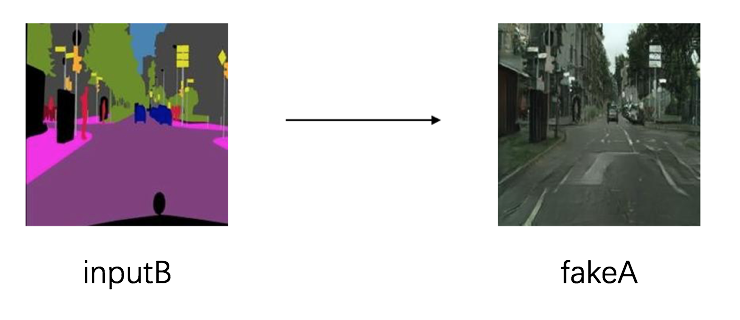

English | [简体中文](./README.md)

# PaddleGAN

PaddleGAN is an development kit of Generative Adversarial Network based on PaddlePaddle.

### Image Translation

### Makeup shifter

### Old video restore

### Super resolution

### Motion driving

Features:

- Highly Flexible:

  Components are designed to be modular. Model architectures, as well as data
preprocess pipelines, can be easily customized with simple configuration
changes.

- Rich applications:

  PaddleGAN provides rich of applications, such as image generation, image restore, image colorization, video interpolate, makeup shifter.

## Install

Please refer to [install](./docs/install_en.md).

## Data Prepare
Please refer to [data prepare](./docs/data_prepare_en.md) for dataset preparation.

## Get Start
Please refer [get started](./docs/get_started_en.md) for the basic usage of PaddleGAN.

## Model tutorial
* [Pixel2Pixel and CycleGAN](./docs/tutorials/pix2pix_cyclegan.md)
* [PSGAN](./docs/tutorials/psgan.md)
* [Video restore](./docs/tutorails/video_restore.md)
* [Motion driving](./docs/tutorials/motion_driving.md)

## License
PaddleGAN is released under the [Apache 2.0 license](LICENSE).

## Contributing

Contributions and suggestions are highly welcomed. Most contributions require you to agree to a [Contributor License Agreement (CLA)](https://cla-assistant.io/PaddlePaddle/PaddleGAN) declaring.
When you submit a pull request, a CLA-bot will automatically determine whether you need to provide a CLA. Simply follow the instructions provided by the bot. You will only need to do this once across all repos using our CLA.
For more, please reference [contribution guidelines](docs/CONTRIBUTE.md).

## External Projects

External gan projects in the community that base on PaddlePaddle:

+ [PaddleGAN](https://github.com/PaddlePaddle/PaddleGAN)
