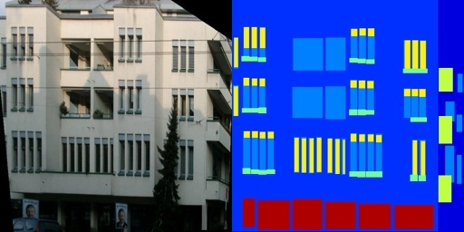

## Data Preparation

## **1. Routes Configuration of Datasets**

The config will suppose your data is in `$PaddleGAN/data`. You can symlink your datasets to `$PaddleGAN/data`.

```
PaddleGAN
|-- configs
|-- data
|   |-- cityscapes
|   |   ├── test
|   |   ├── testA
|   |   ├── testB
|   |   ├── train
|   |   ├── trainA
|   |   └── trainB
|   ├── horse2zebra
|   |   ├── testA
|   |   ├── testB
|   |   ├── trainA
|   |   └── trainB
|   └── facades
|       ├── test
|       ├── train
|       └── val
|-- docs
|-- ppgan
|-- tools

```

If you put the datasets on other place，for example ```your/data/path```, you can also change ```dataroot``` in config file: 

```
dataset:
  train:
    name: PairedDataset
    dataroot: your/data/path
    num_workers: 4
```

## 2. Datasets Preparation

### 2.1 Download of Datasets

#### 2.1.1  Datasets of CycleGAN

- #### Download from website


Datasets of CycleGAN can be downloaded from [here](https://people.eecs.berkeley.edu/~taesung_park/CycleGAN/datasets/), remember to  symlink your datasets to `$PaddleGAN/data`.

- #### Download by script


You can use ```download_cyclegan_data.py``` in ```PaddleGAN/data``` to download datasets you wanted. 

Supported datasets are: apple2orange, summer2winter_yosemite,horse2zebra, monet2photo, cezanne2photo, ukiyoe2photo, vangogh2photo, maps, cityscapes, facades, iphone2dslr_flower, ae_photos, cityscapes。

run following command. Dataset will be downloaded to ```~/.cache/ppgan``` and symlink to ```PaddleGAN/data/``` .
```
python data/download_cyclegan_data.py --name horse2zebra
```

#### Custom dataset

Data should be arranged in following way if you use custom dataset.

```
custom_datasets
├── testA
├── testB
├── trainA
└── trainB
```

#### 2.1.2 Datasets of Pix2Pix

- #### Download from website


Dataset for pix2pix can be downloaded from [here](https://people.eecs.berkeley.edu/~tinghuiz/projects/pix2pix/datasets/)

- #### Download by script


You can use ```download_pix2pix_data.py``` in ```PaddleGAN/data``` to download datasets you wanted. Supported datasets are: apple2orange, summer2winter_yosemite,horse2zebra, monet2photo, cezanne2photo, ukiyoe2photo, vangogh2photo, maps, cityscapes, facades, iphone2dslr_flower, ae_photos, cityscapes.

Dataset will be downloaded to ```~/.cache/ppgan``` and symlink to ```PaddleGAN/data/``` .

```
python data/download_pix2pix_data.py --name cityscapes
```

#### Custom datasets
Data should be arranged in following way if you use custom dataset. And image content should be the same with example image.

```
facades
├── test
├── train
└── val
```


