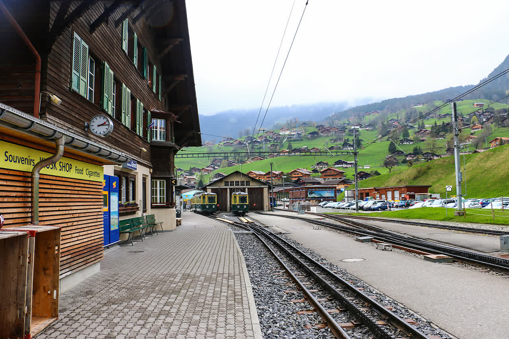
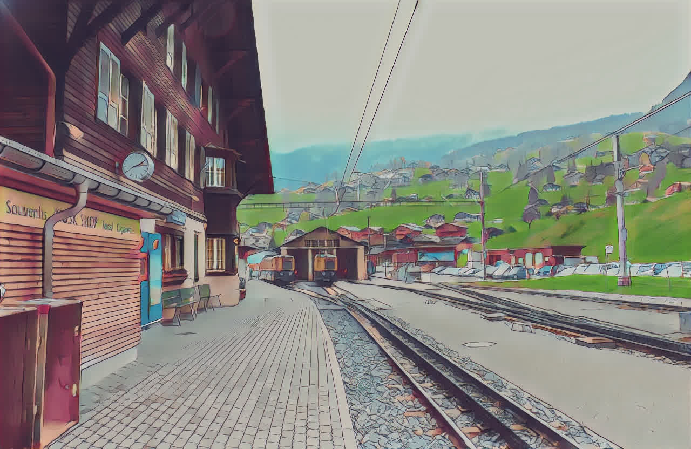

# 1 AnimeGANv2

## 1.1 Introduction

[AnimeGAN](https://github.com/TachibanaYoshino/AnimeGANv2) improved the [CVPR paper CartoonGAN](https://openaccess.thecvf.com/content_cvpr_2018/papers/Chen_CartoonGAN_Generative_Adversarial_CVPR_2018_paper.pdf), mainly to solve the over-stylized and color artifact area. For the details, you can refer to the [Zhihu article](https://zhuanlan.zhihu.com/p/76574388?from_voters_page=true) writes by the paper author.Based on the AnimeGAN, the AnimeGANv2 add the `total variation loss` in the generator loss.


## 1.2 How to use

### 1.2.1 Quick start

After installing PaddleGAN, you can run python code as follows to generate the stylized image. Where the `PATH_OF_IMAGE` is your source image path.

```python
from ppgan.apps import AnimeGANPredictor
predictor = AnimeGANPredictor()
predictor.run(PATH_OF_IMAGE)
```

Or run such a command to get the same result:

```sh
python applications/tools/animeganv2.py --input_image ${PATH_OF_IMAGE}
```

### 1.2.1 Prepare dataset

We download the dataset provided by the author from [here](https://github.com/TachibanaYoshino/AnimeGAN/releases/tag/dataset-1).Then unzip to the `data` directory.

```sh
wget https://github.com/TachibanaYoshino/AnimeGAN/releases/download/dataset-1/dataset.zip
cd PaddleGAN
unzip YOUR_DATASET_DIR/dataset.zip -d data/animedataset
```

For example, the structure of `animedataset` is as following:

```sh
animedataset
├── Hayao
│   ├── smooth
│   └── style
├── Paprika
│   ├── smooth
│   └── style
├── Shinkai
│   ├── smooth
│   └── style
├── SummerWar
│   ├── smooth
│   └── style
├── test
│   ├── HR_photo
│   ├── label_map
│   ├── real
│   ├── test_photo
│   └── test_photo256
├── train_photo
└── val
```

### 1.2.2 Training

  An example is training to Hayao stylize.

  1.  To ensure the generator can generate the original image, we need to warmup the model.:
  ```sh
  python tools/main.py --config-file configs/animeganv2_pretrain.yaml
  ```

  2.  After the warmup, we strat to training GAN.:
  **NOTE：** you must modify the `configs/animeganv2.yaml > pretrain_ckpt ` parameter first! ensure the GAN can reuse the warmup generator model.
  Set the `batch size=4` and the `learning rate=0.0002`. Train 30 epochs on a GTX2060S GPU to reproduce the result. For other hyperparameters, please refer to `configs/animeganv2.yaml`.
  ```sh
  python tools/main.py --config-file configs/animeganv2.yaml
  ```

  3.  Change target style
  Modify `style` parameter in the `configs/animeganv2.yaml`, now support choice from `Hayao, Paprika, Shinkai, SummerWar`. If you want to use your own dataset, you can modify it to be your own in the configuration file.

  **NOTE :** After modifying the target style, calculate the mean value of the target style dataset at first, and the `transform_anime->Add->value` parameter in `configs/animeganv2.yaml` must be modified.

  The following example shows how to obtain the  mean value of the `Hayao` style:
  ```sh
  python tools/animegan_picmean.py --dataset data/animedataset/Hayao/style
  image_num: 1792
  100%|███████████████████████████████████████████████████████████████████████████████████████████████████████████████████████████| 1792/1792 [00:04<00:00, 444.95it/s]
  RGB mean diff
  [-4.4346957 -8.665916  13.100612 ]
  ```


### 1.2.3 Test

test model on `data/animedataset/test/HR_photo`
```sh
python tools/main.py --config-file configs/animeganv2.yaml --evaluate-only --load ${PATH_OF_WEIGHT}
```

## 1.3 Results
| original image                      | style image                        |
| ----------------------------------- | ---------------------------------- |
|  |  |
