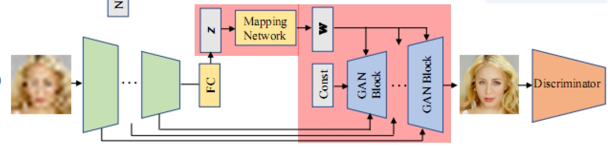

English | [Chinese](../../zh_CH/tutorials/gpen.md)

## GPEN Blind Face Restoration Model


## 1、Introduction

The GPEN model is a blind face restoration model. The author embeds the decoder of StyleGAN V2 proposed by the previous model as the decoder of GPEN; reconstructs a simple encoder with DNN to provide input for the decoder. In this way, while retaining the excellent performance of the StyleGAN V2 decoder, the function of the model is changed from image style conversion to blind face restoration. The overall structure of the model is shown in the following figure:



For a more detailed introduction to the model, and refer to the repo, you can view the following AI Studio project [link]([GPEN Blind Face Repair Model Reproduction - Paddle AI Studio (baidu.com)](https://aistudio.baidu.com/ The latest version of aistudio/projectdetail/3936241?contributionType=1)).


## 2、Ready to work

### 2.1 Dataset Preparation

The GPEN model training set is the classic FFHQ face data set, with a total of 70,000 high-resolution 1024 x 1024 high-resolution face pictures, and the test set is the CELEBA-HQ data set, with a total of 2,000 high-resolution face pictures. For details, please refer to **Dataset URL:** [FFHQ](https://github.com/NVlabs/ffhq-dataset), [CELEBA-HQ](https://github.com/tkarras/progressive_growing_of_gans). The specific download links are given below:

**Original dataset download address:**

**FFHQ ：**           https://drive.google.com/drive/folders/1tZUcXDBeOibC6jcMCtgRRz67pzrAHeHL?usp=drive_open

**CELEBA-HQ：** https://drive.google.com/drive/folders/0B4qLcYyJmiz0TXY1NG02bzZVRGs?resourcekey=0-arAVTUfW9KRhN-irJchVKQ&usp=sharing


Since the original FFHQ dataset is too large, you can also download the 256-resolution FFHQ dataset from the following link:

[Flickr-Faces-HQ Dataset (FFHQ) 256x256 - 飞桨AI Studio (baidu.com)](https://aistudio.baidu.com/aistudio/datasetdetail/111879)


**After downloading, the file organization is as follows**

```
|-- data/GPEN
	|-- train
		|-- 00000
			|-- 00000.png
			|-- 00001.png
			|-- ......
			|-- 00999.png
		|-- 01000
			|-- ......
		|-- ......
		|-- 69000
            |-- ......
                |-- 69999.png
	|-- test
		|-- 2000张png图片
```


### 2.2 Model preparation

**Model parameter file and training log download address:**

link：https://pan.baidu.com/s/1MORzH2C58xlAXrMI5MyJow    code：pyda


Download the model parameters from the link and put them in the data/gpen/weights folder in the project root directory. The specific file structure is as follows:


```
data/gpen/weights
    |-- model_ir_se50_2.pdparams
    |-- weight_pretrain.pdparams  
    |-- g_ema.pdparams  
```


## 3、Start using

### 3.1 model training

Enter the following code in the console to start training：

 ```shell
 python tools/main.py -c configs/gpen_256_ffhq.yaml
 ```


### 3.2 Model evaluation

When evaluating the model, enter the following code in the console, using the downloaded model parameters mentioned above:

 ```shell
python tools/main.py -c configs/gpen_256_ffhq.yaml -o dataset.test.amount=2000 --load data/gpen/weights/weight_pretrain.pdparams --evaluate-only
 ```

If you want to test on your own provided model, please modify the path after --load .


### 3.3 Model prediction

#### 3.3.1 Export generator weights

After training, you need to use ``tools/extract_weight.py`` to extract the weights of the generator from the trained model (including the generator and discriminator) for inference to `applications/tools/gpen.py` to achieve Various applications of the GPEN model. Enter the following command to extract the weights of the generator:

```bash
python tools/extract_weight.py data/gpen/weights/weight_pretrain.pdparams --net-name g_ema --output data/gpen/weights/g_ema.pdparams
```


#### 3.3.2 Process a single image

After extracting the weights of the generator, enter the following command to test the images under the --test_img path. Modifying the --seed parameter can generate different degraded images to show richer effects. You can modify the path after --test_img to any image you want to test.

```bash
python applications/tools/gpen.py --test_img data/gpen/lite_data/15006.png --seed=100 --weight_path data/gpen/weights/g_ema.pdparams
```

The following are the sample images and the corresponding inpainted images, from left to right, the degraded image, the generated image, and the original clear image:

<p align='center'>

An example output is as follows:

```
result saved in : output_dir/gpen_predict.png
        FID: 92.11730631094356
        PSNR:19.014782083825743
```


## 4. Tipc

### 4.1 Export the inference model

```bash
python tools/export_model.py -c configs/gpen_256_ffhq.yaml --inputs_size=1,3,256,256 --load data/gpen/weights/weight_pretrain.pdparams
```

The above command will generate the model structure file `gpenmodel_g_ema.pdmodel` and model weight files `gpenmodel_g_ema.pdiparams` and `gpenmodel_g_ema.pdiparams.info` files required for prediction, which are stored in the `inference_model/` directory. You can also modify the parameters after --load to the model parameter file you want to test.


### 4.2 Inference with a prediction engine

```bash
python tools/inference.py --model_type GPEN --seed 100 -c configs/gpen_256_ffhq.yaml -o dataset.test.dataroot="./data/gpen/lite_data/" --output_path test_tipc/output/ --model_path inference_model/gpenmodel_g_ema
```

At the end of the inference, the repaired image generated by the model will be saved in the test_tipc/output/GPEN directory by default, and the FID value obtained by the test will be output in test_tipc/output/GPEN/metric.txt.


The default output is as follows:

```
Metric fid: 187.0158
```

Note: Since the operation of degrading high-definition pictures has a certain degree of randomness, the results of each test will be different. In order to ensure that the test results are consistent, here I fixed the random seed, so that the same degradation operation is performed on the image for each test.


### 4.3 Call the script to complete the training and push test in two steps

To invoke the `lite_train_lite_infer` mode of the foot test base training prediction function, run:

```shell
# prepare data
bash test_tipc/prepare.sh ./test_tipc/configs/GPEN/train_infer_python.txt 'lite_train_lite_infer'
# run the test
bash test_tipc/test_train_inference_python.sh ./test_tipc/configs/GPEN/train_infer_python.txt 'lite_train_lite_infer'
```


## 5. LICENSE

This project is released under the [Apache 2.0 license](https://github.com/PaddlePaddle/models/blob/release/2.2/community/repo_template/LICENSE) license.


## 7、参考文献与链接

Paper address: https://paperswithcode.com/paper/gan-prior-embedded-network-for-blind-face

Reference repo Github: https://github.com/yangxy/GPEN

Paper Reproduction Guide - CV Direction: https://github.com/PaddlePaddle/models/blob/release%2F2.2/tutorials/article-implementation/ArticleReproduction_CV.md

readme documentation template: https://github.com/PaddlePaddle/models/blob/release/2.2/community/repo_template/README.md
