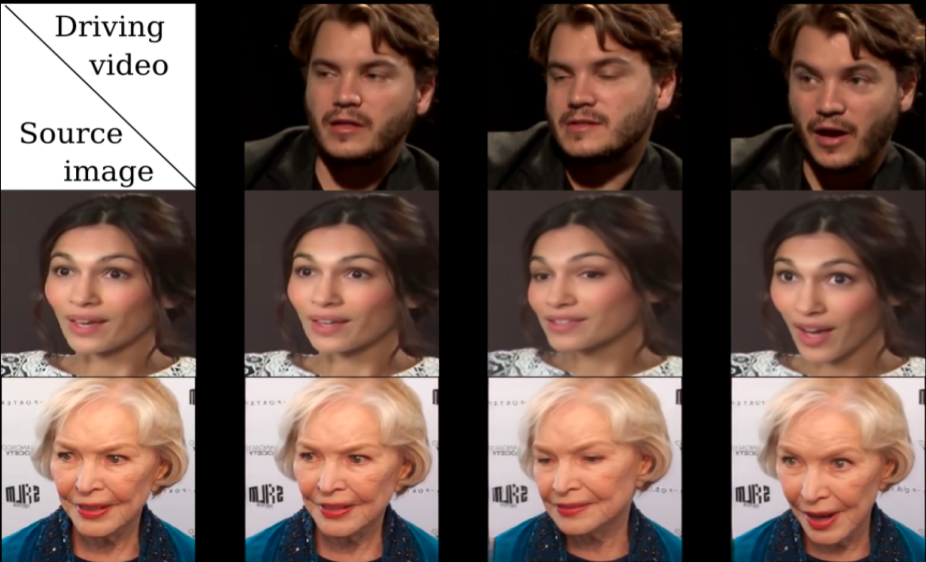

# First Order Motion

[First order motion model](https://arxiv.org/abs/2003.00196) is to complete the Image animation task, which consists of generating a video sequence so that an object in a source image is animated according to the motion of the driving video. The image below gives examples of source images with objects and driving videos containing a series of motions.

<div align="center">
  
</div>
Taking the face in the upper left corner as an example, given a source object and a driving video, a new video can be generated in which the source subject wears an expression that is derived from the driving video. Usually, we need to annotate the keypoints of the source object and train the model for facial expression transfer.

The following gif clearly expounds the principle:  

[](https://user-images.githubusercontent.com/48054808/127443878-b9369c1a-909c-4af6-8c84-a62821262910.gif)

The proposed method is not exclusively for facial expression transfer, it also supports other object with training on similar datasets. For example, you can transfer the motion of playing Tai Chi by training on Tai Chi video datasets and achieve facial expression transfer by using dataset voxceleb for training. After that, you could realize real-time image animation with the corresponding pre-training model.

## Features

- #### Multi-Faces Swapping

  - **Unique face detection algorithm that supports automatic multi-faces detection and expression swapping.**

    - We adopt PaddleGAN's face detection model [S3FD](https://github.com/PaddlePaddle/PaddleGAN/tree/develop/ppgan/faceutils/face_detection/detection) to detect all the faces in an image and transfer those expressions for multi-faces swapping.

      Specific technical steps are shown below:

       a. Use the S3FD model to detect all the faces in an image

       b. Use the First Order Motion model to do the facial expression transfer of each face

       c. Crop those "new" generated faces and put them back to the original photo

    At the same time, PaddleGAN also provides a ["faceutils" tool](https://github.com/PaddlePaddle/PaddleGAN/tree/develop/ppgan/faceutils) for face-related work, including face detection, face segmentation, keypoints detection, etc.

- #### Face Enhancement

  - **This effect significantly improves the definition of the driven video.**

- #### Abundant applications for online experience

  - 🐜**Ant Ah Hey**🐜：https://aistudio.baidu.com/aistudio/projectdetail/1603391
  - 💙**Special For Love Confession on May 20th (pronounced as I love you)**💙：https://aistudio.baidu.com/aistudio/projectdetail/1956943
  - **Smile of the Deceased(▰˘◡˘▰)**：https://aistudio.baidu.com/aistudio/projectdetail/1660701
  - 👨**Special For Father's Day**：https://aistudio.baidu.com/aistudio/projectdetail/2068655

## How to use
### 1. Quick Start: Face Detection and Effect Enhancement

Users can upload a source image with single or multiple faces and driving video, then substitute the paths of source image and driving video for the `source_image` and `driving_video` parameters respectively and run the following command. It will generate a video file named `result.mp4` in the `output` folder, which is the animated video file.

Note: For photos with multiple faces, the longer the distances between faces, the better the result quality you can get, or you could optimize the effect by adjusting ratio.

The original image and driving video here are provided for demonstration purposes, the running command is as follows:

#### Running Command：

```
cd applications/
python -u tools/first-order-demo.py  \
     --driving_video ../docs/imgs/fom_dv.mp4 \
     --source_image ../docs/imgs/fom_source_image.png \
     --ratio 0.4 \
     --relative \
     --adapt_scale \
     --image_size 512 \
     --face_enhancement \
     --multi_person
```


#### Parameters：

| Parameters       | Instructions                                                 |
| ---------------- | ------------------------------------------------------------ |
| driving_video    | driving video, the motion and expression of the driving video is to be migrated. |
| source_image     | source image, support single face and multi-faces images, the image will be animated according to the motion and expression of the driving video. |
| relative         | indicate whether the relative or absolute coordinates of the key points in the video are used in the program. It is recommended to use relative coordinates, or the characters will be distorted after animation. |
| adapt_scale      | adaptive movement scale based on convex hull of keypoints.   |
| ratio            | The pasted face percentage of generated image, this parameter should be adjusted in the case of multi-person image in which the adjacent faces are close. The default value is 0.4 and the range is [0.4, 0.5]. |
| image_size       | The image size of the face. 256 by default, 512 is supported |
| face_enhancement | enhance the face, closed by default with no parameter added. |
| multi_person     | multiple faces in the image. Default means only one face in the image |

#### 📣Result of Face Enhancement

|                            Before                            |                            After                             |
| :----------------------------------------------------------: | :----------------------------------------------------------: |
| [](https://user-images.githubusercontent.com/17897185/126444836-b68593e3-ae43-4450-b18f-1a549230bf07.gif) | [](https://user-images.githubusercontent.com/17897185/126444194-436cc885-259d-4636-ad4c-c3dcc52fe175.gif) |

### 2. Training

#### **Datasets:**

- fashion See [here](https://vision.cs.ubc.ca/datasets/fashion/)
- VoxCeleb See [here](https://github.com/AliaksandrSiarohin/video-preprocessing). Here you can process the data sizes according to your requirements. We deal with two resolution sizes: 256 and 512, the results can be seen below： [](https://github.com/PaddlePaddle/PaddleGAN/blob/develop/docs/imgs/fom_512_vs_256.png)

**Parameters:**

- dataset_name.yaml: Configure your own yaml document and parameters

- Training using single GPU:
```
export CUDA_VISIBLE_DEVICES=0
python tools/main.py --config-file configs/dataset_name.yaml
```
- Training using multiple GPUs: change the *nn.BatchNorm* in /ppgan/modules/first_order.py to *nn.SyncBatchNorm*
```
export CUDA_VISIBLE_DEVICES=0,1,2,3
python -m paddle.distributed.launch \
    tools/main.py \
    --config-file configs/dataset_name.yaml

```

**Example:**
- Training using single GPU:
```
export CUDA_VISIBLE_DEVICES=0
python tools/main.py --config-file configs/firstorder_fashion.yaml \
```
- Training using multiple GPUs:
```
export CUDA_VISIBLE_DEVICES=0,1,2,3
python -m paddle.distributed.launch \
    tools/main.py \
    --config-file configs/firstorder_fashion.yaml \
```


## Animation results

  [](https://user-images.githubusercontent.com/48054808/119469551-0a377b00-bd7a-11eb-9117-e4871c8fb9c0.gif)


### 3. Model Compression

**Prediction:**

```
cd applications/
python -u tools/first-order-demo.py  \
     --driving_video ../docs/imgs/mayiyahei.MP4 \
     --source_image ../docs/imgs/father_23.jpg \
     --config ../configs/firstorder_vox_mobile_256.yaml \
     --ratio 0.4 \
     --relative \
     --adapt_scale \
     --mobile_net
```

Currently, we use mobilenet combined with pruning to compress models, see the comparison below:

|            | Size(M) | reconstruction loss |
| ---------- | ------- | ------------------- |
| Original   | 229     | 0.041781392         |
| Compressed | 10.1    | 0.047878753         |

**Training:** First, set mode in configs/firstorder_vox_mobile_256.yaml as kp_detector, train the compressed kp_detector model, and immobilize the original  generator model. Then set mode in configs/firstorder_vox_mobile_256.yaml as generator，train the compressed generator model, and immobilize the original kp_detector model. Finally, set mode as both and modify kp_weight_path and gen_weight_path in the config to the path of trained model to train together。

```
export CUDA_VISIBLE_DEVICES=0
python tools/main.py --config-file configs/firstorder_vox_mobile_256.yaml
```


### 4. Deployment

#### 4.1 Export

Use the `tools/fom_export.py` script to export the configuration file used when the model has been deployed with the config name of `firstorder_vox_mobile_256.yml`. The export script of the model is as follows.

```
# Export FOM Model

python tools/export_model.py \
    --config-file configs/firstorder_vox_mobile_256.yaml \
    --load /root/.cache/ppgan/vox_mobile.pdparams \
    --inputs_size "1,3,256,256;1,3,256,256;1,10,2;1,10,2,2" \
    --export_model output_inference/
```

The prediction models will be exported to the directory of `output_inference/fom_dy2st/` as `model.pdiparams`,  `model.pdiparams.info`, `model.pdmodel`。

- [Pre-training Model](https://paddlegan.bj.bcebos.com/applications/first_order_model/paddle_lite/inference/lite.zip)

#### 4.2 Deployment of PaddleLite

- [Deployment of FOM model  with Paddle Lite](https://github.com/PaddlePaddle/PaddleGAN/tree/develop/deploy/lite)

- [FOM-Lite-Demo](https://paddlegan.bj.bcebos.com/applications/first_order_model/paddle_lite/apk/face_detection_demo 2.zip)。For more details, please refer to [Paddle-Lite](https://github.com/PaddlePaddle/Paddle-Lite) .

  Current problems： (a).Paddle Lite performs slightly worse than Paddle Inference，under optimization (b).Run Generator in a single thread, if the number of frames is too large, it will run at the small core rather than the large core.

## References

```
@InProceedings{Siarohin_2019_NeurIPS,
  author={Siarohin, Aliaksandr and Lathuilière, Stéphane and Tulyakov, Sergey and Ricci, Elisa and Sebe, Nicu},
  title={First Order Motion Model for Image Animation},
  booktitle = {Conference on Neural Information Processing Systems (NeurIPS)},
  month = {December},
  year = {2019}
}
```
