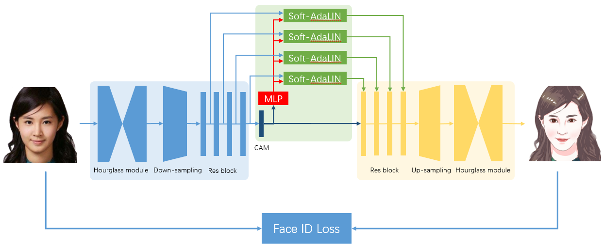
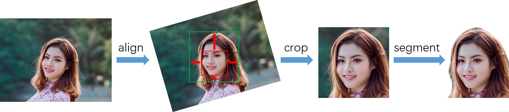

# Photo2cartoon

## 1 Principle

  The aim of portrait cartoon stylization is to transform real photos into cartoon images with portrait's ID information and texture details. We use Generative Adversarial Network method to realize the mapping of picture to cartoon. Considering the difficulty in obtaining paired data and the non-corresponding shape of input and output, we adopt unpaired image translation fashion.
  
  Recently, Kim et al. propose a novel normalization function (AdaLIN) and an attention module in paper "U-GAT-IT" and achieve exquisite selfie2anime results. Different from the exaggerated anime style, our cartoon style is more realistic and contains unequivocal ID information.
  
  We propose a Soft Adaptive Layer-Instance Normalization (Soft-AdaLIN) method which fuses the statistics of encoding features and decoding features in de-standardization. 

  Based on U-GAT-IT, two hourglass modules are introduced before encoder and after decoder to improve the performance in a progressively way.

  Different from the exaggerated anime style, our cartoon style is more realistic and contains unequivocal ID information. In original [project](https://github.com/minivision-ai/photo2cartoon), we add a Face ID Loss (cosine distance of ID features between input image and cartoon image) to reach identity invariance. (Face ID Loss is not added in this repo, please refer to photo2cartoon)

  

  We also pre-process the data to a fixed pattern to help reduce the difficulty of optimization. For details, see below.
  
  

## 2 How to use 

### 2.1 Test

  ```
  from ppgan.apps import Photo2CartoonPredictor

  p2c = Photo2CartoonPredictor()
  p2c.run('test_img.jpg')
  ```

### 2.2 Train

  Prepare Datasets:
  
  Training data contains portrait photos (domain A) and cartoon images (domain B), and can be downloaded from [baidu driver](https://pan.baidu.com/s/1RqB4MNMAY_yyXAIS3KBXqw)(password: fo8u).
  The structure of dataset is as following:
  
  ```
  ├── data
      └── photo2cartoon
          ├── trainA
          ├── trainB
          ├── testA
          └── testB
  ```

  Train:
  
  ```
     python -u tools/main.py --config-file configs/ugatit_photo2cartoon.yaml
  ```


## 3 Results


## 4 Download

| model | link |
|---|---|
| photo2cartoon_genA2B | [photo2cartoon_genA2B](https://paddlegan.bj.bcebos.com/models/photo2cartoon_genA2B_weight.pdparams)


# References

- [U-GAT-IT: Unsupervised Generative Attentional Networks with Adaptive Layer-Instance Normalization for Image-to-Image Translation](https://arxiv.org/abs/1907.10830)

  ```
  @inproceedings{Kim2020U-GAT-IT:,
    title={U-GAT-IT: Unsupervised Generative Attentional Networks with Adaptive Layer-Instance Normalization for Image-to-Image Translation},
    author={Junho Kim and Minjae Kim and Hyeonwoo Kang and Kwang Hee Lee},
    booktitle={International Conference on Learning Representations},
    year={2020}
  }
  ```


# Authors
[minivision-ai](https://github.com/minivision-ai)、[haoqiang](https://github.com/hao-qiang)
