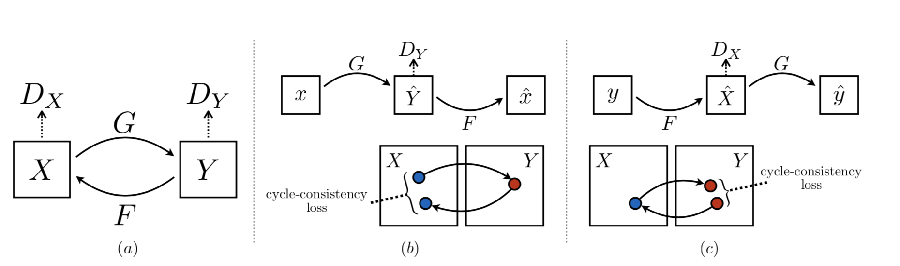

# 1 Pix2pix

## 1.1 Principle

  Pix2pix uses paired images for image translation, which has two different styles of the same image as input, can be used for style transfer. Pix2pix is encouraged by cGAN, cGAN inputs a noisy image and a condition as the supervision information to the generation network, pix2pix uses another style of image as the supervision information input into the generation network, so the fake image is related to another style of image which is input as supervision information, thus realizing the process of image translation.

## 1.2 How to use  

### 1.2.1 Prepare Datasets

  Paired datasets used by Pix2pix can be download from [here](http://efrosgans.eecs.berkeley.edu/pix2pix/datasets/)
  For example, the structure of facades is as following:
  ```
    facades
       ├── test
       ├── train
       └── val
  ```
  You can download from wget, download facades from wget for example:
  ```
    wget http://efrosgans.eecs.berkeley.edu/pix2pix/datasets/facades.tar.gz --no-check-certificate
  ```

### 1.2.2 Train/Test

  Datasets used in example is facades, you can change it to your own dataset in the config file.

  Train a model:
  ```
     python -u tools/main.py --config-file configs/pix2pix_facades.yaml
  ```

  Test the model:
  ```
     python tools/main.py --config-file configs/pix2pix_facades.yaml --evaluate-only --load ${PATH_OF_WEIGHT}
  ```

## 1.3 Results


## 1.4 模型下载
| 模型 | 数据集 | 下载地址 |
|---|---|---|
| Pix2Pix_cityscapes  | cityscapes | [Pix2Pix_cityscapes](https://paddlegan.bj.bcebos.com/models/Pix2Pix_cityscapes.pdparams)
| Pix2Pix_facedes     | facades    | [Pix2Pix_facades](https://paddlegan.bj.bcebos.com/models/Pixel2Pixel_facades.pdparams)


# 2 CycleGAN

## 2.1 Principle

   CycleGAN uses unpaired pictures for image translation, input two different images with different styles, and automatically perform style transfer. CycleGAN consists of two generators and two discriminators, generator A is inputting images of style A and outputting images of style B, generator B is inputting images of style B and outputting images of style A. The biggest difference between CycleGAN and pix2pix is that CycleGAN can realize image translation without establishing a one-to-one mapping between the source domain and the target domain.



## 2.2 How to use

### 2.2.1 Prepare Datasets

  Unpair datasets used by CycleGAN can be download from [here](https://people.eecs.berkeley.edu/~taesung_park/CycleGAN/datasets/)
  For example, the structure of cityscapes is as following:
  ```
    cityscapes
        ├── test
        ├── testA
        ├── testB
        ├── train
        ├── trainA
        └── trainB
  ```
  You can download from wget, download facades from wget for example:
  ```
    wget https://people.eecs.berkeley.edu/~taesung_park/CycleGAN/datasets/facades.zip --no-check-certificate
  ```

### 2.2.2 Train/Test

  Datasets used in example is cityscapes, you can change it to your own dataset in the config file.

  Train a model:
  ```
     python -u tools/main.py --config-file configs/cyclegan_cityscapes.yaml
  ```

  Test the model:
  ```
     python tools/main.py --config-file configs/cyclegan_cityscapes.yaml --evaluate-only --load ${PATH_OF_WEIGHT}
  ```

## 2.3 Results


## 2.4 模型下载
| 模型 | 数据集 | 下载地址 |
|---|---|---|
| CycleGAN_cityscapes  | cityscapes | [CycleGAN_cityscapes](https://paddlegan.bj.bcebos.com/models/CycleGAN_cityscapes.pdparams) |
| CycleGAN_horse2zebra | horse2zebra | [CycleGAN_horse2zebra](https://paddlegan.bj.bcebos.com/models/CycleGAN_horse2zebra.pdparams)


# References

- 1. [Image-to-Image Translation with Conditional Adversarial Networks](https://arxiv.org/abs/1611.07004)

  ```
  @inproceedings{isola2017image,
    title={Image-to-Image Translation with Conditional Adversarial Networks},
    author={Isola, Phillip and Zhu, Jun-Yan and Zhou, Tinghui and Efros, Alexei A},
    booktitle={Computer Vision and Pattern Recognition (CVPR), 2017 IEEE Conference on},
    year={2017}
  }
  ```

- 2. [Unpaired Image-to-Image Translation using Cycle-Consistent Adversarial Networks](https://arxiv.org/abs/1703.10593)

  ```
  @inproceedings{CycleGAN2017,
  title={Unpaired Image-to-Image Translation using Cycle-Consistent Adversarial Networkss},
  author={Zhu, Jun-Yan and Park, Taesung and Isola, Phillip and Efros, Alexei A},
  booktitle={Computer Vision (ICCV), 2017 IEEE International Conference on},
  year={2017}
  }
  ```
