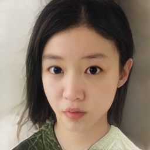

# Pixel2Style2Pixel

## Pixel2Style2Pixel introduction

The task of Pixel2Style2Pixel is image encoding. It mainly encodes an input image as the style vector of StyleGAN V2 and uses StyleGAN V2 as the decoder.

<div align="center">
  
</div>

Pixel2Style2Pixel uses a fairly large model to encode images, and encodes the image into the style vector space of StyleGAN V2, so that the image before encoding and the image after decoding have a strong correlation.

Its main functions are:

- Convert image to hidden codes
- Turn face to face
- Generate images based on sketches or segmentation results
- Convert low-resolution images to high-definition images

At present, only the models of portrait reconstruction and portrait cartoonization are realized in PaddleGAN.

## How to use

### Generate

The user could use the following command to generate and select the local image as input：

```
cd applications/
python -u tools/pixel2style2pixel.py \
       --input_image <YOUR INPUT IMAGE> \
       --output_path <DIRECTORY TO STORE OUTPUT IMAGE> \
       --weight_path <YOUR PRETRAINED MODEL PATH> \
       --model_type ffhq-inversion \
       --seed 233 \
       --size 1024 \
       --style_dim 512 \
       --n_mlp 8 \
       --channel_multiplier 2 \
       --cpu
```

**params:**
- input_image: the input image file path
- output_path: the directory where the generated images are stored
- weight_path: pretrained model path
- model_type: inner model type in PaddleGAN. If you use an existing model type, `weight_path` will have no effect.
  Currently available: `ffhq-inversion`， `ffhq-toonify`
- seed: random number seed
- size: model parameters, output image resolution
- style_dim: model parameters, dimensions of style z
- n_mlp: model parameters, the number of multi-layer perception layers for style z
- channel_multiplier: model parameters, channel product, affect model size and the quality of generated pictures
- cpu: whether to use cpu inference, if not, please remove it from the command

### Train (TODO)

In the future, training scripts will be added to facilitate users to train more types of Pixel2Style2Pixel image encoders.


## Results

Input portrait:

<div align="center">
     
</div>

Cropped portrait-Reconstructed portrait-Cartoonized portrait:

<div align="center">
    
    
     
</div>

## Reference

```
@article{richardson2020encoding,
  title={Encoding in Style: a StyleGAN Encoder for Image-to-Image Translation},
  author={Richardson, Elad and Alaluf, Yuval and Patashnik, Or and Nitzan, Yotam and Azar, Yaniv and Shapiro, Stav and Cohen-Or, Daniel},
  journal={arXiv preprint arXiv:2008.00951},
  year={2020}
}

```
