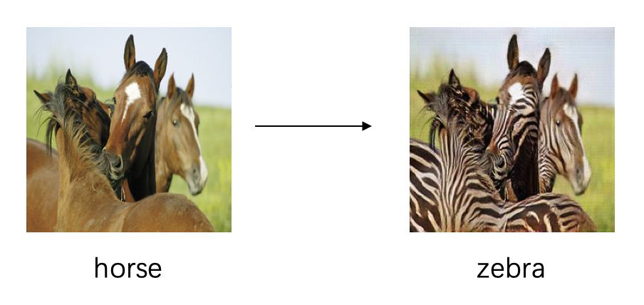

# 1 Single Image Super Resolution(SISR)

## 1.1 Principle

  Super resolution is a process of upscaling and improving the details within an image. It usually takes a low-resolution image as input and upscales the same image to a higher resolution as output.
  Here we provide four super-resolution models, namely [RealSR](https://openaccess.thecvf.com/content_CVPRW_2020/papers/w31/Ji_Real-World_Super-Resolution_via_Kernel_Estimation_and_Noise_Injection_CVPRW_2020_paper.pdf), [ESRGAN](https://arxiv.org/abs/1809.00219v2), [LESRCNN](https://arxiv.org/abs/2007.04344), [PAN](https://arxiv.org/pdf/2010.01073.pdf).

  [RealSR](https://openaccess.thecvf.com/content_CVPRW_2020/papers/w31/Ji_Real-World_Super-Resolution_via_Kernel_Estimation_and_Noise_Injection_CVPRW_2020_paper.pdf) focus on designing a novel degradation framework for realworld images by estimating various blur kernels as well as real noise distributions. Based on the novel degradation framework, we can acquire LR images sharing a common domain with real-world images. RealSR is a real-world super-resolution model aiming at better perception. Extensive experiments on synthetic noise data and real-world images demonstrate that RealSR outperforms the state-of-the-art methods, resulting in lower noise and better visual quality.

  [ESRGAN](https://arxiv.org/abs/1809.00219v2) is an enhanced SRGAN. To further enhance the visual quality of SRGAN, ESRGAN improves three key components of srgan. In addition, ESRGAN also introduces the Residual-in-Residual Dense Block (RRDB) without batch normalization as the basic network building unit, lets the discriminator predict relative realness instead of the absolute value, and improves the perceptual loss by using the features before activation. Benefiting from these improvements, the proposed ESRGAN achieves consistently better visual quality with more realistic and natural textures than SRGAN and won the first place in the PIRM2018-SR Challenge.

  Considering that the application of CNN in SISR often consume high computational cost and more memory storage for training a SR model, a lightweight enhanced SR CNN ([LESRCNN](https://arxiv.org/abs/2007.04344)) was proposed.Extensive experiments demonstrate that the proposed LESRCNN outperforms state-of-the-arts on SISR in terms of qualitative and quantitative evaluation. Then [PAN](https://arxiv.org/pdf/2010.01073.pdf) designed a lightweight convolutional neural network for image super-resolution (SR).


## 1.2 How to use  

### 1.2.1 Prepare Datasets

  A list of common image super-resolution datasets is as following:
  | Name | Datasets | Short Description | Download |
  |---|---|---|---|
  | 2K Resolution  | [DIV2K](https://data.vision.ee.ethz.ch/cvl/DIV2K/) | proposed in [NTIRE17](https://data.vision.ee.ethz.ch/cvl/ntire17//) (800 train and 100 validation) | [official website](https://data.vision.ee.ethz.ch/cvl/DIV2K/) |
  | Classical SR Testing  | Set5 | Set5 test dataset | [Google Drive](https://drive.google.com/drive/folders/1B3DJGQKB6eNdwuQIhdskA64qUuVKLZ9u) / [Baidu Drive](https://pan.baidu.com/s/1q_1ERCMqALH0xFwjLM0pTg#list/path=%2Fsharelink2016187762-785433459861126%2Fclassical_SR_datasets&parentPath=%2Fsharelink2016187762-785433459861126) |
  | Classical SR Testing  | Set14 | Set14 test dataset | [Google Drive](https://drive.google.com/drive/folders/1B3DJGQKB6eNdwuQIhdskA64qUuVKLZ9u) / [Baidu Drive](https://pan.baidu.com/s/1q_1ERCMqALH0xFwjLM0pTg#list/path=%2Fsharelink2016187762-785433459861126%2Fclassical_SR_datasets&parentPath=%2Fsharelink2016187762-785433459861126) |

  The structure of DIV2K, Set5 and Set14 is as following:
  ```
    PaddleGAN
      ├── data
          ├── DIV2K
                ├── DIV2K_train_HR
                ├── DIV2K_train_LR_bicubic
                |    ├──X2
                |    ├──X3
                |    └──X4
                ├── DIV2K_valid_HR
                ├── DIV2K_valid_LR_bicubic
              Set5
                ├── GTmod12
                ├── LRbicx2
                ├── LRbicx3
                ├── LRbicx4
                └── original
              Set14
                ├── GTmod12
                ├── LRbicx2
                ├── LRbicx3
                ├── LRbicx4
                └── original
              ...
  ```

  Use the following commands to process the DIV2K data set:
  ```
    python data/process_div2k_data.py --data-root data/DIV2K
  ```
  When the program is finished, check whether there are ``DIV2K_train_HR_sub``, ``X2_sub``, ``X3_sub`` and ``X4_sub`` directories in the DIV2K directory
  ```
    PaddleGAN
      ├── data
          ├── DIV2K
                ├── DIV2K_train_HR
                ├── DIV2K_train_HR_sub
                ├── DIV2K_train_LR_bicubic
                |    ├──X2
                |    ├──X2_sub
                |    ├──X3
                |    ├──X3_sub
                |    ├──sX4
                |    └──X4_sub
                ├── DIV2K_valid_HR
                ├── DIV2K_valid_LR_bicubic
              ...
  ```

#### Prepare dataset for realsr df2k model
  Download dataset from [NTIRE 2020 RWSR](https://competitions.codalab.org/competitions/22220#participate) and unzip it to your path.
  Unzip Corrupted-tr-x.zip and Corrupted-tr-y.zip to ``PaddleGAN/data/ntire20`` directory.

  Run the following commands:
  ```
    python ./data/realsr_preprocess/create_bicubic_dataset.py --dataset df2k --artifacts tdsr

    python ./data/realsr_preprocess/collect_noise.py --dataset df2k --artifacts tdsr
  ```

#### Prepare dataset for realsr dped model
  Download dataset from [NTIRE 2020 RWSR](https://competitions.codalab.org/competitions/22220#participate) and unzip it to your path.
  Unzip DPEDiphone-tr-x.zip and DPEDiphone-va.zip to ``PaddleGAN/data/ntire20`` directory.

  Use [KernelGAN](https://github.com/sefibk/KernelGAN) to generate kernels from source images. Clone the repo here. Replace SOURCE_PATH with specific path and run:
  ```
  python train.py --X4 --input-dir SOURCE_PATH
  ```
  for convenient, we provide [DPED_KERNEL.tar](https://paddlegan.bj.bcebos.com/datasets/DPED_KERNEL.tar). You can download it to ``PaddleGAN/data/DPED_KERNEL``

  Run the following commands:
  ```
    python ./data/realsr_preprocess/create_kernel_dataset.py --dataset dped --artifacts clean --kernel_path data/DPED_KERNEL
    python ./data/realsr_preprocess/collect_noise.py --dataset dped --artifacts clean
  ```

### 1.2.2 Train/Test

  Datasets used in example is df2k, you can change it to your own dataset in the config file. The model used in example is RealSR, you can change other models by replacing the config file.

  Train a model:
  ```
     python -u tools/main.py --config-file configs/realsr_bicubic_noise_x4_df2k.yaml
  ```

  Test the model:
  ```
     python tools/main.py --config-file configs/realsr_bicubic_noise_x4_df2k.yaml --evaluate-only --load ${PATH_OF_WEIGHT}
  ```

## 1.3 Results
Evaluated on RGB channels, scale pixels in each border are cropped before evaluation.

The metrics are PSNR / SSIM.

| Method | Set5 | Set14 | DIV2K |
|---|---|---|---|
| realsr_df2k  | 28.4385 / 0.8106 | 24.7424 / 0.6678 | 26.7306 / 0.7512 |
| realsr_dped  | 20.2421 / 0.6158 | 19.3775 / 0.5259 | 20.5976 / 0.6051 |
| realsr_merge  | 24.8315 / 0.7030 | 23.0393 / 0.5986 | 24.8510 / 0.6856 |
| lesrcnn_x4  | 31.9476 / 0.8909 | 28.4110 / 0.7770 | 30.231 / 0.8326 |
| esrgan_psnr_x4  | 32.5512 / 0.8991 | 28.8114 / 0.7871 | 30.7565 / 0.8449 |
| esrgan_x4  | 28.7647 / 0.8187 | 25.0065 / 0.6762 | 26.9013 / 0.7542 |
| pan_x4  | 30.4574 / 0.8643 | 26.7204 / 0.7434 | 28.9187 / 0.8176 |
| drns_x4  | 32.6684 / 0.8999 | 28.9037 / 0.7885 | - |

<!--  -->


## 1.4 Model Download
| Method | Dataset | Download Link |
|---|---|---|
| realsr_df2k  | df2k | [realsr_df2k](https://paddlegan.bj.bcebos.com/models/realsr_df2k.pdparams)
| realsr_dped  | dped | [realsr_dped](https://paddlegan.bj.bcebos.com/models/realsr_dped.pdparams)
| realsr_merge  | DIV2K | [realsr_merge](https://paddlegan.bj.bcebos.com/models/realsr_merge.pdparams)
| lesrcnn_x4  | DIV2K | [lesrcnn_x4](https://paddlegan.bj.bcebos.com/models/lesrcnn_x4.pdparams)
| esrgan_psnr_x4  | DIV2K | [esrgan_psnr_x4](https://paddlegan.bj.bcebos.com/models/esrgan_psnr_x4.pdparams)
| esrgan_x4  | DIV2K | [esrgan_x4](https://paddlegan.bj.bcebos.com/models/esrgan_x4.pdparams)
| pan_x4  | DIV2K | [pan_x4](https://paddlegan.bj.bcebos.com/models/pan_x4.pdparams)
| drns_x4  | DIV2K | [drns_x4](https://paddlegan.bj.bcebos.com/models/DRNSx4.pdparams)


# References

- 1. [Real-World Super-Resolution via Kernel Estimation and Noise Injection](https://openaccess.thecvf.com/content_CVPRW_2020/papers/w31/Ji_Real-World_Super-Resolution_via_Kernel_Estimation_and_Noise_Injection_CVPRW_2020_paper.pdf)

  ```
  @inproceedings{ji2020real,
  title={Real-World Super-Resolution via Kernel Estimation and Noise Injection},
  author={Ji, Xiaozhong and Cao, Yun and Tai, Ying and Wang, Chengjie and Li, Jilin and Huang, Feiyue},
  booktitle={Proceedings of the IEEE/CVF Conference on Computer Vision and Pattern Recognition Workshops},
  pages={466--467},
  year={2020}
  }
  ```

- 2. [ESRGAN: Enhanced Super-Resolution Generative Adversarial Networks](https://arxiv.org/abs/1809.00219v2)

  ```
  @inproceedings{wang2018esrgan,
  title={Esrgan: Enhanced super-resolution generative adversarial networks},
  author={Wang, Xintao and Yu, Ke and Wu, Shixiang and Gu, Jinjin and Liu, Yihao and Dong, Chao and Qiao, Yu and Change Loy, Chen},
  booktitle={Proceedings of the European Conference on Computer Vision (ECCV)},
  pages={0--0},
  year={2018}
  }
  ```

- 3. [Lightweight image super-resolution with enhanced CNN](https://arxiv.org/abs/2007.04344)

  ```
  @article{tian2020lightweight,
  title={Lightweight image super-resolution with enhanced CNN},
  author={Tian, Chunwei and Zhuge, Ruibin and Wu, Zhihao and Xu, Yong and Zuo, Wangmeng and Chen, Chen and Lin, Chia-Wen},
  journal={Knowledge-Based Systems},
  volume={205},
  pages={106235},
  year={2020},
  publisher={Elsevier}
  }
  ```

- 4. [Efficient Image Super-Resolution Using Pixel Attention](https://arxiv.org/pdf/2010.01073.pdf)

  ```
  @inproceedings{Hengyuan2020Efficient,
  title={Efficient Image Super-Resolution Using Pixel Attention},
  author={Hengyuan Zhao and Xiangtao Kong and Jingwen He and Yu Qiao and Chao Dong},
  booktitle={Computer Vision – ECCV 2020 Workshops},
  volume={12537},
  pages={56-72},
  year={2020}
  }
  ```
- 5. [Closed-loop Matters: Dual Regression Networks for Single Image Super-Resolution](https://arxiv.org/pdf/2003.07018.pdf)

  ```
  @inproceedings{guo2020closed,
  title={Closed-loop Matters: Dual Regression Networks for Single Image Super-Resolution},
  author={Guo, Yong and Chen, Jian and Wang, Jingdong and Chen, Qi and Cao, Jiezhang and Deng, Zeshuai and Xu, Yanwu and Tan, Mingkui},
  booktitle={Proceedings of the IEEE Conference on Computer Vision and Pattern Recognition},
  year={2020}
  }
  ```
