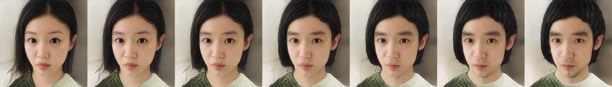
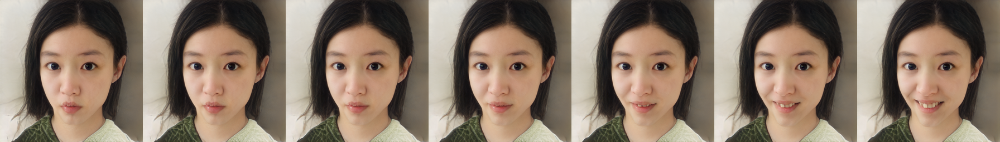
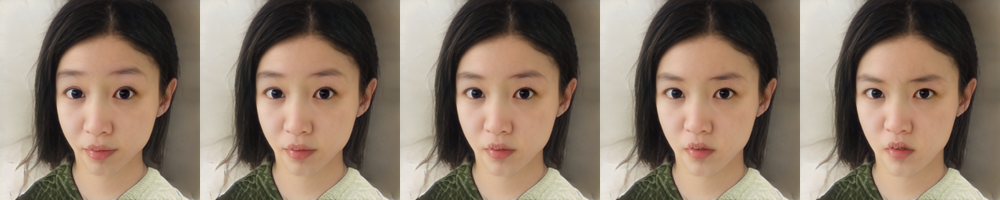
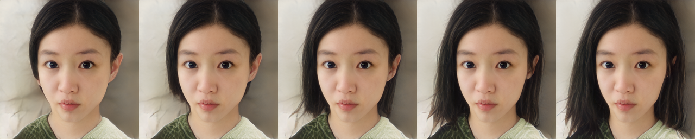
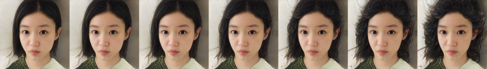
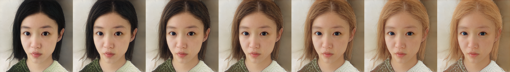

# StyleCLIP: Text-Driven Manipulation of StyleGAN Imagery

## Introduction

The task of StyleGAN V2 is image generation while the Clip guided Editing module uses the attribute manipulation vector obtained by CLIP (Contrastive Language-Image Pre-training) Model for mapping text prompts to input-agnostic directions in StyleGAN’s style space, enabling interactive text-driven image manipulation.


This model uses pretrained StyleGAN V2 generator and uses Pixel2Style2Pixel model for image encoding. At present, only the models of portrait editing (trained on FFHQ dataset) is available.

Paddle-CLIP and dlib package is needed for this module.

```
pip install -e .
pip install paddleclip
pip install dlib-bin
```

## How to use

### Editing

```
cd applications/
python -u tools/styleganv2clip.py \
       --latent <<PATH TO STYLE VECTOR> \
       --output_path <DIRECTORY TO STORE OUTPUT IMAGE> \
       --weight_path <YOUR PRETRAINED MODEL PATH> \
       --model_type ffhq-config-f \
       --size 1024 \
       --style_dim 512 \
       --n_mlp 8 \
       --channel_multiplier 2 \
       --direction_path <PATH TO STORE ATTRIBUTE DIRECTIONS> \
       --neutral <DESCRIPTION OF THE SOURCE IMAGE> \
       --target <DESCRIPTION OF THE TARGET IMAGE> \
       --beta_threshold 0.12 \
       --direction_offset 5
       --cpu
```

**params:**
- latent: The path of the style vector which represents an image. Come from `dst.npy` generated by Pixel2Style2Pixel or `dst.fitting.npy` generated by StyleGANv2 Fitting module
- output_path: the directory where the generated images are stored
- weight_path: pretrained StyleGANv2 model path
- model_type: inner model type, currently only `ffhq-config-f` is available.
- direction_path: The path of CLIP mapping vector
- stat_path: The path of latent statisitc file
- neutral: Description of the source image，for example: face
- target: Description of the target image，for example: young face
- beta_threshold:  editing threshold of the attribute channels
- direction_offset: Offset strength of the attribute
- cpu: whether to use cpu inference, if not, please remove it from the command

>inherited params for the pretrained StyleGAN model
- size: model parameters, output image resolution
- style_dim: model parameters, dimensions of style z
- n_mlp: model parameters, the number of multi-layer perception layers for style z
- channel_multiplier: model parameters, channel product, affect model size and the quality of generated pictures

### Results

Input portrait:
<div align="center">
    
</div>

with
> direction_offset = [ -1, 0, 1, 2, 3, 4, 5]
> beta_threshold = 0.1

edit from 'face' to 'boy face':

<div align="center">
    
</div>

edit from 'face' to 'happy face':

<div align="center">
    
</div>

edit from 'face' to 'angry face':

<div align="center">
    
</div>


edit from 'face' to 'face with long hair':

<div align="center">
    
</div>


edit from 'face' to 'face with curly hair':

<div align="center">
    
</div>

edit from 'head with black hair' to 'head with gold hair':

<div align="center">
    
</div>


## Make Attribute Direction Vector

For details, please refer to [Puzer/stylegan-encoder](https://github.com/Puzer/stylegan-encoder/blob/master/Learn_direction_in_latent_space.ipynb)

## Training

1. extract style latent vector stats
```
python styleclip_getf.py
```
2. calcuate mapping vector using CLIP model

```
python ppgan/apps/styleganv2clip_predictor.py extract
```

# Reference

- 1. [StyleCLIP: Text-Driven Manipulation of StyleGAN Imagery](https://arxiv.org/abs/2103.17249)

  ```
  @article{Patashnik2021StyleCLIPTM,
    title={StyleCLIP: Text-Driven Manipulation of StyleGAN Imagery},
    author={Or Patashnik and Zongze Wu and Eli Shechtman and Daniel Cohen-Or and D. Lischinski},
    journal={2021 IEEE/CVF International Conference on Computer Vision (ICCV)},
    year={2021},
    pages={2065-2074}
  }
  ```
- 2. [Encoding in Style: a StyleGAN Encoder for Image-to-Image Translation](hhttps://arxiv.org/abs/2008.00951)

  ```
  @article{richardson2020encoding,
    title={Encoding in Style: a StyleGAN Encoder for Image-to-Image Translation},
    author={Richardson, Elad and Alaluf, Yuval and Patashnik, Or and Nitzan, Yotam and Azar, Yaniv and Shapiro, Stav and Cohen-Or, Daniel},
    journal={arXiv preprint arXiv:2008.00951},
    year={2020}
  }
  ```
