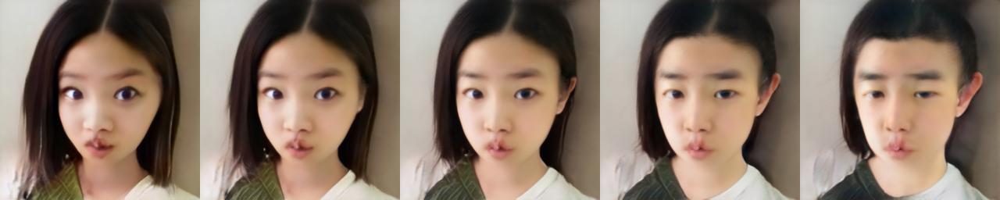

# StyleGAN V2 Editing Module

## StyleGAN V2 Editing introduction

The task of StyleGAN V2 is image generation while the Editing module uses the attribute manipulation vector obtained by pre-classifying and regressing the style vector of the multi-image to manipulate the attributes of the generated image.

## How to use

### Editing


The user can use the following command to edit images：

```
cd applications/
python -u tools/styleganv2editing.py \
       --latent <PATH TO STYLE VECTOR> \
       --output_path <DIRECTORY TO STORE OUTPUT IMAGE> \
       --weight_path <YOUR PRETRAINED MODEL PATH> \
       --model_type ffhq-config-f \
       --size 1024 \
       --style_dim 512 \
       --n_mlp 8 \
       --channel_multiplier 2 \
       --direction_path <PATH TO STORE ATTRIBUTE DIRECTIONS> \
       --direction_name <ATTRIBUTE NAME TO BE MANIPULATED> \
       --direction_offset 0.0 \
       --cpu
```

**params:**
- latent: The path of the style vector which represents an image. Come from `dst.npy` generated by Pixel2Style2Pixel or `dst.fitting.npy` generated by StyleGANv2 Fitting module
- output_path: the directory where the generated images are stored
- weight_path: pretrained model path
- model_type: inner model type in PaddleGAN. If you use an existing model type, `weight_path` will have no effect.
  Currently recommended use: `ffhq-config-f`
- size: model parameters, output image resolution
- style_dim: model parameters, dimensions of style z
- n_mlp: model parameters, the number of multi-layer perception layers for style z
- channel_multiplier: model parameters, channel product, affect model size and the quality of generated pictures
- direction_path: The path of the file storing a series of attribute names and object attribute vectors. The default is empty, that is, the file that comes with ppgan is used. If you don’t use it, please remove it from the command
- direction_name: Attribute to be manipulated，For `ffhq-conf-f`, we have: age, eyes_open, eye_distance, eye_eyebrow_distance, eye_ratio, gender, lip_ratio, mouth_open, mouth_ratio, nose_mouth_distance, nose_ratio, nose_tip, pitch, roll, smile, yaw
- direction_offset: Offset strength of the attribute
- cpu: whether to use cpu inference, if not, please remove it from the command

## Editing Results

The image corresponding to the style vector:

<div align="center">
    
</div>

The image obtained by editing the `age` attribute according to [-5,-2.5,0,2.5,5]:

<div align="center">
    
</div>

The image obtained by further editing the `gender` to the style vector obtained by the `-5` offset:

<div align="center">
    
</div>

## Make Attribute Direction Vector

For details, please refer to [Puzer/stylegan-encoder](https://github.com/Puzer/stylegan-encoder/blob/master/Learn_direction_in_latent_space.ipynb)

## Reference

- 1. [Analyzing and Improving the Image Quality of StyleGAN](https://arxiv.org/abs/1912.04958)

  ```
  @article{Karras2019stylegan2,
    title={Analyzing and Improving the Image Quality of {StyleGAN}},
    author={Tero Karras and Samuli Laine and Miika Aittala and Janne Hellsten and Jaakko Lehtinen and Timo Aila},
    booktitle={Proc. CVPR},
    year={2020}
  }
  ```
- 2. [Encoding in Style: a StyleGAN Encoder for Image-to-Image Translation](hhttps://arxiv.org/abs/2008.00951)

  ```
  @article{richardson2020encoding,
    title={Encoding in Style: a StyleGAN Encoder for Image-to-Image Translation},
    author={Richardson, Elad and Alaluf, Yuval and Patashnik, Or and Nitzan, Yotam and Azar, Yaniv and Shapiro, Stav and Cohen-Or, Daniel},
    journal={arXiv preprint arXiv:2008.00951},
    year={2020}
  }
  ```
