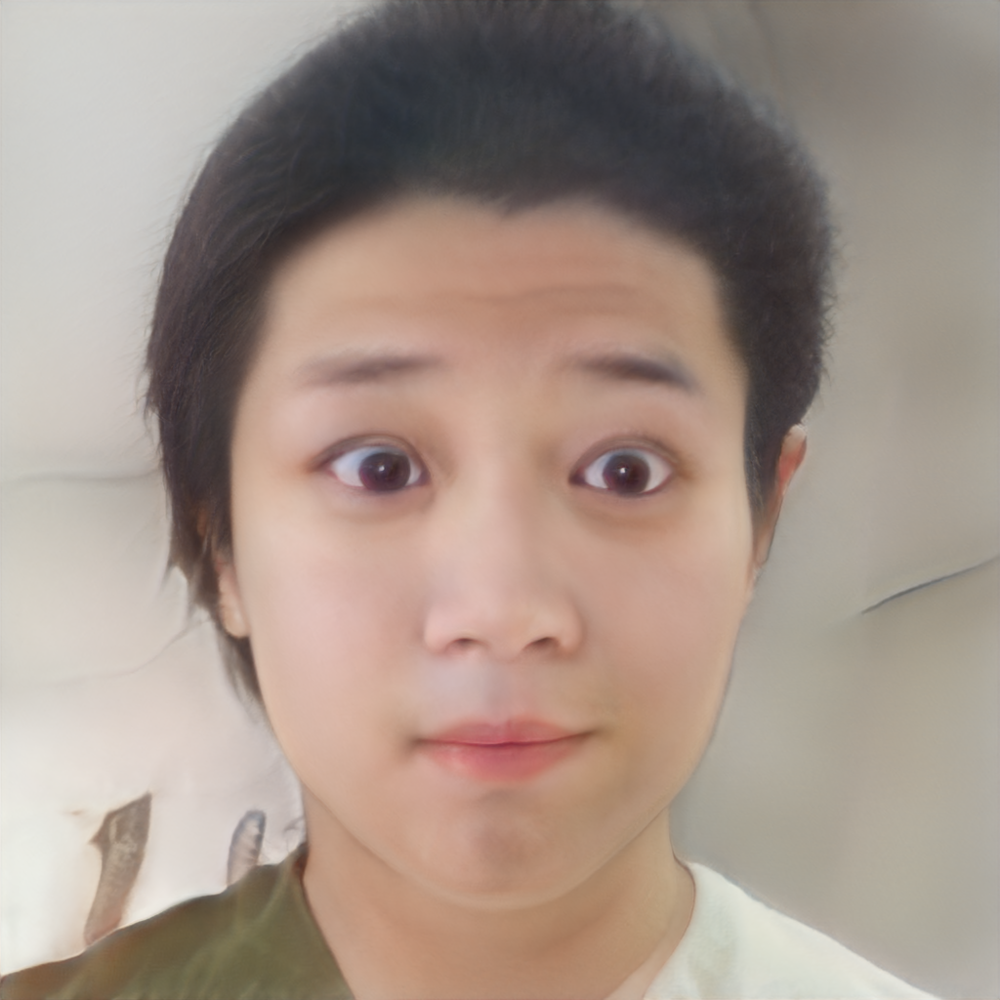

# StyleGAN V2 Mixing Module

## StyleGAN V2 Mixing introduction

The task of StyleGAN V2 is image generation while the Mixing module uses its style vector to achieve the mixing of two generated images with different levels and different proportions.

## How to use

### Mixing


The user can use the following command to mix images：

```
cd applications/
python -u tools/styleganv2mixing.py \
       --latent1 <PATH TO FIRST STYLE VECTOR> \
       --latent2 <PATH TO SECOND STYLE VECTOR> \
       --weights \
                 0.5 0.5 0.5 0.5 0.5 0.5 \
                 0.5 0.5 0.5 0.5 0.5 0.5 \
                 0.5 0.5 0.5 0.5 0.5 0.5 \
       --output_path <DIRECTORY TO STORE OUTPUT IMAGE> \
       --weight_path <YOUR PRETRAINED MODEL PATH> \
       --model_type ffhq-config-f \
       --size 1024 \
       --style_dim 512 \
       --n_mlp 8 \
       --channel_multiplier 2 \
       --cpu
```

**params:**
- latent1: The path of the first style vector. Come from `dst.npy` generated by Pixel2Style2Pixel or `dst.fitting.npy` generated by StyleGANv2 Fitting module
- latent2: The path of the second style vector. The source is the same as the first style vector
- weights: The two style vectors are mixed in different proportions at different levels. For a resolution of 1024, there are 18 levels. For a resolution of 512, there are 16 levels, and so on.
  The more in front, the more it affects the whole of the mixed image. The more behind, the more it affects the details of the mixed image. In the figure below we show the fusion results of different weights for reference.
- output_path: the directory where the generated images are stored
- weight_path: pretrained model path
- model_type: inner model type in PaddleGAN. If you use an existing model type, `weight_path` will have no effect.
  Currently recommended use: `ffhq-config-f`
- size: model parameters, output image resolution
- style_dim: model parameters, dimensions of style z
- n_mlp: model parameters, the number of multi-layer perception layers for style z
- channel_multiplier: model parameters, channel product, affect model size and the quality of generated pictures
- cpu: whether to use cpu inference, if not, please remove it from the command

## Mixing Results

The image corresponding to the first style vector:

<div align="center">
    
</div>

The image corresponding to the second style vector:

<div align="center">
    
</div>

The result of mixing two style vectors in a specific ratio:

<div align="center">
    
</div>

## Results with different weight
The image corresponding to the first style vector:

<div align="center">
    
</div>

The image corresponding to the second style vector:

<div align="center">
    
</div>

The result of mixing two style vectors with different weight:
<div align="center">
    
</div>


## Reference

- 1. [Analyzing and Improving the Image Quality of StyleGAN](https://arxiv.org/abs/1912.04958)

  ```
  @article{Karras2019stylegan2,
    title={Analyzing and Improving the Image Quality of {StyleGAN}},
    author={Tero Karras and Samuli Laine and Miika Aittala and Janne Hellsten and Jaakko Lehtinen and Timo Aila},
    booktitle={Proc. CVPR},
    year={2020}
  }
  ```
- 2. [Encoding in Style: a StyleGAN Encoder for Image-to-Image Translation](hhttps://arxiv.org/abs/2008.00951)

  ```
  @article{richardson2020encoding,
    title={Encoding in Style: a StyleGAN Encoder for Image-to-Image Translation},
    author={Richardson, Elad and Alaluf, Yuval and Patashnik, Or and Nitzan, Yotam and Azar, Yaniv and Shapiro, Stav and Cohen-Or, Daniel},
    journal={arXiv preprint arXiv:2008.00951},
    year={2020}
  }
  ```
