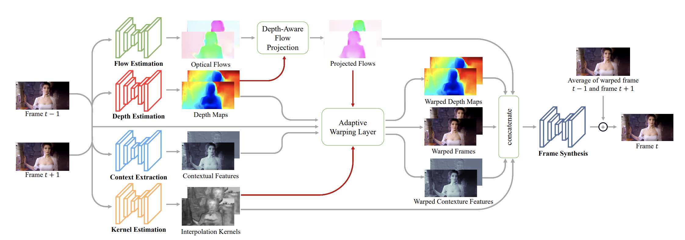
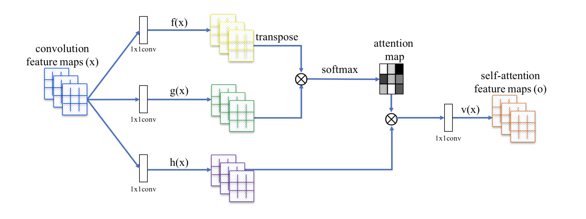
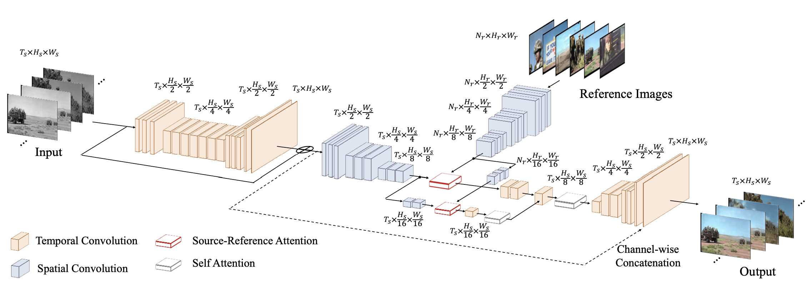
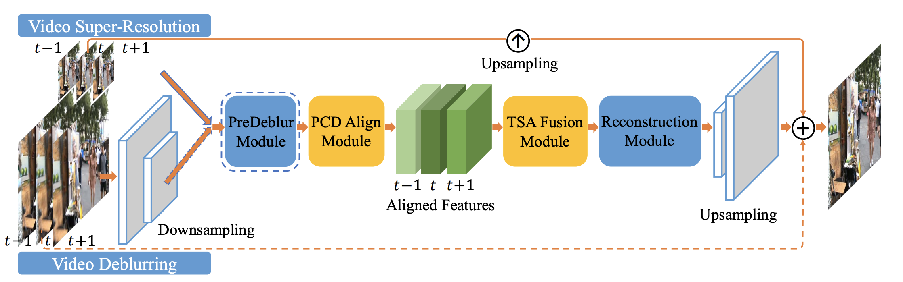

## Old Video Restoration

Old video often has the characteristics of few frames, no color, low resolution. Therefore, in view of these characteristics, we use the complementary frame, coloring, super resolution model to restore the video.

### Using 'video-enhance.py' in 'applications' for quick start video restoration
```
cd applications
python tools/video-enhance.py --input you_video_path.mp4 --process_order DAIN DeOldify EDVR --output output_dir
```
#### Parameters

- `--input (str)`: path of the input video.
- `--output (str)`: path of the output video.
- `--process_order`: name and order of called model. For example, if the input is `DAIN DeOldify EDVR`, then `DAINPredictor` `DeOldifyPredictor` `EDVRPredictor` will be called in sequence.

#### Results


### Quick experience
We made an [ai studio old Beijing video restoration tutorial](https://aistudio.baidu.com/aistudio/projectdetail/1161285) in ai studio.

### Points for attention

* Before using this tutorial, please make sure that you have [installed paddle and ppgan](../install.md).

* All commands in this tutorial are executed based on the 'PaddleGAN/applications' home directory.

* Each model takes a long time, especially for the super-resolution model. It is recommended that the resolution of input video should be lower and the time should be shorter.

* It needs to run on GPU environment.

### Brief introduction of ppgan's prediction API for video restoration
Different models and parameters can be used according to the characteristics of the video to be restored.

### Complementary frame model -- DAIN
The Dain model can detect occlusion explicitly by exploring the depth information. A depth aware stream projection layer is developed to synthesize intermediate streams in this model. It has a good effect in video complementary frame.


```
ppgan.apps.DAINPredictor(
                        output='output',
                        weight_path=None,
                        time_step=None,
                        use_gpu=True,
                        remove_duplicates=False)
```
#### Parameters

- `output (str, Optional)`: path of your output, default: `output`.
- `weight_path (None, Optional)`: path of your model weight. If it is not set, the default weight will be downloaded from the cloud to the local. Default: `None`.
- `time_step (int)`: time coefficient of the complementary frame. If it is set to 0.5 and the original video is 30 frames per second, it will become 60 frames per second after complementary frame.
- `remove_duplicates (bool, Optional)`: whether remove duplicate frames, default: `False`.

### Coloring model -- DeOldifyPredictor
DeOldify is generative adversarial networks with self attention mechanism. And the generator is a u-net structure. this model has a good effect in image coloring.


```
ppgan.apps.DeOldifyPredictor(output='output', weight_path=None, render_factor=32)
```
#### Parameters

- `output (str, Optional)`: path of your output, default: `output`.
- `weight_path (None, Optional)`: path of your model weight. If it is not set, the default weight will be downloaded from the cloud to the local. Default: `None`.
- `artistic (bool)`: whether use "artistic" model. The "artistic" model may produce some interesting colors, but there are more burrs.
- `render_factor (int)`: this parameter is multiplied by 16 as the resize value of the input frame. If the value is set to 32, the input frame will be resized to (32 * 16, 32 * 16) and then input into the network.

### Coloring model -- eepRemasterPredictor
DeepRemaster model is based on spatial-temporal convolutional neural network and self attention mechanism. And the picture can be colored according to any number of input reference frames.


```
ppgan.apps.DeepRemasterPredictor(
                                output='output',
                                weight_path=None,
                                colorization=False,
                                reference_dir=None,
                                mindim=360):
```
#### Parameters

- `output (str, Optional)`: path of your output, default: `output`.
- `weight_path (None, Optional)`: path of your model weight. If it is not set, the default weight will be downloaded from the cloud to the local. Default: `None`.
- `colorization (bool)`: whether color the input video. If the option is set to `True`, the path of the reference frame must also be set. Default: `False`.
- `reference_dir (bool)`: path of the reference frame, default: `None`.
- `mindim (bool)`: size of the short side of the input frame after resize, default: `360`.

### Super resolution model -- RealSRPredictor
RealSR model focus on designing a novel degradation framework for realworld images by estimating various blur kernels as well as real noise distributions. Based on the novel degradation framework, we can acquire LR images sharing a common domain with real-world images. RealSR is a real-world super-resolution model aiming at better perception. Extensive experiments on synthetic noise data and real-world images demonstrate that RealSR outperforms the state-of-the-art methods, resulting in lower noise and better visual quality.


```
ppgan.apps.RealSRPredictor(output='output', weight_path=None)
```
#### Parameters

- `output (str, Optional)`: path of your output, default: `output`.
- `weight_path (None, Optional)`: path of your model weight. If it is not set, the default weight will be downloaded from the cloud to the local. Default: `None`.

### Super resolution model -- EDVRPredictor
EDVR model proposes a novel video restoration framework with enhanced deformable convolution. First, to handle large motions, it devise a Pyramid, Cascading and Deformable (PCD) alignment module, in which frame alignment is done at the feature level using deformable convolutions in a coarse-to-fine manner. Second, it propose a Temporal and Spatial Attention (TSA) fusion module, in which attention is applied both temporally and spatially, so as to emphasize important features for subsequent restoration.

EDVR model is a super resolution model based on continuous frames, which can effectively use the information between frames and is faster than RealSR model.



```
ppgan.apps.EDVRPredictor(output='output', weight_path=None)
```
#### Parameters

- `output (str, Optional)`: path of your output, default: `output`.
- `weight_path (None, Optional)`: path of your model weight. If it is not set, the default weight will be downloaded from the cloud to the local. Default: `None`.

### Video super-resolution model -- BasicVSRPredictor & IconVSRPredictor
BasicVSR is a generic and efficient baseline for VSR. With minimal redesigns of existing components including optical flow and residual blocks, it outperforms existing state of the arts with high efficiency. BasicVSR adopts a typical bidirectional recurrent network. The upsampling module U contains multiple pixel-shuffle and convolutions. The red and blue colors represent the backward and forward propagations, respectively. The propagation branches contain only generic components. S, W, and R refer to the flow estimation module, spatial warping module, and residual blocks, respectively.


```
ppgan.apps.BasiVSRPredictor(output='output', weight_path=None, num_frames=10)
ppgan.apps.IconVSRPredictor(output='output', weight_path=None, num_frames=10)
```
#### Parameters

- `output (str, Optional)`: path of your output, default: `output`.
- `weight_path (None, Optional)`: path of your model weight. If it is not set, the default weight will be downloaded from the cloud to the local. Default: `None`.
- `num_frames (10, Optional)`: the number of video frames input at a time. Default: `10`.


### Video super-resolution model -- BasicVSRPlusPlusPredictor
BasicVSR++ consists of two effective modifications for improving propagation and alignment. The proposed second-order grid propagation and flow-guided deformable alignment allow BasicVSR++ to significantly outperform existing state of the arts with comparable runtime. BasicVSR++ won 3 champions and 1 runner-up in NTIRE 2021 Video Restoration and Enhancement Challenge.


```
ppgan.apps.BasiVSRPlusPlusPredictor(output='output', weight_path=None, num_frames=10)
```
#### Parameters

- `output (str, Optional)`: path of your output, default: `output`.
- `weight_path (None, Optional)`: path of your model weight. If it is not set, the default weight will be downloaded from the cloud to the local. Default: `None`.
- `num_frames (10, Optional)`: the number of video frames input at a time. Default: `10`.


### Video super-resolution model -- BasicVSRPlusPlusPredictor
BasicVSR++ consists of two effective modifications for improving propagation and alignment. The proposed second-order grid propagation and flow-guided deformable alignment allow BasicVSR++ to significantly outperform existing state of the arts with comparable runtime. BasicVSR++ won 3 champions and 1 runner-up in NTIRE 2021 Video Restoration and Enhancement Challenge.


```
ppgan.apps.BasiVSRPlusPlusPredictor(output='output', weight_path=None, num_frames=10)
```
#### Parameters

- `output (str, Optional)`: path of your output, default: `output`.
- `weight_path (None, Optional)`: path of your model weight. If it is not set, the default weight will be downloaded from the cloud to the local. Default: `None`.
- `num_frames (10, Optional)`: the number of video frames input at a time. Default: `10`.


### Video super-resolution model -- PPMSVSRPredictor
PP-MSVSR proposes local fusion module, auxiliary loss and re-align module to refine the enhanced result progressively.


```
ppgan.apps.PPMSVSRPredictor(output='output', weight_path=None, num_frames=10)
ppgan.apps.PPMSVSRLargePredictor(output='output', weight_path=None, num_frames=10)
```
#### Parameters

- `output (str, Optional)`: path of your output, default: `output`.
- `weight_path (None, Optional)`: path of your model weight. If it is not set, the default weight will be downloaded from the cloud to the local. Default: `None`.
- `num_frames (10, Optional)`: the number of video frames input at a time. Default: `10`.
