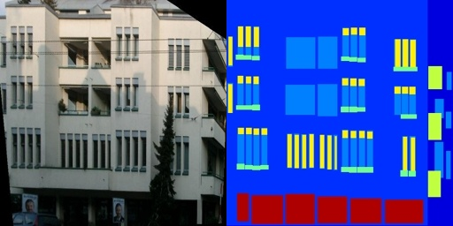

# 数据准备

## 1. 数据集路径配置

现有的配置默认数据集的路径是在`$PaddleGAN/data`下，目录结构如下图所示。如果你已经下载好数据集了，建议将数据集软链接到 `$PaddleGAN/data`。

```
PaddleGAN
|-- configs
|-- data
|   |-- cityscapes
|   |   ├── test
|   |   ├── testA
|   |   ├── testB
|   |   ├── train
|   |   ├── trainA
|   |   └── trainB
|   ├── horse2zebra
|   |   ├── testA
|   |   ├── testB
|   |   ├── trainA
|   |   └── trainB
|   └── facades
|       ├── test
|       ├── train
|       └── val
|-- docs
|-- ppgan
|-- tools

```

如果将数据集放在其他位置，比如 ```your/data/path```，
你可以修改配置文件中的 ```dataroot``` 参数:

```
dataset:
  train:
    name: PairedDataset
    dataroot: your/data/path
    num_workers: 4
```

## 2. 准备数据集

### 2.1 下载数据集

#### 2.1.1 CycleGAN模型相关的数据集下载

- #### 从网页下载


CycleGAN模型相关的数据集可以在[这里](https://people.eecs.berkeley.edu/~taesung_park/CycleGAN/datasets/)下载，下载后记得软连接到 ```PaddleGAN/data/``` 下。

- #### 使用脚本下载


我们在 ```PaddleGAN/data``` 文件夹下提供了一个脚本 ```download_cyclegan_data.py``` 方便下载CycleGAN相关的
数据集。

目前支持下载的数据集名称有：apple2orange, summer2winter_yosemite,horse2zebra, monet2photo, cezanne2photo, ukiyoe2photo, vangogh2photo, maps, cityscapes, facades, iphone2dslr_flower, ae_photos, cityscapes

执行如下命令，可以下载对应的数据集到 ```~/.cache/ppgan``` 并软连接到 ```PaddleGAN/data/``` 下。

```
python data/download_cyclegan_data.py --name horse2zebra
```

#### 2.1.2 Pix2Pix相关的数据集下载

- #### 从网页下载


pixel2pixel模型相关的数据集可以在[这里](https://people.eecs.berkeley.edu/~tinghuiz/projects/pix2pix/datasets/)下载，下载后记得软连接到 ```PaddleGAN/data/``` 下。

- #### 使用脚本下载


我们在 ```PaddleGAN/data``` 文件夹下提供了一个脚本 ```download_pix2pix_data.py``` 方便下载pix2pix模型相关的数据集。

目前支持下载的数据集名称有：apple2orange, summer2winter_yosemite,horse2zebra, monet2photo, cezanne2photo, ukiyoe2photo, vangogh2photo, maps, cityscapes, facades, iphone2dslr_flower, ae_photos, cityscapes。

同理，执行如下命令，可以下载对应的数据集到 ```~/.cache/ppgan``` 并软连接到 ```PaddleGAN/data/``` 下。

```
python data/download_pix2pix_data.py --name cityscapes
```

### 2.2 自制数据集

#### 2.2.1非成对数据集构建

针对不需成对数据训练的模型，如CycleGAN等，如需使用自己的数据集，需要构造成如下目录的格式。

注意 ```xxxA```，```xxxB```文件数量，文件内容无需一一对应。

```
custom_datasets
├── testA
├── testB
├── trainA
└── trainB
```

### 2.2.2 成对数据集构建

针对需要成对数据训练的模型，如Pixel2Pixel等，如需使用自己的数据集，需要构造成如下目录的格式。

注意图片应该制作成下图的样式，即左边为一种风格，另一边为相应转换的风格。

```
facades
├── test
├── train
└── val
```


