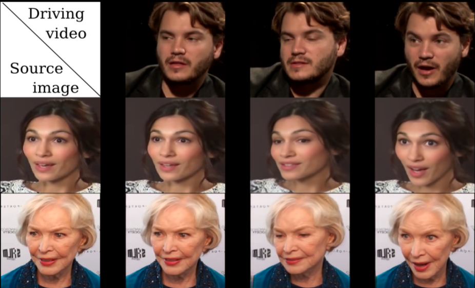

# First Order Motion

First Order Motion的任务是图像动画/Image Animation，即输入为一张源图片和一个驱动视频，源图片中的人物则会做出驱动视频中的动作。如下图所示，源图像通常包含一个主体，驱动视频包含一系列动作。

<div align="center">
  
</div>
以左上角的人脸表情迁移为例，给定一个源人物，给定一个驱动视频，可以生成一个视频，其中主体是源人物，视频中源人物的表情是由驱动视频中的表情所确定的。通常情况下，我们需要对源人物进行人脸关键点标注、进行表情迁移的模型训练。

用下图可以简单阐述其中原理：

<div align="center">
  
</div>

不仅可以做脸部表情动作迁移，这篇文章提出的方法只需要在同类别物体的数据集上进行训练即可，比如实现太极动作迁移就用太极视频数据集进行训练，想要达到表情迁移的效果就使用人脸视频数据集voxceleb进行训练。训练好后，我们使用对应的预训练模型就可以达到前言中实时image animation的操作。

## 特点

- #### 支持多人脸同时驱动

  - **独家引入人脸检测算法，自动检测多人脸，实现多人脸表情同时驱动。**

    - 使用PaddleGAN提供的[人脸检测算法S3FD](https://github.com/PaddlePaddle/PaddleGAN/tree/develop/ppgan/faceutils/face_detection/detection)，将照片中多个人脸检测出来并进行表情迁移，实现多人同时换脸。

      具体技术原理：

    1. 使用S3FD人脸检测模型将照片中的每张人脸检测出来并抠出
    2. 使用First Order Motion模型对抠出的每张人脸进行脸部表情迁移
    3. 将完成表情迁移的人脸进行适当剪裁后贴回原照片位置

    同时，PaddleGAN针对人脸的相关处理提供[faceutil工具](https://github.com/PaddlePaddle/PaddleGAN/tree/develop/ppgan/faceutils)，包括人脸检测、五官分割、关键点检测等能力。

- #### 新增人脸增强效果

  - **人脸增强特效使得驱动后的视频中人脸清晰度大大提升。**

- #### 丰富的在线体验应用

  - 🐜**蚂蚁呀嘿**🐜：https://aistudio.baidu.com/aistudio/projectdetail/1603391
  - 💙**520告白特辑**💙：https://aistudio.baidu.com/aistudio/projectdetail/1956943
  - **复刻故人的微笑(▰˘◡˘▰)**：https://aistudio.baidu.com/aistudio/projectdetail/1660701
  - 👨**父亲节特辑**：https://aistudio.baidu.com/aistudio/projectdetail/2068655

## 使用方法
### 1. 人脸检测与效果增强
用户可上传一张单人/多人照片与驱动视频，并在如下命令中的`source_image`参数和`driving_video`参数分别换成自己的图片和视频路径，然后运行如下命令，即可完成单人/多人脸动作表情迁移，运行结果为命名为result.mp4的视频文件，保存在output文件夹中。

注意：使用多人脸时，尽量使用人脸间距较大的照片，效果更佳，也可通过手动调节ratio进行效果优化。

本项目中提供了原始图片和驱动视频供展示使用，运行的命令如下：

#### 运行命令如下：

```
cd applications/
python -u tools/first-order-demo.py  \
     --driving_video ../docs/imgs/fom_dv.mp4 \
     --source_image ../docs/imgs/fom_source_image.png \
     --ratio 0.4 \
     --relative \
     --adapt_scale \
     --image_size 512 \
     --face_enhancement \
     --multi_person
```
#### 参数说明：

| 参数             | 使用说明                                                     |
| ---------------- | ------------------------------------------------------------ |
| driving_video    | 驱动视频，视频中人物的表情动作作为待迁移的对象。             |
| source_image     | 原始图片，支持单人图片和多人图片，视频中人物的表情动作将迁移到该原始图片中的人物上。 |
| relative         | 指示程序中使用视频和图片中人物关键点的相对坐标还是绝对坐标，建议使用相对坐标，若使用绝对坐标，会导致迁移后人物扭曲变形。 |
| adapt_scale      | 根据关键点凸包自适应运动尺度。                               |
| ratio            | 贴回驱动生成的人脸区域占原图的比例, 用户需要根据生成的效果调整该参数，尤其对于多人脸距离比较近的情况下需要调整改参数, 默认为0.4，调整范围是[0.4, 0.5]。 |
| image_size       | 图片人脸大小，默认为256，可设置为512.                        |
| face_enhancement | 添加人脸增强，不添加参数默认为不使用增强功能                 |
| multi_person     | 当图片中有多张人脸请添加此参数，不加则默认为单人脸           |

#### 📣新增脸部增强功能

|                          人脸增强前                          |                          人脸增强后                          |
| :----------------------------------------------------------: | :----------------------------------------------------------: |
|  |  |

### 2. 模型训练
#### **数据集:**

- fashion 可以参考[这里](https://vision.cs.ubc.ca/datasets/fashion/)
- VoxCeleb 可以参考[这里](https://github.com/AliaksandrSiarohin/video-preprocessing). 将数据按照需求处理为想要的大小，即可开始训练，这里我们处理了256和512两种分辨率大小，结果对比如下：


#### **参数说明:**

- dataset_name.yaml: 需要配置自己的yaml文件及参数

- GPU单卡训练:
```
export CUDA_VISIBLE_DEVICES=0
python tools/main.py --config-file configs/dataset_name.yaml
```
- GPU多卡训练:
```
export CUDA_VISIBLE_DEVICES=0,1,2,3
python -m paddle.distributed.launch \
    tools/main.py \
    --config-file configs/dataset_name.yaml \

```

**例如:**
- GPU单卡训练:
```
export CUDA_VISIBLE_DEVICES=0
python tools/main.py --config-file configs/firstorder_fashion.yaml
```
- GPU多卡训练:
```
export CUDA_VISIBLE_DEVICES=0,1,2,3
python -m paddle.distributed.launch \
    tools/main.py \
    --config-file configs/firstorder_fashion.yaml \
```

## 生成结果展示

<div align='center'>
  
</div>


## 参考文献

```
@InProceedings{Siarohin_2019_NeurIPS,
  author={Siarohin, Aliaksandr and Lathuilière, Stéphane and Tulyakov, Sergey and Ricci, Elisa and Sebe, Nicu},
  title={First Order Motion Model for Image Animation},
  booktitle = {Conference on Neural Information Processing Systems (NeurIPS)},
  month = {December},
  year = {2019}
}

```
