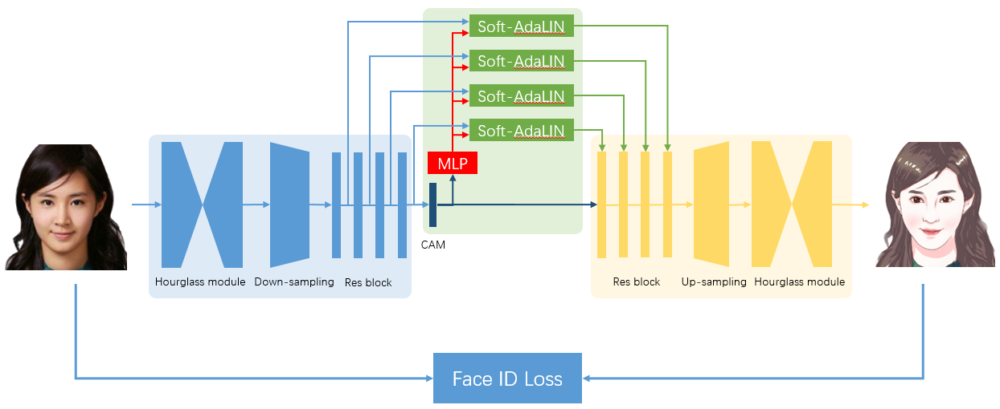

# Photo2cartoon

## 1 原理介绍

  人像卡通风格渲染的目标是，在保持原图像ID信息和纹理细节的同时，将真实照片转换为卡通风格的非真实感图像。一般而言，基于成对数据的pix2pix方法能达到较好的图像转换效果，但本任务的输入输出轮廓并非一一对应，例如卡通风格的眼睛更大、下巴更瘦；且成对的数据绘制难度大、成本较高，因此我们采用unpaired image translation方法来实现。
  
  近期的论文U-GAT-IT提出了一种归一化方法——AdaLIN，能够自动调节Instance Norm和Layer Norm的比重，再结合attention机制能够实现精美的人像日漫风格转换。为了实现写实的人像卡通化风格，我们对U-GAT-IT进行了定制化的修改。
  
  我们提出了一种Soft-AdaLIN（Soft Adaptive Layer-Instance Normalization）归一化方法，在反规范化时将编码器的均值方差（照片特征）与解码器的均值方差（卡通特征）相融合。

  模型结构方面，在U-GAT-IT的基础上，我们在编码器之前和解码器之后各增加了2个hourglass模块，渐进地提升模型特征抽象和重建能力。

  在[原项目](https://github.com/minivision-ai/photo2cartoon)中我们还增加了Face ID Loss，使用预训练的人脸识别模型提取照片和卡通画的ID特征，通过余弦距离来约束生成的卡通画，使其更像本人。(paddle版本中暂时未加入Face ID Loss，请参见原项目)

  

  由于实验数据较为匮乏，为了降低训练难度，我们将数据处理成固定的模式。首先检测图像中的人脸及关键点，根据人脸关键点旋转校正图像，并按统一标准裁剪，再将裁剪后的头像输入人像分割模型（基于PaddleSeg框架训练）去除背景。
  
  

## 2 如何使用

### 2.1 测试
  ```
  from ppgan.apps import Photo2CartoonPredictor

  p2c = Photo2CartoonPredictor()
  p2c.run('test_img.jpg')
  ```

### 2.2 训练

  数据准备：
  
  模型使用非成对数据训练，下载地址:[百度网盘](https://pan.baidu.com/s/1RqB4MNMAY_yyXAIS3KBXqw)，提取码：fo8u。
  数据集组成方式如下：
  ```
  ├── data
      └── photo2cartoon
          ├── trainA
          ├── trainB
          ├── testA
          └── testB
  ```

  训练模型：
  ```
     python -u tools/main.py --config-file configs/ugatit_photo2cartoon.yaml
  ```


## 3 结果展示


## 4 模型下载
| 模型 | 下载地址 |
|---|---|
| photo2cartoon_genA2B | [下载链接](https://paddlegan.bj.bcebos.com/models/photo2cartoon_genA2B_weight.pdparams)


# 参考

- [U-GAT-IT: Unsupervised Generative Attentional Networks with Adaptive Layer-Instance Normalization for Image-to-Image Translation](https://arxiv.org/abs/1907.10830)

  ```
  @inproceedings{Kim2020U-GAT-IT:,
    title={U-GAT-IT: Unsupervised Generative Attentional Networks with Adaptive Layer-Instance Normalization for Image-to-Image Translation},
    author={Junho Kim and Minjae Kim and Hyeonwoo Kang and Kwang Hee Lee},
    booktitle={International Conference on Learning Representations},
    year={2020}
  }
  ```


# 作者
[minivision-ai](https://github.com/minivision-ai)、[haoqiang](https://github.com/hao-qiang)
