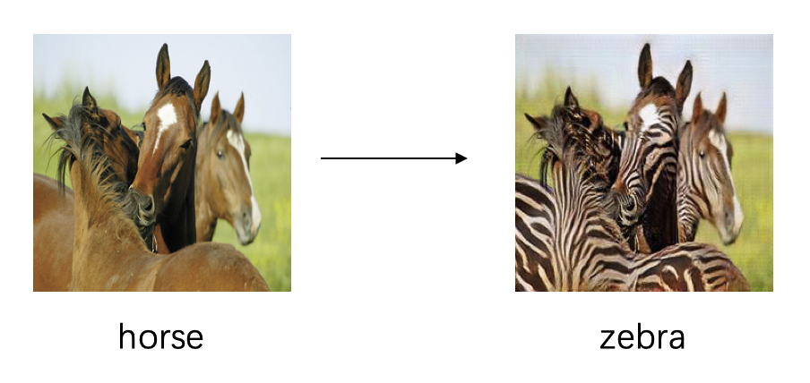

# 1 Pix2pix

## 1.1 原理介绍

  Pix2pix利用成对的图片进行图像翻译，即输入为同一张图片的两种不同风格，可用于进行风格迁移。Pix2pix是在cGAN的基础上进行改进的，cGAN的生成网络不仅会输入一个噪声图片，同时还会输入一个条件作为监督信息，pix2pix则是把另外一种风格的图像作为监督信息输入生成网络中，这样生成的fake图像就会和作为监督信息的另一种风格的图像相关，从而实现了图像翻译的过程。
  

## 1.2 如何使用

### 1.2.1 数据准备

  Pix2pix使用成对数据作为训练数据，训练数据可以从[这里](http://efrosgans.eecs.berkeley.edu/pix2pix/datasets/)下载。
  例如，pix2pix所使用的facades数据的组成形式为：
  ```
    facades
       ├── test
       ├── train
       └── val
  ```

  也可以通过wget的方式进行数据下载，例如facades数据集的下载方式为:
  ```
    wget http://efrosgans.eecs.berkeley.edu/pix2pix/datasets/facades.tar.gz --no-check-certificate
  ```

### 1.2.2 训练/测试
  示例以facades数据为例。如果您想使用自己的数据集，可以在配置文件中修改数据集为您自己的数据集。

  训练模型：
  ```
     python -u tools/main.py --config-file configs/pix2pix_facades.yaml
  ```

  测试模型：
  ```
     python tools/main.py --config-file configs/pix2pix_facades.yaml --evaluate-only --load ${PATH_OF_WEIGHT}
  ```

## 1.3 结果展示



## 1.4 模型下载
| 模型 | 数据集 | 下载地址 |
|---|---|---|
| Pix2Pix_cityscapes  | cityscapes | [Pix2Pix_cityscapes](https://paddlegan.bj.bcebos.com/models/Pix2Pix_cityscapes.pdparams)
| Pix2Pix_facedes     | facades    | [Pix2Pix_facades](https://paddlegan.bj.bcebos.com/models/Pixel2Pixel_facades.pdparams)


# 2 CycleGAN

## 2.1 原理介绍

  CycleGAN可以利用非成对的图片进行图像翻译，即输入为两种不同风格的不同图片，自动进行风格转换。CycleGAN由两个生成网络和两个判别网络组成，生成网络A是输入A类风格的图片输出B类风格的图片，生成网络B是输入B类风格的图片输出A类风格的图片。CycleGAN和pix2pix最大的不同就是CycleGAN在源域和目标域之间无需建立数据间一对一的映射就可以实现图像翻译。

## 2.2 如何使用

### 2.2.1 数据准备

  CycleGAN使用的是非成对的数据，训练数据可以从[这里](https://people.eecs.berkeley.edu/~taesung_park/CycleGAN/datasets/)下载。
  例如，cycleGAN所使用的cityscapes数据的组成形式为：
  ```
    cityscapes
        ├── test
        ├── testA
        ├── testB
        ├── train
        ├── trainA
        └── trainB
  ```

  也可以通过wget的方式进行数据下载，例如facades数据集的下载方式为:
  ```
    wget https://people.eecs.berkeley.edu/~taesung_park/CycleGAN/datasets/facades.zip --no-check-certificate
  ```

### 2.2.2 训练/测试

  示例以cityscapes数据为例。如果您想使用自己的数据集，可以在配置文件中修改数据集为您自己的数据集。

  训练模型:
  ```
     python -u tools/main.py --config-file configs/cyclegan_cityscapes.yaml
  ```

  测试模型:
  ```
     python tools/main.py --config-file configs/cyclegan_cityscapes.yaml --evaluate-only --load ${PATH_OF_WEIGHT}
  ```

## 2.3 结果展示


## 2.4 模型下载
| 模型 | 数据集 | 下载地址 |
|---|---|---|
| CycleGAN_cityscapes  | cityscapes | [CycleGAN_cityscapes](https://paddlegan.bj.bcebos.com/models/CycleGAN_cityscapes.pdparams) |
| CycleGAN_horse2zebra | horse2zebra | [CycleGAN_horse2zebra](https://paddlegan.bj.bcebos.com/models/CycleGAN_horse2zebra.pdparams)


# 参考：

- 1. [Image-to-Image Translation with Conditional Adversarial Networks](https://arxiv.org/abs/1611.07004)

  ```
  @inproceedings{isola2017image,
    title={Image-to-Image Translation with Conditional Adversarial Networks},
    author={Isola, Phillip and Zhu, Jun-Yan and Zhou, Tinghui and Efros, Alexei A},
    booktitle={Computer Vision and Pattern Recognition (CVPR), 2017 IEEE Conference on},
    year={2017}
  }
  ```


- 2. [Unpaired Image-to-Image Translation using Cycle-Consistent Adversarial Networks](https://arxiv.org/abs/1703.10593)

  ```
  @inproceedings{CycleGAN2017,
  title={Unpaired Image-to-Image Translation using Cycle-Consistent Adversarial Networkss},
  author={Zhu, Jun-Yan and Park, Taesung and Isola, Phillip and Efros, Alexei A},
  booktitle={Computer Vision (ICCV), 2017 IEEE International Conference on},
  year={2017}
  }
  ```
