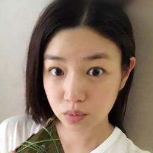
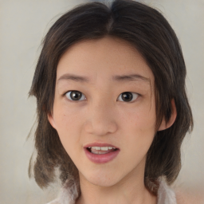

# Pixel2Style2Pixel

## Pixel2Style2Pixel 原理

Pixel2Style2Pixel 的任务是image encoding。它主要是将图像编码为StyleGAN V2的风格向量，将StyleGAN V2当作解码器。

<div align="center">
  
</div>

Pixel2Style2Pixel使用相当大的模型对图像进行编码，将图像编码到StyleGAN V2的风格向量空间中，使编码前的图像和解码后的图像具有强关联性。

它的主要功能有:

- 将图像转成隐藏编码
- 将人脸转正
- 根据草图或者分割结果生成图像
- 将低分辨率图像转成高清图像

目前在PaddleGAN中实现了人像重建和人像卡通化的模型。

## 使用方法

### 生成

用户使用如下命令中进行生成，选择本地图像作为输入：

```
cd applications/
python -u tools/pixel2style2pixel.py \
       --input_image <替换为输入的图像路径> \
       --output_path <替换为生成图片存放的文件夹> \
       --weight_path <替换为你的预训练模型路径> \
       --model_type ffhq-inversion \
       --seed 233 \
       --size 1024 \
       --style_dim 512 \
       --n_mlp 8 \
       --channel_multiplier 2 \
       --cpu
```

**参数说明:**
- input_image: 输入的图像路径
- output_path: 生成图片存放的文件夹
- weight_path: 预训练模型路径
- model_type: PaddleGAN内置模型类型，若输入PaddleGAN已存在的模型类型，`weight_path`将失效。
  当前可用: `ffhq-inversion`， `ffhq-toonify`
- seed: 随机数种子
- size: 模型参数，输出图片的分辨率
- style_dim: 模型参数，风格z的维度
- n_mlp: 模型参数，风格z所输入的多层感知层的层数
- channel_multiplier: 模型参数，通道乘积，影响模型大小和生成图片质量
- cpu: 是否使用cpu推理，若不使用，请在命令中去除

### 训练(TODO)

未来还将添加训练脚本方便用户训练出更多类型的 Pixel2Style2Pixel 图像编码器。


## 生成结果展示

输入人像:

<div align="center">
     
</div>

裁剪人像-重建人像-卡通化人像:

<div align="center">
    
    
     
</div>

## 参考文献

```
@article{richardson2020encoding,
  title={Encoding in Style: a StyleGAN Encoder for Image-to-Image Translation},
  author={Richardson, Elad and Alaluf, Yuval and Patashnik, Or and Nitzan, Yotam and Azar, Yaniv and Shapiro, Stav and Cohen-Or, Daniel},
  journal={arXiv preprint arXiv:2008.00951},
  year={2020}
}

```
