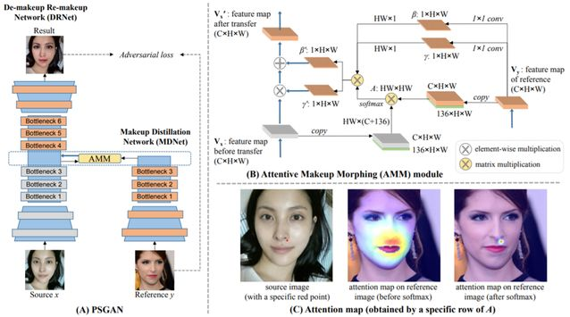

# PSGAN

## 1. PSGAN原理

[PSGAN](https://arxiv.org/abs/1909.06956)模型的任务是妆容迁移， 即将任意参照图像上的妆容迁移到不带妆容的源图像上。很多人像美化应用都需要这种技术。近来的一些妆容迁移方法大都基于生成对抗网络（GAN）。它们通常采用 CycleGAN 的框架，并在两个数据集上进行训练，即无妆容图像和有妆容图像。但是，现有的方法存在一个局限性：只在正面人脸图像上表现良好，没有为处理源图像和参照图像之间的姿态和表情差异专门设计模块。PSGAN是一种全新的姿态稳健可感知空间的生成对抗网络。PSGAN 主要分为三部分：妆容提炼网络（MDNet）、注意式妆容变形（AMM）模块和卸妆-再化妆网络（DRNet）。这三种新提出的模块能让 PSGAN 具备上述的完美妆容迁移模型所应具备的能力。

<div align="center">
  
</div>

## 2. 使用方法
### 2.1 测试
预训练模型可以从如下地址下载: [psgan_weight](https://paddlegan.bj.bcebos.com/models/psgan_weight.pdparams)

运行如下命令，就可以完成妆容迁移，程序运行成功后，会在当前文件夹生成妆容迁移后的图片文件。本项目中提供了原始图片和参考供展示使用，具体命令如下所示：

```
python tools/psgan_infer.py \  
  --config-file configs/makeup.yaml \
  --model_path /your/model/path \
  --source_path  docs/imgs/ps_source.png  \
  --reference_dir docs/imgs/ref \
  --evaluate-only
```
**参数说明:**
- config-file: PSGAN网络到参数配置文件，格式为yaml
- model_path: 训练完成保存下来网络权重文件的路径
- source_path: 未化妆的原始图片文件全路径，包含图片文件名字
- reference_dir: 化妆的参考图片文件路径，不包含图片文件名字

### 2.2 训练
1. 从百度网盘下载原始换妆数据[data](https://pan.baidu.com/s/1ZF-DN9PvbBteOSfQodWnyw)(密码:rtdd)到PaddleGAN文件夹, 并解压
2. 下载landmarks数据[lmks](https://paddlegan.bj.bcebos.com/landmarks.tar)，并解压
3. 运行如下命令进行文件夹及文件替换:
```
rm -rf MT-Dataset/landmarks/makeup && mv landmarks/makeup MT-Dataset/landmarks/
rm -rf MT-Dataset/landmarks/non-makeup && mv landmarks/non-makeup MT-Dataset/landmarks/
cp landmarks/train_makeup.txt MT-Dataset/train_makeup.txt
cp landmarks/train_non-makeup.txt MT-Dataset/train_non-makeup.txt
```

最后数据集目录如下所示：
```
data/MT-Dataset
├── images
│   ├── makeup
│   └── non-makeup
├── landmarks
│   ├── makeup
│   └── non-makeup
├── train_makeup.txt
├── train_non-makeup.txt
├── segs
│   ├── makeup
│   └── non-makeup
```

4. `python tools/main.py --config-file configs/makeup.yaml` ，训练参数设置参考makeup.yaml.
单卡batch_size=1训练部分log如下所示：
```
[10/29 05:39:40] ppgan.engine.trainer INFO: Epoch: 0, iters: 0 lr: 0.000200 D_A: 0.448 G_A: 0.973 rec: 1.258 idt: 0.624 D_B: 0.436 G_B: 0.889 G_A_his: 0.402 G_B_his: 0.472 G_bg_consis: 0.030 A_vgg: 0.027 B_vgg: 0.040 reader cost: 2.45463s batch cost: 4.20075s
[10/29 05:40:00] ppgan.engine.trainer INFO: Epoch: 0, iters: 10 lr: 0.000200 D_A: 0.200 G_A: 0.488 rec: 0.954 idt: 0.539 D_B: 0.179 G_B: 0.767 G_A_his: 0.224 G_B_his: 0.266 G_bg_consis: 0.033 A_vgg: 0.019 B_vgg: 0.026 reader cost: 0.55506s batch cost: 1.95968s
[10/29 05:40:22] ppgan.engine.trainer INFO: Epoch: 0, iters: 20 lr: 0.000200 D_A: 0.340 G_A: 0.339 rec: 1.293 idt: 0.698 D_B: 0.124 G_B: 0.174 G_A_his: 0.302 G_B_his: 0.233 G_bg_consis: 0.061 A_vgg: 0.032 B_vgg: 0.045 reader cost: 0.74937s batch cost: 2.13529s
[10/29 05:40:42] ppgan.engine.trainer INFO: Epoch: 0, iters: 30 lr: 0.000200 D_A: 0.238 G_A: 0.276 rec: 0.907 idt: 0.449 D_B: 0.324 G_B: 0.292 G_A_his: 0.263 G_B_his: 0.380 G_bg_consis: 0.029 A_vgg: 0.040 B_vgg: 0.049 reader cost: 0.69248s batch cost: 2.06999s
[10/29 05:41:03] ppgan.engine.trainer INFO: Epoch: 0, iters: 40 lr: 0.000200 D_A: 0.236 G_A: 0.111 rec: 0.865 idt: 0.470 D_B: 0.237 G_B: 0.465 G_A_his: 0.289 G_B_his: 0.211 G_bg_consis: 0.021 A_vgg: 0.042 B_vgg: 0.049 reader cost: 0.65904s batch cost: 2.07197s
[10/29 05:41:23] ppgan.engine.trainer INFO: Epoch: 0, iters: 50 lr: 0.000200 D_A: 0.341 G_A: 0.073 rec: 0.698 idt: 0.424 D_B: 0.153 G_B: 0.731 G_A_his: 0.198 G_B_his: 0.180 G_bg_consis: 0.019 A_vgg: 0.032 B_vgg: 0.047 reader cost: 0.52772s batch cost: 1.92949s
[10/29 05:41:43] ppgan.engine.trainer INFO: Epoch: 0, iters: 60 lr: 0.000200 D_A: 0.267 G_A: 0.475 rec: 0.843 idt: 0.462 D_B: 0.266 G_B: 0.534 G_A_his: 0.259 G_B_his: 0.219 G_bg_consis: 0.024 A_vgg: 0.031 B_vgg: 0.041 reader cost: 0.58212s batch cost: 2.02212s
[10/29 05:42:03] ppgan.engine.trainer INFO: Epoch: 0, iters: 70 lr: 0.000200 D_A: 0.116 G_A: 0.298 rec: 0.983 idt: 0.543 D_B: 0.097 G_B: 0.233 G_A_his: 0.210 G_B_his: 0.169 G_bg_consis: 0.046 A_vgg: 0.028 B_vgg: 0.034 reader cost: 0.56367s batch cost: 1.97049s
[10/29 05:42:23] ppgan.engine.trainer INFO: Epoch: 0, iters: 80 lr: 0.000200 D_A: 0.325 G_A: 0.339 rec: 0.744 idt: 0.417 D_B: 0.292 G_B: 0.310 G_A_his: 0.189 G_B_his: 0.206 G_bg_consis: 0.016 A_vgg: 0.029 B_vgg: 0.034 reader cost: 0.60760s batch cost: 2.04126s
[10/29 05:42:43] ppgan.engine.trainer INFO: Epoch: 0, iters: 90 lr: 0.000200 D_A: 0.177 G_A: 0.308 rec: 0.970 idt: 0.494 D_B: 0.199 G_B: 0.813 G_A_his: 0.116 G_B_his: 0.153 G_bg_consis: 0.036 A_vgg: 0.019 B_vgg: 0.042 reader cost: 0.62142s batch cost: 1.96606s
[10/29 05:43:03] ppgan.engine.trainer INFO: Epoch: 0, iters: 100 lr: 0.000200 D_A: 0.178 G_A: 0.382 rec: 1.358 idt: 0.607 D_B: 0.265 G_B: 0.405 G_A_his: 0.086 G_B_his: 0.161 G_bg_consis: 0.060 A_vgg: 0.025 B_vgg: 0.047 reader cost: 0.63939s batch cost: 2.00111s
```
注意：训练时makeup.yaml文件中`isTrain`参数值为`True`, 测试时修改该参数值为`False` .

### 2.3 模型
Model|Dataset|BatchSize|Inference speed|Download
---|:--:|:--:|:--:|:--:
PSGAN|MT-Dataset| 1 | 1.9s(GPU:P40) | [model](https://paddlegan.bj.bcebos.com/models/psgan_weight.pdparams)

## 3. 妆容迁移结果展示


### 4. 参考文献

```
@InProceedings{Jiang_2020_CVPR,
  author = {Jiang, Wentao and Liu, Si and Gao, Chen and Cao, Jie and He, Ran and Feng, Jiashi and Yan, Shuicheng},
  title = {PSGAN: Pose and Expression Robust Spatial-Aware GAN for Customizable Makeup Transfer},
  booktitle = {IEEE/CVF Conference on Computer Vision and Pattern Recognition (CVPR)},
  month = {June},
  year = {2020}
}
```
