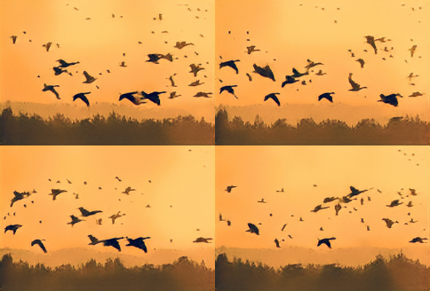
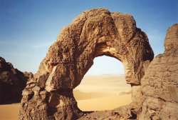
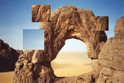
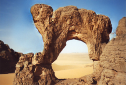
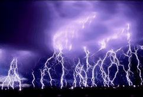
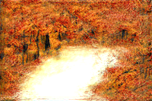

# SinGAN

## 简介

SinGAN是一种新的可以从单个自然图像中学习的无条件生成模型。该模型包含一个全卷积生成对抗网络的金字塔结构，每个生成对抗网络负责学习不同在不同比例的图像上的块分布。这允许生成任意大小和纵横比的新样本，具有显著的可变性，但同时保持训练图像的全局结构和精细纹理。与以往单一图像生成方案相比，该方法不局限于纹理图像，也没有条件（即从噪声中生成样本）。

## 使用方法

### 配置说明

我们为SinGAN提供了4个配置文件：

- `singan_universal.yaml`
- `singan_sr.yaml`
- `singan_animation.yaml`
- `singan_finetune.yaml`

其中`singan_universal.yaml`对所有任务都适用配置，`singan_sr.yaml`是官方建议的用于超分任务的配置，`singan_animation.yaml`是官方建议的用于“静图转动”任务的配置。本文档展示的结果均由`singan_universal.yaml`训练而来。对于手绘转照片任务，使用`singan_universal.yaml`训练后再用`singan_finetune.yaml`微调会得到更好的结果。

### 训练

启动训练：

```bash
python tools/main.py -c PaddleGAN/configs/singan_universal.yaml\
                     -o model.train_image=训练图片.png
```

为“手绘转照片”任务微调：

```bash
python tools/main.py -c configs/singan_finetune.yaml \
                     -o model.train_image=训练图片.png \
                     --load 已经训练好的模型.pdparams
```


### 导出生成器权重

训练结束后，需要使用 ``tools/extract_weight.py`` 来从训练模型（包含了生成器和判别器）中提取生成器的权重来给`applications/tools/singan.py`进行推理。

```bash
python tools/extract_weight.py 训练过程中保存的权重文件.pdparams --net-name netG --output 生成器权重文件.pdparams
```

### 推理及结果展示

#### 随机采样

```bash
python applications/tools/singan.py \
       --weight_path 生成器权重文件.pdparams \
       --mode random_sample \
       --scale_v 1 \ # 垂直缩放比例
       --scale_h 1 \ # 水平缩放比例
       --n_row 2 \
       --n_col 2
```

|训练图片|随机采样结果|
| ---- | ---- |
|||

#### 图像编辑&风格和谐化

```bash
python applications/tools/singan.py \
       --weight_path 生成器权重文件.pdparams \
       --mode editing \ # 或者 harmonization
       --ref_image 编辑后的图片.png \
       --mask_image 编辑区域标注图片.png \
       --generate_start_scale 2
```


|训练图片|编辑图片|编辑区域标注|SinGAN生成|
|----|----|----|----|
|||||

#### 超分

```bash
python applications/tools/singan.py \
       --weight_path 生成器权重文件.pdparams \
       --mode sr \
       --ref_image 待超分的图片亦即用于训练的图片.png \
       --sr_factor 4
```
|训练图片|超分结果|
| ---- | ---- |
|||


#### 静图转动

```bash
python applications/tools/singan.py \
       --weight_path 生成器权重文件.pdparams \
       --mode animation \
       --animation_alpha 0.6 \ # 这个参数决定了动画与训练图像的接近程度
       --animation_beta 0.7 \ # 这个参数决定了动画的连续程度
       --animation_frames 20 \ # 生成的动画的总帧数
       --animation_duration 0.1	# 动画的每一帧停留时长
```

|训练图片|动画效果|
| ---- | ---- |
|||


#### 手绘转照片
```bash
python applications/tools/singan.py \
       --weight_path 生成器权重文件.pdparams \
       --mode paint2image \
       --ref_image 手绘图片.png \
       --generate_start_scale 2
```
|训练图片|手绘图片|SinGAN生成|SinGAN微调后生成|
|----|----|----|----|
|||||

## 参考文献

```
@misc{shaham2019singan,
      title={SinGAN: Learning a Generative Model from a Single Natural Image}, 
      author={Tamar Rott Shaham and Tali Dekel and Tomer Michaeli},
      year={2019},
      eprint={1905.01164},
      archivePrefix={arXiv},
      primaryClass={cs.CV}
}
```

