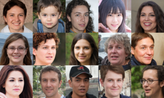
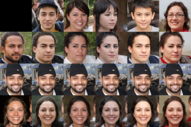

# StyleGAN V2

## StyleGAN V2 原理

StyleGAN V2 的任务是image generation，给定特定长度的向量，生成该向量对应的图像，是StyleGAN的升级版，解决了StyleGAN生成的伪像等问题。

<div align="center">
  
</div>

StyleGAN V2 可对多级风格向量进行混合。其内核是自适应的风格解耦。

相对于StyleGAN，其主要改进为:

- 生成的图像质量明显更好(FID分数更高、artifacts减少)
- 提出替代渐进式训练的新方法，牙齿、眼睛等细节更完美
- 改善了风格混合
- 更平滑的插值
- 训练速度更快

## 使用方法

### 生成

用户使用如下命令中进行生成，可通过替换seed的值或去掉seed生成不同的结果：

```
cd applications/
python -u tools/styleganv2.py \
       --output_path <替换为生成图片存放的文件夹> \
       --weight_path <替换为你的预训练模型路径> \
       --model_type ffhq-config-f \
       --seed 233 \
       --size 1024 \
       --style_dim 512 \
       --n_mlp 8 \
       --channel_multiplier 2 \
       --n_row 3 \
       --n_col 5 \
       --cpu
```

**参数说明:**
- output_path: 生成图片存放的文件夹
- weight_path: 预训练模型路径
- model_type: PaddleGAN内置模型类型，若输入PaddleGAN已存在的模型类型，`weight_path`将失效。
  当前可用: `ffhq-config-f`， `animeface-512`
- seed: 随机数种子
- size: 模型参数，输出图片的分辨率
- style_dim: 模型参数，风格z的维度
- n_mlp: 模型参数，风格z所输入的多层感知层的层数
- channel_multiplier: 模型参数，通道乘积，影响模型大小和生成图片质量
- n_row: 采样的图片的行数
- n_col: 采样的图片的列数
- cpu: 是否使用cpu推理，若不使用，请在命令中去除

### 训练

#### 准备数据集
你可以从[这里](https://drive.google.com/drive/folders/1u2xu7bSrWxrbUxk-dT-UvEJq8IjdmNTP)下载对应的数据集

为了方便，我们提供了[images256x256.tar](https://paddlegan.bj.bcebos.com/datasets/images256x256.tar)

目前的配置文件默认数据集的结构如下:
  ```
    PaddleGAN
      ├── data
          ├── ffhq
                ├──images1024x1024
                      ├── 00000.png
                      ├── 00001.png
                      ├── 00002.png
                      ├── 00003.png
                      ├── 00004.png
                 ├──images256x256
                      ├── 00000.png
                      ├── 00001.png
                      ├── 00002.png
                      ├── 00003.png
                      ├── 00004.png
         ├──custom_data
              ├── img0.png
              ├── img1.png
              ├── img2.png
              ├── img3.png
              ├── img4.png
              ...
  ```

启动训练
```
python tools/main.py -c configs/stylegan_v2_256_ffhq.yaml
```

### 推理

训练结束后，需要使用 ``tools/extract_weight.py`` 来提取对应的权重给``applications/tools/styleganv2.py``来进行推理.
```
python tools/extract_weight.py output_dir/YOUR_TRAINED_WEIGHT.pdparams --net-name gen_ema --output YOUR_WEIGHT_PATH.pdparams
```

```
python tools/styleganv2.py --output_path stylegan01 --weight_path YOUR_WEIGHT_PATH.pdparams --size 256
```

注意: ``--size`` 这个参数要和配置文件中的参数保持一致.


## 生成结果展示

随机采样结果:



随机风格插值结果:




## 参考文献

```
@inproceedings{Karras2019stylegan2,
  title     = {Analyzing and Improving the Image Quality of {StyleGAN}},
  author    = {Tero Karras and Samuli Laine and Miika Aittala and Janne Hellsten and Jaakko Lehtinen and Timo Aila},
  booktitle = {Proc. CVPR},
  year      = {2020}
}

```
