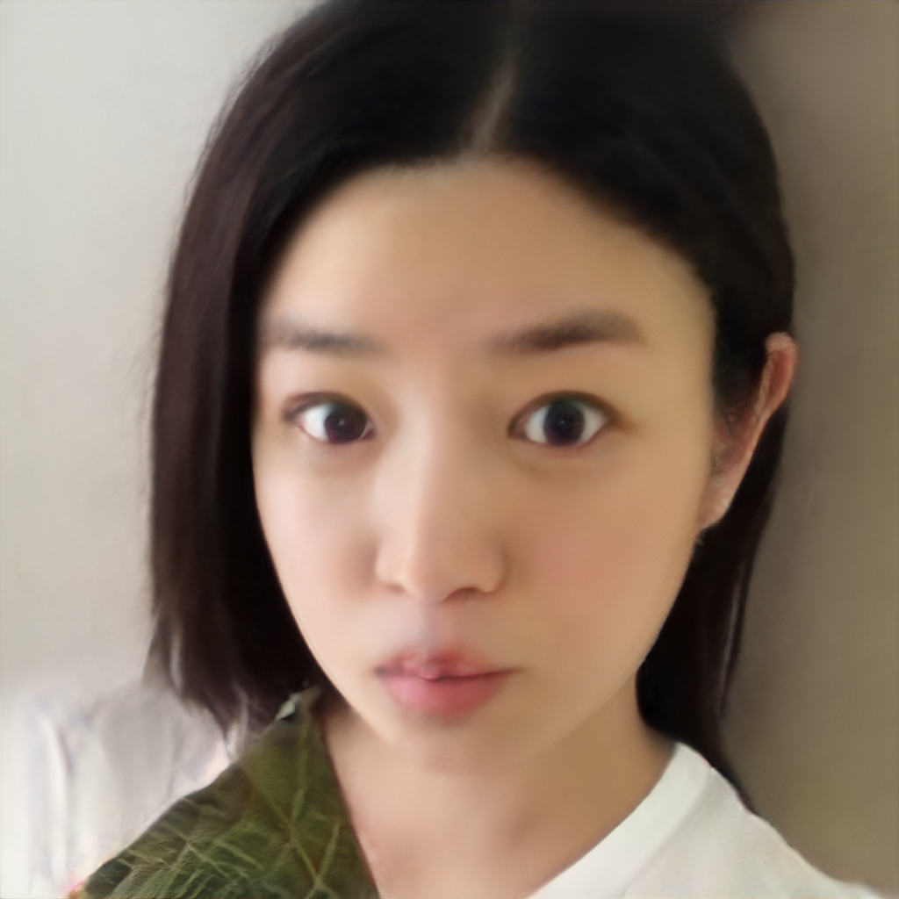

# StyleGAN V2 Editing 模块

## StyleGAN V2 Editing 原理

StyleGAN V2 的任务是使用风格向量进行image generation，而Editing模块则是利用预先对多图的风格向量进行分类回归得到的属性操纵向量来操纵生成图像的属性

## 使用方法

### 编辑

用户使用如下命令中对图像属性进行编辑：

```
cd applications/
python -u tools/styleganv2editing.py \
       --latent <替换为要编辑的风格向量的路径> \
       --output_path <替换为生成图片存放的文件夹> \
       --weight_path <替换为你的预训练模型路径> \
       --model_type ffhq-config-f \
       --size 1024 \
       --style_dim 512 \
       --n_mlp 8 \
       --channel_multiplier 2 \
       --direction_path <替换为存放属性向量的文件路径> \
       --direction_name <替换为你操纵的属性名称> \
       --direction_offset 0.0 \
       --cpu
```

**参数说明:**
- latent: 要编辑的代表图像的风格向量的路径。可来自于Pixel2Style2Pixel生成的`dst.npy`或StyleGANv2 Fitting模块生成的`dst.fitting.npy`
- latent2: 第二个风格向量的路径。来源同第一个风格向量
- output_path: 生成图片存放的文件夹
- weight_path: 预训练模型路径
- model_type: PaddleGAN内置模型类型，若输入PaddleGAN已存在的模型类型，`weight_path`将失效。当前建议使用: `ffhq-config-f`
- size: 模型参数，输出图片的分辨率
- style_dim: 模型参数，风格z的维度
- n_mlp: 模型参数，风格z所输入的多层感知层的层数
- channel_multiplier: 模型参数，通道乘积，影响模型大小和生成图片质量
- direction_path: 存放一系列属性名称及对象属性向量的文件的路径。默认为空，即使用ppgan自带的文件。若不使用，请在命令中去除
- direction_name: 要编辑的属性名称，对于`ffhq-conf-f`有预先准备的这些属性: age、eyes_open、eye_distance、eye_eyebrow_distance、eye_ratio、gender、lip_ratio、mouth_open、mouth_ratio、nose_mouth_distance、nose_ratio、nose_tip、pitch、roll、smile、yaw
- direction_offset: 属性的偏移强度
- cpu: 是否使用cpu推理，若不使用，请在命令中去除

## 编辑结果展示

风格向量对应的图像:

<div align="center">
    
</div>

按[-5,-2.5,0,2.5,5]进行`age`(年龄)属性编辑得到的图像:

<div align="center">
    
</div>

对`-5`偏移得到的风格向量进一步进行`gender`(性别)编辑得到的图像:

<div align="center">
    
</div>

## 制作属性向量

具体可以参考[Puzer/stylegan-encoder](https://github.com/Puzer/stylegan-encoder/blob/master/Learn_direction_in_latent_space.ipynb)中的做法。


# 参考文献

- 1. [Analyzing and Improving the Image Quality of StyleGAN](https://arxiv.org/abs/1912.04958)

  ```
  @article{Karras2019stylegan2,
    title={Analyzing and Improving the Image Quality of {StyleGAN}},
    author={Tero Karras and Samuli Laine and Miika Aittala and Janne Hellsten and Jaakko Lehtinen and Timo Aila},
    booktitle={Proc. CVPR},
    year={2020}
  }
  ```
- 2. [Encoding in Style: a StyleGAN Encoder for Image-to-Image Translation](hhttps://arxiv.org/abs/2008.00951)

  ```
  @article{richardson2020encoding,
    title={Encoding in Style: a StyleGAN Encoder for Image-to-Image Translation},
    author={Richardson, Elad and Alaluf, Yuval and Patashnik, Or and Nitzan, Yotam and Azar, Yaniv and Shapiro, Stav and Cohen-Or, Daniel},
    journal={arXiv preprint arXiv:2008.00951},
    year={2020}
  }
  ```
