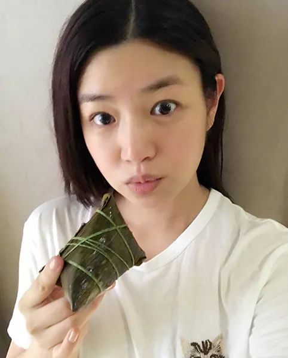

# StyleGAN V2 Fitting 模块

## StyleGAN V2 Fitting 原理

StyleGAN V2 的任务是使用风格向量进行image generation，而Fitting模块则是根据已有的图像反推出解耦程度高的风格向量。得到的风格向量可用于人脸融合、人脸属性编辑等任务中

## 使用方法

### 拟合

用户使用如下命令中进行拟合：

```
cd applications/
python -u tools/styleganv2fitting.py \
       --input_image <替换为输入的图像路径> \
       --need_align \
       --start_lr 0.1 \
       --final_lr 0.025 \
       --latent_level 0 1 2 3 4 5 6 7 8 9 10 11 \
       --step 100 \
       --mse_weight 1 \
       --pre_latent <替换为预先准备好的风格向量> \
       --output_path <替换为生成图片存放的文件夹> \
       --weight_path <替换为你的预训练模型路径> \
       --model_type ffhq-config-f \
       --size 1024 \
       --style_dim 512 \
       --n_mlp 8 \
       --channel_multiplier 2 \
       --cpu
```

**参数说明:**
- input_image: 输入的图像路径
- need_align: 是否将图像裁剪为模型能识别的图像，对于输入为已经裁剪过的图像，如使用Pixel2Style2Pixel生成风格向量时预生成的`src.png`，可不填写need_align参数
- start_lr: 拟合的初始学习率
- final_lr: 拟合结束时的学习率
- latent_level: 参与拟合的风格向量层次，1024分辨率下为0到17，512分辨率下则为0到15，以此类推。级别越低越偏向于整体风格改变，越高越偏向于细节风格改变
- step: 拟合图像所需步数，步数越大，花费时间越久，效果也更好
- mse_weight: MSE损失的权重
- pre_latent: 预制的风格向量保存的文件，便于更好效果的拟合。默认为空，可填入使用Pixel2Style2Pixel生成的`dst.npy`文件路径
- output_path: 生成图片存放的文件夹
- weight_path: 预训练模型路径
- model_type: PaddleGAN内置模型类型，若输入PaddleGAN已存在的模型类型，`weight_path`将失效。当前建议使用: `ffhq-config-f`
- size: 模型参数，输出图片的分辨率
- style_dim: 模型参数，风格z的维度
- n_mlp: 模型参数，风格z所输入的多层感知层的层数
- channel_multiplier: 模型参数，通道乘积，影响模型大小和生成图片质量
- cpu: 是否使用cpu推理，若不使用，请在命令中去除

## 拟合结果展示

源图像:

<div align="center">
    
</div>

Pixel2Style2Pixel编码结果:

<div align="center">
    
</div>

利用Pixel2Style2Pixel产生的风格向量，使用Fitting模块再进行1000步拟合的结果:

<div align="center">
    
</div>

# 参考文献

- 1. [Analyzing and Improving the Image Quality of StyleGAN](https://arxiv.org/abs/1912.04958)

  ```
  @article{Karras2019stylegan2,
    title={Analyzing and Improving the Image Quality of {StyleGAN}},
    author={Tero Karras and Samuli Laine and Miika Aittala and Janne Hellsten and Jaakko Lehtinen and Timo Aila},
    booktitle={Proc. CVPR},
    year={2020}
  }
  ```
- 2. [Encoding in Style: a StyleGAN Encoder for Image-to-Image Translation](hhttps://arxiv.org/abs/2008.00951)

  ```
  @article{richardson2020encoding,
    title={Encoding in Style: a StyleGAN Encoder for Image-to-Image Translation},
    author={Richardson, Elad and Alaluf, Yuval and Patashnik, Or and Nitzan, Yotam and Azar, Yaniv and Shapiro, Stav and Cohen-Or, Daniel},
    journal={arXiv preprint arXiv:2008.00951},
    year={2020}
  }
  ```
