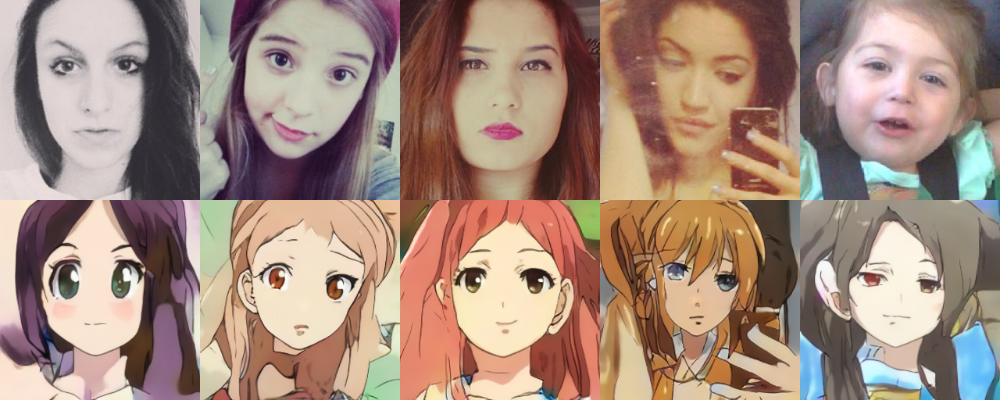

# 1 U-GAT-IT

## 1.1 原理介绍

  与CycleGAN类似，[U-GAT-IT](https://arxiv.org/abs/1907.10830)使用未配对的图片进行图像风格转换，输入两个不同风格的图像，U-GAT-IT自动执行风格转换。不同的是，U-GAT-IT在历史研究的基础上以端到端的方式引入了一个新的注意模块和一个新的可学习的归一化函数。

## 1.2 如何使用 

### 1.2.1 数据准备

  U-GAT-IT使用的Selfie2anime数据集可以从[这里](https://www.kaggle.com/arnaud58/selfie2anime)下载，您也可以使用自己的数据集。

  数据的组成形式为：

  ```
    ├── dataset
        └── YOUR_DATASET_NAME
            ├── trainA
            ├── trainB
            ├── testA
            └── testB
  ```

### 1.2.2 训练/测试

  示例以selfie2anime数据集为例。如果您想使用自己的数据集，可以在配置文件中修改数据集为您自己的数据集。

  训练模型:
  ```
     python -u tools/main.py --config-file configs/ugatit_selfie2anime_light.yaml
  ```

  测试模型:
  ```
     python tools/main.py --config-file configs/ugatit_selfie2anime_light.yaml --evaluate-only --load ${PATH_OF_WEIGHT}
  ```

## 1.3 结果展示



## 1.4 模型下载
| 模型 | 数据集 | 下载地址 |
|---|---|---|
| ugatit_light  | selfie2anime | [ugatit_light](https://paddlegan.bj.bcebos.com/models/ugatit_light.pdparams)


# 参考文献

- 1. [U-GAT-IT: Unsupervised Generative Attentional Networks with Adaptive Layer-Instance Normalization for Image-to-Image Translation](https://arxiv.org/abs/1907.10830)

  ```
  @article{kim2019u,
  title={U-GAT-IT: unsupervised generative attentional networks with adaptive layer-instance normalization for image-to-image translation},
  author={Kim, Junho and Kim, Minjae and Kang, Hyeonwoo and Lee, Kwanghee},
  journal={arXiv preprint arXiv:1907.10830},
  year={2019}
  }
  ```
