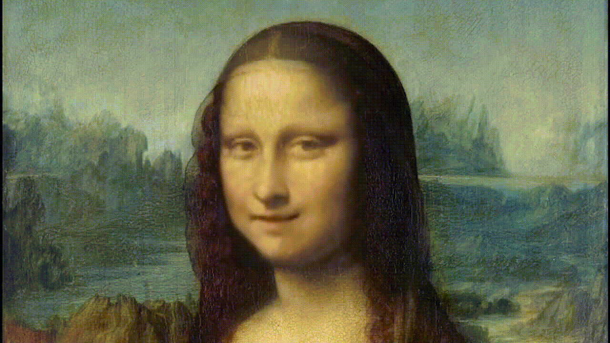

# Wav2Lip

## 1. Wav2Lip介绍

Wav2Lip实现的是视频人物根据输入音频生成与语音同步的人物唇形，使得生成的视频人物口型与输入语音同步。Wav2Lip不仅可以基于静态图像来输出与目标语音匹配的唇形同步视频，还可以直接将动态的视频进行唇形转换，输出与目标语音匹配的视频。Wav2Lip实现唇形与语音精准同步突破的关键在于，它采用了唇形同步判别器，以强制生成器持续产生准确而逼真的唇部运动。此外，它通过在鉴别器中使用多个连续帧而不是单个帧，并使用视觉质量损失（而不仅仅是对比损失）来考虑时间相关性，从而改善了视觉质量。Wav2Lip适用于任何人脸、任何语言，对任意视频都能达到很高都准确率，可以无缝地与原始视频融合，还可以用于转换动画人脸。

## 2. 使用方法
### 2.1 测试
预训练模型可以从如下地址下载: [wav2lip_weight](https://paddlegan.bj.bcebos.com/models/wav2lip_hq.pdparams)


运行如下命令，就可以完成唇形同步任务，程序运行成功后，会在当前文件夹生成唇形同步后的视频文件。本项目中提供了视频与音频文件供展示使用，具体命令如下所示：

```
cd applications
python tools/wav2lip.py \
    --face ../docs/imgs/mona7s.mp4 \
    --audio ../docs/imgs/guangquan.m4a \
    --outfile pp_guangquan_mona7s.mp4 \
    --face_enhancement
```
**参数说明:**
- face: 视频或图片，视频或图片中的人物唇形将根据音频进行唇形合成，以和音频同步
- audio: 驱动唇形合成的音频，视频中的人物将根据此音频进行唇形合成
- outfile: 合成的视频
- face_enhancement: 添加人脸增强，不添加参数默认为不使用增强功能

### 2.2 训练
1. 我们的模型是基于LRS2数据集训练的。可以参考[这里](https://github.com/Rudrabha/Wav2Lip#training-on-datasets-other-than-lrs2)获得在其它训练集上进行训练的一些建议。

输入到Wav2Lip模型的LRS2数据集的文件组织结构如下：

```
preprocessed_root (lrs2_preprocessed)
├── list of folders
|    ├── Folders with five-digit numbered video IDs
|    │   ├── *.jpg
|    │   ├── audio.wav
```
将LRS2的(train, val, test) `.txt` 文件列表放入 `filelists/`文件夹。

2. 你可以选择训练不带视觉质量判别器的模型，也可以将视觉质量判别起加上进行训练。对于前者，运行如下命令：

- GPU单卡训练:
```
export CUDA_VISIBLE_DEVICES=0
python tools/main.py --config-file configs/wav2lip.yaml
```

- GPU多卡训练:
```
export CUDA_VISIBLE_DEVICES=0,1,2,3
python -m paddle.distributed.launch \
    tools/main.py \
    --config-file configs/wav2lip.yaml \

```
对于后者，运行如下命令:
- GPU单卡训练:
```
export CUDA_VISIBLE_DEVICES=0
python tools/main.py --config-file configs/wav2lip_hq.yaml
```
- GPU多卡训练:
```
export CUDA_VISIBLE_DEVICES=0,1,2,3
python -m paddle.distributed.launch \
    tools/main.py \
    --config-file configs/wav2lip_hq.yaml \

```


### 2.3 模型
Model|Dataset|BatchSize|Inference speed|Download
---|:--:|:--:|:--:|:--:
wa2lip_hq|LRS2| 1 | 0.2853s/image (GPU:P40) | [model](https://paddlegan.bj.bcebos.com/models/wav2lip_hq.pdparams)

## 3. 结果展示




### 4. 参考文献

```
@inproceedings{10.1145/3394171.3413532,
author = {Prajwal, K R and Mukhopadhyay, Rudrabha and Namboodiri, Vinay P. and Jawahar, C.V.},
title = {A Lip Sync Expert Is All You Need for Speech to Lip Generation In the Wild},
year = {2020},
isbn = {9781450379885},
publisher = {Association for Computing Machinery},
address = {New York, NY, USA},
url = {https://doi.org/10.1145/3394171.3413532},
doi = {10.1145/3394171.3413532},
booktitle = {Proceedings of the 28th ACM International Conference on Multimedia},
pages = {484–492},
numpages = {9},
keywords = {lip sync, talking face generation, video generation},
location = {Seattle, WA, USA},
series = {MM '20}
}
```
