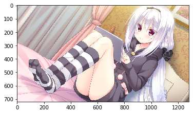

# 七日课 大作业：实现超分

经过这几天的学习，相信大家对GAN已经有了一定的了解了，也在前面的作业中体验过GAN的一些应用了。那现在大家是不是想要升级一下难度，自己动手来训练一个模型呢？

需要自己动手训练的大作业来啦，大作业内容为基于PaddleGAN中的超分模型，实现卡通画超分。


## 安装PaddleGAN

PaddleGAN的安装目前支持Clone GitHub和Gitee两种方式：


```python
%cd ~
# 安装ppgan
# 当前目录在: /home/aistudio/, 这个目录也是左边文件和文件夹所在的目录
# 克隆最新的PaddleGAN仓库到当前目录
# !git clone https://github.com/PaddlePaddle/PaddleGAN.git
# 如果从github下载慢可以从gitee clone：
# !git clone https://gitee.com/paddlepaddle/PaddleGAN.git --depth=1
# 安装Paddle GAN
%cd ~/PaddleGAN/
!pip install -v -e .
```

    /home/aistudio
    /home/aistudio/PaddleGAN
    Created temporary directory: /tmp/pip-ephem-wheel-cache-u0j90o22
    Created temporary directory: /tmp/pip-req-tracker-hml06ma9
    Created requirements tracker '/tmp/pip-req-tracker-hml06ma9'
    Created temporary directory: /tmp/pip-install-tckmai9k
    Looking in indexes: https://mirror.baidu.com/pypi/simple/
    Obtaining file:///home/aistudio/PaddleGAN
      Added file:///home/aistudio/PaddleGAN to build tracker '/tmp/pip-req-tracker-hml06ma9'
        Running setup.py (path:/home/aistudio/PaddleGAN/setup.py) egg_info for package from file:///home/aistudio/PaddleGAN
        Running command python setup.py egg_info
        running egg_info
        writing ppgan.egg-info/PKG-INFO
        writing dependency_links to ppgan.egg-info/dependency_links.txt
        writing entry points to ppgan.egg-info/entry_points.txt
        writing requirements to ppgan.egg-info/requires.txt
        writing top-level names to ppgan.egg-info/top_level.txt
        reading manifest file 'ppgan.egg-info/SOURCES.txt'
        writing manifest file 'ppgan.egg-info/SOURCES.txt'
      Source in /home/aistudio/PaddleGAN has version 0.1.0, which satisfies requirement ppgan==0.1.0 from file:///home/aistudio/PaddleGAN
      Removed ppgan==0.1.0 from file:///home/aistudio/PaddleGAN from build tracker '/tmp/pip-req-tracker-hml06ma9'
    Requirement already satisfied: tqdm in /opt/conda/envs/python35-paddle120-env/lib/python3.7/site-packages (from ppgan==0.1.0) (4.36.1)
    Requirement already satisfied: PyYAML>=5.1 in /opt/conda/envs/python35-paddle120-env/lib/python3.7/site-packages (from ppgan==0.1.0) (5.1.2)
    Requirement already satisfied: scikit-image>=0.14.0 in /opt/conda/envs/python35-paddle120-env/lib/python3.7/site-packages (from ppgan==0.1.0) (0.18.1)
    Requirement already satisfied: scipy>=1.1.0 in /opt/conda/envs/python35-paddle120-env/lib/python3.7/site-packages (from ppgan==0.1.0) (1.3.0)
    Requirement already satisfied: opencv-python in /opt/conda/envs/python35-paddle120-env/lib/python3.7/site-packages (from ppgan==0.1.0) (4.1.1.26)
    Requirement already satisfied: imageio-ffmpeg in /opt/conda/envs/python35-paddle120-env/lib/python3.7/site-packages (from ppgan==0.1.0) (0.3.0)
    Requirement already satisfied: librosa==0.7.0 in /opt/conda/envs/python35-paddle120-env/lib/python3.7/site-packages (from ppgan==0.1.0) (0.7.0)
    Requirement already satisfied: numba==0.48 in /opt/conda/envs/python35-paddle120-env/lib/python3.7/site-packages (from ppgan==0.1.0) (0.48.0)
    Requirement already satisfied: easydict in /opt/conda/envs/python35-paddle120-env/lib/python3.7/site-packages (from ppgan==0.1.0) (1.9)
    Requirement already satisfied: matplotlib!=3.0.0,>=2.0.0 in /opt/conda/envs/python35-paddle120-env/lib/python3.7/site-packages (from scikit-image>=0.14.0->ppgan==0.1.0) (2.2.3)
    Requirement already satisfied: imageio>=2.3.0 in /opt/conda/envs/python35-paddle120-env/lib/python3.7/site-packages (from scikit-image>=0.14.0->ppgan==0.1.0) (2.6.1)
    Requirement already satisfied: networkx>=2.0 in /opt/conda/envs/python35-paddle120-env/lib/python3.7/site-packages (from scikit-image>=0.14.0->ppgan==0.1.0) (2.4)
    Requirement already satisfied: pillow!=7.1.0,!=7.1.1,>=4.3.0 in /opt/conda/envs/python35-paddle120-env/lib/python3.7/site-packages (from scikit-image>=0.14.0->ppgan==0.1.0) (7.1.2)
    Requirement already satisfied: tifffile>=2019.7.26 in /opt/conda/envs/python35-paddle120-env/lib/python3.7/site-packages (from scikit-image>=0.14.0->ppgan==0.1.0) (2021.4.8)
    Requirement already satisfied: PyWavelets>=1.1.1 in /opt/conda/envs/python35-paddle120-env/lib/python3.7/site-packages (from scikit-image>=0.14.0->ppgan==0.1.0) (1.1.1)
    Requirement already satisfied: numpy>=1.16.5 in /opt/conda/envs/python35-paddle120-env/lib/python3.7/site-packages (from scikit-image>=0.14.0->ppgan==0.1.0) (1.20.2)
    Requirement already satisfied: six>=1.3 in /opt/conda/envs/python35-paddle120-env/lib/python3.7/site-packages (from librosa==0.7.0->ppgan==0.1.0) (1.15.0)
    Requirement already satisfied: joblib>=0.12 in /opt/conda/envs/python35-paddle120-env/lib/python3.7/site-packages (from librosa==0.7.0->ppgan==0.1.0) (0.14.1)
    Requirement already satisfied: audioread>=2.0.0 in /opt/conda/envs/python35-paddle120-env/lib/python3.7/site-packages (from librosa==0.7.0->ppgan==0.1.0) (2.1.8)
    Requirement already satisfied: resampy>=0.2.0 in /opt/conda/envs/python35-paddle120-env/lib/python3.7/site-packages (from librosa==0.7.0->ppgan==0.1.0) (0.2.2)
    Requirement already satisfied: soundfile>=0.9.0 in /opt/conda/envs/python35-paddle120-env/lib/python3.7/site-packages (from librosa==0.7.0->ppgan==0.1.0) (0.10.3.post1)
    Requirement already satisfied: scikit-learn!=0.19.0,>=0.14.0 in /opt/conda/envs/python35-paddle120-env/lib/python3.7/site-packages (from librosa==0.7.0->ppgan==0.1.0) (0.22.1)
    Requirement already satisfied: decorator>=3.0.0 in /opt/conda/envs/python35-paddle120-env/lib/python3.7/site-packages (from librosa==0.7.0->ppgan==0.1.0) (4.4.0)
    Requirement already satisfied: llvmlite<0.32.0,>=0.31.0dev0 in /opt/conda/envs/python35-paddle120-env/lib/python3.7/site-packages (from numba==0.48->ppgan==0.1.0) (0.31.0)
    Requirement already satisfied: setuptools in /opt/conda/envs/python35-paddle120-env/lib/python3.7/site-packages (from numba==0.48->ppgan==0.1.0) (41.4.0)
    Requirement already satisfied: kiwisolver>=1.0.1 in /opt/conda/envs/python35-paddle120-env/lib/python3.7/site-packages (from matplotlib!=3.0.0,>=2.0.0->scikit-image>=0.14.0->ppgan==0.1.0) (1.1.0)
    Requirement already satisfied: pytz in /opt/conda/envs/python35-paddle120-env/lib/python3.7/site-packages (from matplotlib!=3.0.0,>=2.0.0->scikit-image>=0.14.0->ppgan==0.1.0) (2019.3)
    Requirement already satisfied: pyparsing!=2.0.4,!=2.1.2,!=2.1.6,>=2.0.1 in /opt/conda/envs/python35-paddle120-env/lib/python3.7/site-packages (from matplotlib!=3.0.0,>=2.0.0->scikit-image>=0.14.0->ppgan==0.1.0) (2.4.2)
    Requirement already satisfied: cycler>=0.10 in /opt/conda/envs/python35-paddle120-env/lib/python3.7/site-packages (from matplotlib!=3.0.0,>=2.0.0->scikit-image>=0.14.0->ppgan==0.1.0) (0.10.0)
    Requirement already satisfied: python-dateutil>=2.1 in /opt/conda/envs/python35-paddle120-env/lib/python3.7/site-packages (from matplotlib!=3.0.0,>=2.0.0->scikit-image>=0.14.0->ppgan==0.1.0) (2.8.0)
    Requirement already satisfied: cffi>=1.0 in /opt/conda/envs/python35-paddle120-env/lib/python3.7/site-packages (from soundfile>=0.9.0->librosa==0.7.0->ppgan==0.1.0) (1.14.0)
    Requirement already satisfied: pycparser in /opt/conda/envs/python35-paddle120-env/lib/python3.7/site-packages (from cffi>=1.0->soundfile>=0.9.0->librosa==0.7.0->ppgan==0.1.0) (2.19)
    Installing collected packages: ppgan
      Found existing installation: ppgan 0.1.0
        Uninstalling ppgan-0.1.0:
          Created temporary directory: /tmp/pip-uninstall-7jigonil
          Removing file or directory /opt/conda/envs/python35-paddle120-env/bin/paddlegan
          Created temporary directory: /tmp/pip-uninstall-j6ap2zfn
          Removing file or directory /opt/conda/envs/python35-paddle120-env/lib/python3.7/site-packages/ppgan.egg-link
          Removing pth entries from /opt/conda/envs/python35-paddle120-env/lib/python3.7/site-packages/easy-install.pth:
          Removing entry: /home/aistudio/PaddleGAN
          Successfully uninstalled ppgan-0.1.0
      Running setup.py develop for ppgan
        Running command /opt/conda/envs/python35-paddle120-env/bin/python -c 'import sys, setuptools, tokenize; sys.argv[0] = '"'"'/home/aistudio/PaddleGAN/setup.py'"'"'; __file__='"'"'/home/aistudio/PaddleGAN/setup.py'"'"';f=getattr(tokenize, '"'"'open'"'"', open)(__file__);code=f.read().replace('"'"'\r\n'"'"', '"'"'\n'"'"');f.close();exec(compile(code, __file__, '"'"'exec'"'"'))' develop --no-deps
        running develop
        running egg_info
        writing ppgan.egg-info/PKG-INFO
        writing dependency_links to ppgan.egg-info/dependency_links.txt
        writing entry points to ppgan.egg-info/entry_points.txt
        writing requirements to ppgan.egg-info/requires.txt
        writing top-level names to ppgan.egg-info/top_level.txt
        reading manifest file 'ppgan.egg-info/SOURCES.txt'
        writing manifest file 'ppgan.egg-info/SOURCES.txt'
        running build_ext
        Creating /opt/conda/envs/python35-paddle120-env/lib/python3.7/site-packages/ppgan.egg-link (link to .)
        Adding ppgan 0.1.0 to easy-install.pth file
        Installing paddlegan script to /opt/conda/envs/python35-paddle120-env/bin
    
        Installed /home/aistudio/PaddleGAN
    Successfully installed ppgan
    Cleaning up...
    Removed build tracker '/tmp/pip-req-tracker-hml06ma9'


### 数据准备
我们为大家准备了处理好的超分数据集[卡通画超分数据集](https://aistudio.baidu.com/aistudio/datasetdetail/80790)


```python
# 回到/home/aistudio/下
%cd /home/aistudio
# 解压数据
!unzip -qao data/data80790/animeSR.zip -d data/
# 将解压后的数据链接到` /home/aistudio/PaddleGAN/data `目录下
!mv -f data/animeSR PaddleGAN/data/ 
```

    /home/aistudio


### 数据集的组成形式
```
    PaddleGAN
      ├── data
          ├── animeSR
                ├── train
                ├── train_X4
                ├── test
                └── test_X4
  ```

训练数据集包括400张卡通画，其中``` train ```中是高分辨率图像，``` train_X4 ```中是对应的4倍缩小的低分辨率图像。测试数据集包括20张卡通画，其中``` test ```中是高分辨率图像，``` test_X4 ```中是对应的4倍缩小的低分辨率图像。

### 数据可视化


```python
%cd ~
```

    /home/aistudio


```python
import os
import cv2
import numpy as np
import matplotlib.pyplot as plt
# 训练数据统计
train_names = os.listdir('PaddleGAN/data/animeSR/train')
print(f'训练集数据量: {len(train_names)}')

# 测试数据统计
test_names = os.listdir('PaddleGAN/data/animeSR/test')
print(f'测试集数据量: {len(test_names)}')

# 训练数据可视化
img = cv2.imread('PaddleGAN/data/animeSR/train/Anime_1.jpg')
img = img[:,:,::-1]
plt.figure()
plt.imshow(img)
plt.show()
```

    训练集数据量: 400
    测试集数据量: 20





### 选择超分模型

PaddleGAN中提供的超分模型包括RealSR, ESRGAN, LESRCNN, DRN等，详情可见[超分模型](https://github.com/PaddlePaddle/PaddleGAN/blob/develop/docs/zh_CN/tutorials/super_resolution.md)。

接下来以ESRGAN为例进行演示。

### 修改配置文件
 所有模型的配置文件均在``` /home/aistudio/PaddleGAN/configs ```目录下。
 
 找到你需要的模型的配置文件，修改模型参数，一般修改迭代次数，num_workers，batch_size以及数据集路径。有能力的同学也可以尝试修改其他参数，或者基于现有模型进行二次开发，模型代码在``` /home/aistudio/PaddleGAN/ppgan/models ```目录下。
 
 以ESRGAN为例，这里将将配置文件``esrgan_psnr_x4_div2k.yaml``中的
 
 参数``total_iters``改为50000
 
 参数``dataset：train：num_workers``改为12
 
 参数``dataset：train：batch_size``改为48
 
 参数``dataset：train：gt_folder``改为data/animeSR/train
 
 参数``dataset：train：lq_folder``改为data/animeSR/train_X4
 
 参数``dataset：test：gt_folder``改为data/animeSR/test
 
 参数``dataset：test：lq_folder``改为data/animeSR/test_X4
 

### 训练模型
以ESRGAN为例，运行以下代码训练ESRGAN模型。

如果希望使用其他模型训练，可以修改配置文件名字。


```python
%pwd
```


    '/home/aistudio'


```python
%cd ~/home/aistudio/PaddleGAN/
%pwd
!python -u tools/main.py --config-file configs/esrgan_psnr_x4_div2k.yaml
```

    [Errno 2] No such file or directory: '/home/aistudio/home/aistudio/PaddleGAN/'
    /home/aistudio
    python: can't open file 'tools/main.py': [Errno 2] No such file or directory


### 测试模型
以ESRGAN为例，模型训练好后，运行以下代码测试ESRGAN模型。

其中``/home/aistudio/pretrained_model/ESRGAN_PSNR_50000_weight.pdparams``是刚才ESRGAN训练的模型参数，同学们需要换成自己的模型参数。

如果希望使用其他模型测试，可以修改配置文件名字。


```python
%cd PaddleGAN
!python tools/main.py --config-file configs/esrgan_psnr_x4_div2k.yaml --evaluate-only --load /home/aistudio/pretrained_model/ESRGAN_PSNR_50000_weight.pdparams
```

    /home/aistudio/PaddleGAN
    /opt/conda/envs/python35-paddle120-env/lib/python3.7/site-packages/setuptools/depends.py:2: DeprecationWarning: the imp module is deprecated in favour of importlib; see the module's documentation for alternative uses
      import imp
    /opt/conda/envs/python35-paddle120-env/lib/python3.7/site-packages/paddle/fluid/layers/utils.py:26: DeprecationWarning: `np.int` is a deprecated alias for the builtin `int`. To silence this warning, use `int` by itself. Doing this will not modify any behavior and is safe. When replacing `np.int`, you may wish to use e.g. `np.int64` or `np.int32` to specify the precision. If you wish to review your current use, check the release note link for additional information.
    Deprecated in NumPy 1.20; for more details and guidance: https://numpy.org/devdocs/release/1.20.0-notes.html#deprecations
      def convert_to_list(value, n, name, dtype=np.int):
    /home/aistudio/PaddleGAN/ppgan/engine/trainer.py:73: DeprecationWarning: invalid escape sequence \/
      """
    /opt/conda/envs/python35-paddle120-env/lib/python3.7/site-packages/scipy/fftpack/__init__.py:103: DeprecationWarning: The module numpy.dual is deprecated.  Instead of using dual, use the functions directly from numpy or scipy.
      from numpy.dual import register_func
    /opt/conda/envs/python35-paddle120-env/lib/python3.7/site-packages/scipy/special/orthogonal.py:81: DeprecationWarning: `np.int` is a deprecated alias for the builtin `int`. To silence this warning, use `int` by itself. Doing this will not modify any behavior and is safe. When replacing `np.int`, you may wish to use e.g. `np.int64` or `np.int32` to specify the precision. If you wish to review your current use, check the release note link for additional information.
    Deprecated in NumPy 1.20; for more details and guidance: https://numpy.org/devdocs/release/1.20.0-notes.html#deprecations
      from numpy import (exp, inf, pi, sqrt, floor, sin, cos, around, int,
    /opt/conda/envs/python35-paddle120-env/lib/python3.7/site-packages/scipy/io/matlab/mio5.py:98: DeprecationWarning: `np.bool` is a deprecated alias for the builtin `bool`. To silence this warning, use `bool` by itself. Doing this will not modify any behavior and is safe. If you specifically wanted the numpy scalar type, use `np.bool_` here.
    Deprecated in NumPy 1.20; for more details and guidance: https://numpy.org/devdocs/release/1.20.0-notes.html#deprecations
      from .mio5_utils import VarReader5
    /home/aistudio/PaddleGAN/ppgan/models/base_model.py:52: DeprecationWarning: invalid escape sequence \/
      """
    /home/aistudio/PaddleGAN/ppgan/modules/init.py:70: DeprecationWarning: invalid escape sequence \s
      """
    /home/aistudio/PaddleGAN/ppgan/modules/init.py:134: DeprecationWarning: invalid escape sequence \m
      """
    /home/aistudio/PaddleGAN/ppgan/modules/init.py:159: DeprecationWarning: invalid escape sequence \m
      """
    /home/aistudio/PaddleGAN/ppgan/modules/init.py:190: DeprecationWarning: invalid escape sequence \m
      """
    /home/aistudio/PaddleGAN/ppgan/modules/init.py:227: DeprecationWarning: invalid escape sequence \m
      """
    [04/19 14:11:11] ppgan INFO: Configs: {'total_iters': 50000, 'output_dir': 'output_dir/esrgan_psnr_x4_div2k-2021-04-19-14-11', 'min_max': (0.0, 1.0), 'model': {'name': 'BaseSRModel', 'generator': {'name': 'RRDBNet', 'in_nc': 3, 'out_nc': 3, 'nf': 64, 'nb': 23}, 'pixel_criterion': {'name': 'L1Loss'}}, 'dataset': {'train': {'name': 'SRDataset', 'gt_folder': 'data/animeSR/train', 'lq_folder': 'data/animeSR/train_X4', 'num_workers': 12, 'batch_size': 48, 'scale': 4, 'preprocess': [{'name': 'LoadImageFromFile', 'key': 'lq'}, {'name': 'LoadImageFromFile', 'key': 'gt'}, {'name': 'Transforms', 'input_keys': ['lq', 'gt'], 'pipeline': [{'name': 'SRPairedRandomCrop', 'gt_patch_size': 128, 'scale': 4, 'keys': ['image', 'image']}, {'name': 'PairedRandomHorizontalFlip', 'keys': ['image', 'image']}, {'name': 'PairedRandomVerticalFlip', 'keys': ['image', 'image']}, {'name': 'PairedRandomTransposeHW', 'keys': ['image', 'image']}, {'name': 'Transpose', 'keys': ['image', 'image']}, {'name': 'Normalize', 'mean': [0.0, 0.0, 0.0], 'std': [255.0, 255.0, 255.0], 'keys': ['image', 'image']}]}]}, 'test': {'name': 'SRDataset', 'gt_folder': 'data/animeSR/test', 'lq_folder': 'data/animeSR/test_X4', 'scale': 4, 'preprocess': [{'name': 'LoadImageFromFile', 'key': 'lq'}, {'name': 'LoadImageFromFile', 'key': 'gt'}, {'name': 'Transforms', 'input_keys': ['lq', 'gt'], 'pipeline': [{'name': 'Transpose', 'keys': ['image', 'image']}, {'name': 'Normalize', 'mean': [0.0, 0.0, 0.0], 'std': [255.0, 255.0, 255.0], 'keys': ['image', 'image']}]}]}}, 'lr_scheduler': {'name': 'CosineAnnealingRestartLR', 'learning_rate': 0.0002, 'periods': [250000, 250000, 250000, 250000], 'restart_weights': [1, 1, 1, 1], 'eta_min': 1e-07}, 'optimizer': {'name': 'Adam', 'net_names': ['generator'], 'beta1': 0.9, 'beta2': 0.99}, 'validate': {'interval': 5000, 'save_img': False, 'metrics': {'psnr': {'name': 'PSNR', 'crop_border': 4, 'test_y_channel': True}, 'ssim': {'name': 'SSIM', 'crop_border': 4, 'test_y_channel': True}}}, 'log_config': {'interval': 10, 'visiual_interval': 500}, 'snapshot_config': {'interval': 5000}, 'is_train': False, 'timestamp': '-2021-04-19-14-11'}
    W0419 14:11:11.087523  1505 device_context.cc:362] Please NOTE: device: 0, GPU Compute Capability: 7.0, Driver API Version: 11.0, Runtime API Version: 10.1
    W0419 14:11:11.092507  1505 device_context.cc:372] device: 0, cuDNN Version: 7.6.
    [04/19 14:11:15] ppgan.engine.trainer INFO: Loaded pretrained weight for net generator
    /opt/conda/envs/python35-paddle120-env/lib/python3.7/site-packages/paddle/fluid/dataloader/dataloader_iter.py:89: DeprecationWarning: `np.bool` is a deprecated alias for the builtin `bool`. To silence this warning, use `bool` by itself. Doing this will not modify any behavior and is safe. If you specifically wanted the numpy scalar type, use `np.bool_` here.
    Deprecated in NumPy 1.20; for more details and guidance: https://numpy.org/devdocs/release/1.20.0-notes.html#deprecations
      if isinstance(slot[0], (np.ndarray, np.bool, numbers.Number)):
    [04/19 14:11:18] ppgan.engine.trainer INFO: Test iter: [0/20]
    [04/19 14:11:46] ppgan.engine.trainer INFO: Test iter: [10/20]
    [04/19 14:12:09] ppgan.engine.trainer INFO: Metric psnr: 25.4782
    [04/19 14:12:09] ppgan.engine.trainer INFO: Metric ssim: 0.7608


### 实验结果展示及模型下载
这里使用ESRGAN模型训练了一个基于PSNR指标的预测模型和一个基于GAN的预测模型。

数值结果展示及模型下载

| 方法 | 数据集 | 迭代次数 | 训练时长 | PSNR | SSIM | 模型下载 |
|---|---|---|---|---|---|---|
| ESRGAN_PSNR  | 卡通画超分数据集 | 50000 | 13.5h | 25.4782 | 0.7608 |[ESRGAN_PSNR](./pretrained_model/ESRGAN_PSNR_50000_weight.pdparams)|
| ESRGAN_GAN  | 卡通画超分数据集 | 50000 | 11h | 21.4148 | 0.6176 |[ESRGAN_GAN](./pretrained_model/ESRGAN_GAN_50000_weight.pdparams)|

可视化
| 低分辨率 | ESRGAN_PSNR | ESRGAN_GAN | GT |
|---|---|---|---|
|||||
|||||


