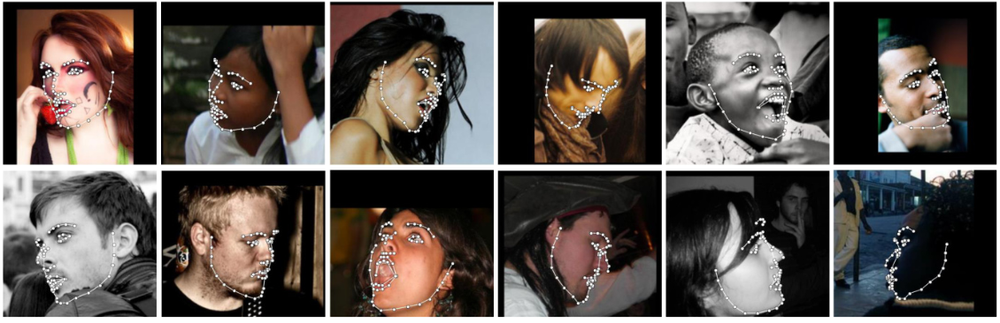

# Face Recognition

Detect facial landmarks from Python using the world's most accurate face alignment network, capable of detecting points in both 2D and 3D coordinates.

Build using [FAN](https://www.adrianbulat.com)'s state-of-the-art deep learning based face alignment method. 

<p align="center"></p>

**Note:** The lua version is available [here](https://github.com/1adrianb/2D-and-3D-face-alignment).

For numerical evaluations it is highly recommended to use the lua version which uses indentical models with the ones evaluated in the paper. More models will be added soon.

[](https://opensource.org/licenses/BSD-3-Clause)  [](https://github.com/1adrianb/face-alignment/actions?query=workflow%3A%22Test+Face+alignmnet%22) [](https://anaconda.org/1adrianb/face_alignment)
[](https://pypi.org/project/face-alignment/)

## Features

#### Detect 2D facial landmarks in pictures

<p align='center'>
</img>
</p>

```python
import face_alignment
from skimage import io

fa = face_alignment.FaceAlignment(face_alignment.LandmarksType._2D, flip_input=False)

input = io.imread('../test/assets/aflw-test.jpg')
preds = fa.get_landmarks(input)
```

#### Detect 3D facial landmarks in pictures

<p align='center'>
</img>
</p>

```python
import face_alignment
from skimage import io

fa = face_alignment.FaceAlignment(face_alignment.LandmarksType._3D, flip_input=False)

input = io.imread('../test/assets/aflw-test.jpg')
preds = fa.get_landmarks(input)
```

#### Process an entire directory in one go

```python
import face_alignment
from skimage import io

fa = face_alignment.FaceAlignment(face_alignment.LandmarksType._2D, flip_input=False)

preds = fa.get_landmarks_from_directory('../test/assets/')
```

#### Detect the landmarks using a specific face detector.

By default the package will use the SFD face detector. However the users can alternatively use dlib, BlazeFace, or pre-existing ground truth bounding boxes.

```python
import face_alignment

# sfd for SFD, dlib for Dlib and folder for existing bounding boxes.
fa = face_alignment.FaceAlignment(face_alignment.LandmarksType._2D, face_detector='sfd')
```

#### Running on CPU/GPU
In order to specify the device (GPU or CPU) on which the code will run one can explicitly pass the device flag:

```python
import face_alignment

# cuda for CUDA
fa = face_alignment.FaceAlignment(face_alignment.LandmarksType._2D, device='cpu')
```

Please also see the ``examples`` folder

## Installation

### Requirements

* Python 3.5+ (it may work with other versions too). Last version with support for python 2.7 was v1.1.1
* Linux, Windows or macOS
* pytorch (>=1.5)

While not required, for optimal performance(especially for the detector) it is **highly** recommended to run the code using a CUDA enabled GPU.

### Binaries

The easiest way to install it is using either pip or conda:

| **Using pip**                | **Using conda**                            |
|------------------------------|--------------------------------------------|
| `pip install face-alignment` | `conda install -c 1adrianb face_alignment` |
|                              |                                            |

Alternatively, bellow, you can find instruction to build it from source.

### From source

 Install pytorch and pytorch dependencies. Please check the [pytorch readme](https://github.com/pytorch/pytorch) for this.

#### Get the Face Alignment source code
```bash
git clone https://github.com/1adrianb/face-alignment
```
#### Install the Face Alignment lib
```bash
pip install -r requirements.txt
python setup.py install
```

### Docker image

A Dockerfile is provided to build images with cuda support and cudnn. For more instructions about running and building a docker image check the orginal Docker documentation.
```
docker build -t face-alignment .
```

## How does it work?

While here the work is presented as a black-box, if you want to know more about the intrisecs of the method please check the original paper either on arxiv or my [webpage](https://www.adrianbulat.com).

## Contributions

All contributions are welcomed. If you encounter any issue (including examples of images where it fails) feel free to open an issue. If you plan to add a new features please open an issue to discuss this prior to making a pull request.

## Citation

```
@inproceedings{bulat2017far,
  title={How far are we from solving the 2D \& 3D Face Alignment problem? (and a dataset of 230,000 3D facial landmarks)},
  author={Bulat, Adrian and Tzimiropoulos, Georgios},
  booktitle={International Conference on Computer Vision},
  year={2017}
}
```

For citing dlib, pytorch or any other packages used here please check the original page of their respective authors.

## Acknowledgements

* To the [pytorch](http://pytorch.org/) team for providing such an awesome deeplearning framework
* To [my supervisor](http://www.cs.nott.ac.uk/~pszyt/) for his patience and suggestions.
* To all other python developers that made available the rest of the packages used in this repository.